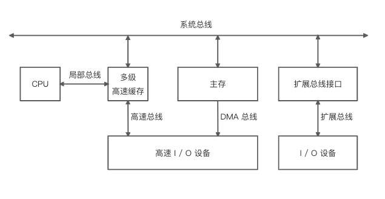
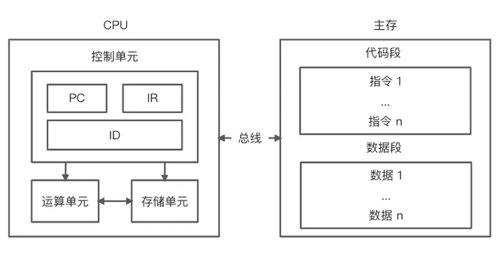
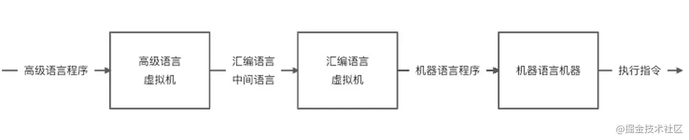
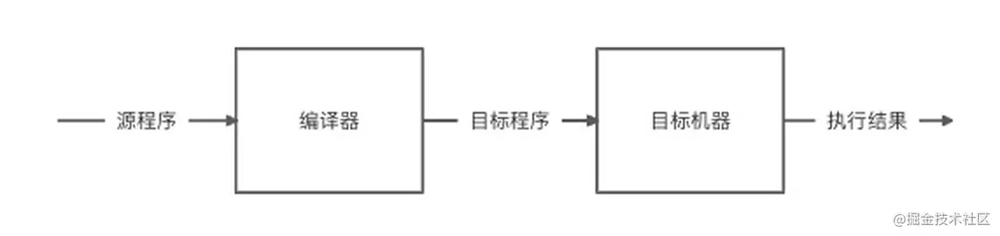
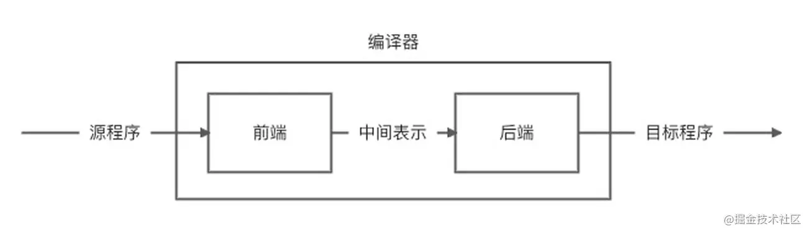
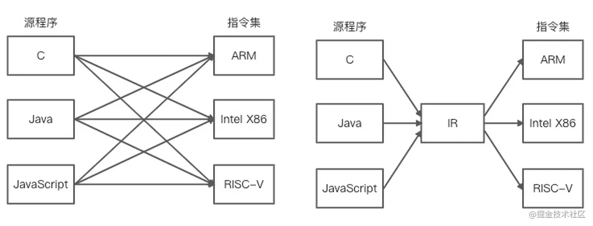
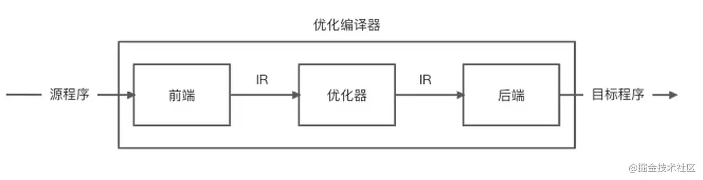
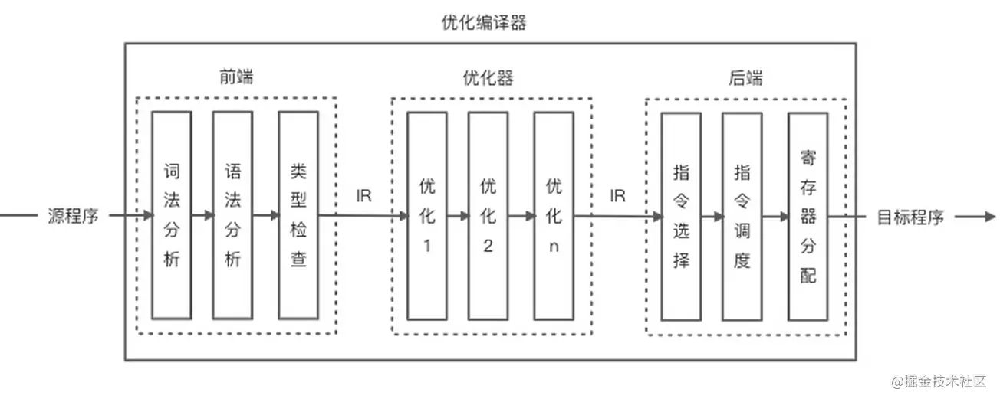
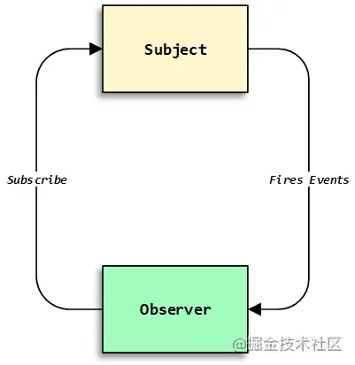

# 专有钉钉前端面试指南

原作者：专有钉钉前端团队
原文链接：<https://juejin.cn/post/6986436944913924103>

****
ℹ️：未完成
★：常考
★★：重点掌握
★★★：高频，必背
****

## 面试技巧

建议大家在投递简历时可以先投递一些试水的小公司，先检验一下自己是不是可以胜任这些公司的面试。同时在每一次面试完后记得把面试官提问的问题记录下来，对于没有答上来的问题还是要好好搞懂或者实践一下，因为很有可能下一家的面试官会问同样的问题。在面试的过程中，这里给出几点意见：

- **回答问题不要过于着急，一定要耐心等待面试官把问题说完**
- **回答问题要有逻辑、干练简洁**
- **如果面试官打断你说话，此时一定要谨慎回答，因为很有可能你回答过于繁琐且他对你当下的回答不满意**
- **千万不要长篇大论，千万不要长篇大论，千万不要长篇大论**
- 一个问题不要纠结很久.....
- 心态放平稳，假设第一题你答不上来很正常，面试官不会因为第一题你不会就 PASS 你
- 不会的题目一定不要瞎猜，往往面试官给你挖的坑就是希望你往错的方向猜，一定要答不知道
- 不要说太多跟当前面试题无关的内容，问你什么问题尽量就答什么问题，除非面试官指定你发散一下思维
- 如果没有听懂面试题可以试着询问面试官，您要问的是关于 xxx 的问题么
- 对于某些问题一定要自己先提前精炼一下（例如作用域链、继承以及原型链等问题）
- 如果面试官问的某项技术自己在某些场景使用过或看到别的场景有使用，可结合这些场景进行讲解（让面试官知道你不仅仅理解它，你还会很好的使用它）
- 如果是 Vue 技术栈希望可以深入源码或者至少理解一些别人的源码分析
- 面试一定要真诚，切勿投机取巧
- 面试态度一定要谦虚
- 一定要提前准备好自己想要问的问题，最致命的是面试官问了你一堆问题你却不知道该问面试官什么问题
- 面试之后一定要记录面试官的问题并一一了解，及时了解面试反馈

回答问题的时候要有逻辑并且干练简洁，例如：我觉得可以从 n 个方面进行讲解，首先第 1 个方面是...，其次第 2 个方面是...，我觉得这个问题有几种解决方案，首先第 1 个方案是...，其次第 2 个方案是... 如果你的回答没有逻辑还繁琐且没有命中要点，通常面试官对你的印象会非常差。相反，如果你回答问题过于简洁，通常情况下面试官会觉得你没 Get 到他的问题点（当然会怀疑自己的表述有没有问题），一般都会追加更详细的问题描述。

## 考察内容

专有钉钉的一面面试主要考察以下三个方面的内容：

- 基础知识：考察面试者是否掌握扎实的前端基础知识体系
- 业务思考：考察面试者的业务深度
- 笔试实践：考察面试者基本知识的实践能力，并考察代码风格和逻辑思维能力

需要注意，如果你觉得某些面试题有些突兀，不要觉得惊讶，这些面试题是在不断深入沟通的过程中层层递进被带出来的，其中某些面试题可能相对较偏，纯粹是加分项面试题。

## 基础知识

基础知识主要包含以下几个方面：

- 基础：计算机原理、编译原理、数据结构、算法、设计模式、编程范式等基本知识了解
- 语法：`JavaScript、ECMAScript、CSS、TypeScript、HTML、Node.js` 等语法的了解和使用
- 框架：`React、Vue、Egg、Koa、Express、Webpack` 等原理的了解和使用
- 工程：编译工具、格式工具、`Git`、`NPM`、单元测试、`Nginx`、`PM2`、`CI / CD` 了解和使用
- 网络：`HTTP、TCP、UDP、WebSocket、Cookie、Session`、跨域、缓存、协议的了解
- 性能：编译性能、监控、白屏检测、`SEO、Service Worker` 等了解
- 插件：`Chrome、Vue CLI 、Webpack` 等插件设计思路的理解
- 系统：`Mac、Windows、Linux` 系统配置的实践
- 后端：`Redis` 缓存、数据库、`Graphql、SSR`、模板引擎等了解和使用

### 基础

1. #### 列举你所了解的计算机存储设备类型？

    现代计算机以存储器为中心，主要由 `CPU、I / O` 设备以及主存储器三大部分组成。各个部分之间通过总线进行连接通信，具体如下图所示：

    

    上图是一种多总线结构的示意图，`CPU`、主存以及 `I / O` 设备之间的所有数据都是通过总线进行并行传输，使用局部总线是为了提高 `CPU` 的吞吐量（`CPU` 不需要直接跟 `I / O` 设备通信），而使用高速总线（更贴近 `CPU`）和 `DMA` 总线则是为了提升高速 `I / O` 设备（外设存储器、局域网以及多媒体等）的执行效率。
    <br>

    主存包括随机存储器 `RAM` 和只读存储器 `ROM`，其中 `ROM` 又可以分为 `MROM`（一次性）、`PROM、EPROM、EEPROM`。`ROM` 中存储的程序（例如启动程序、固化程序）和数据（例如常量数据）在断电后不会丢失。`RAM`  主要分为静态 `RAM（SRAM）`和动态 `RAM（DRAM）`两种类型（`DRAM` 种类很多，包括 `SDRAM、RDRAM、CDRAM` 等），断电后数据会丢失，主要用于存储临时程序或者临时变量数据。`DRAM`  一般访问速度相对较慢。由于现代 `CPU` 读取速度要求相对较高，因此在 `CPU` 内核中都会设计 `L1、L2` 以及 `L3` 级别的多级高速缓存，这些缓存基本是由 `SRAM` 构成，一般访问速度较快。
    <br>

    **其它回答：**
    - 随机存储器 `RAM`
    `SRAM、DRAM`（`SDRAM、RDRAM、CDRAM` 等）

    - 只读存储器 `ROM`
    `MROM、PROM、EPROM、EEPROM`

1. #### 一般代码存储在计算机的哪个设备中？代码在 `CPU` 中是如何运行的？

    高级程序设计语言不能直接被计算机理解并执行，需要通过翻译程序将其转换成特定处理器上可执行的指令，计算机 `CPU` 的简单工作原理如下所示：

    

    `CPU` 主要由控制单元、运算单元和存储单元组成（注意忽略了中断系统），各自的作用如下：

    - **控制单元**：在节拍脉冲的作用下，将程序计数器（`Program Counter，PC`）指向的主存或者多级高速缓存中的指令地址送到地址总线，接着获取指令地址所对应的指令并放入指令寄存器 （`Instruction Register，IR`）中，然后通过指令译码器（`Instruction Decoder，ID`）分析指令需要进行的操作，最后通过操作控制器（`Operation Controller，OC`）向其他设备发出微操作控制信号。
    - **运算单元**：如果控制单元发出的控制信号存在算术运算（加、减、乘、除、增 1、减 1、取反等）或者逻辑运算（与、或、非、异或），那么需要通过运算单元获取存储单元的计算数据进行处理。
    - **存储单元**：包括片内缓存和寄存器组，是 `CPU` 中临时数据的存储地方。`CPU` 直接访问主存数据大概需要花费数百个机器周期，而访问寄存器或者片内缓存只需要若干个或者几十个机器周期，因此会使用内部寄存器或缓存来存储和获取临时数据（即将被运算或者运算之后的数据），从而提高 `CPU` 的运行效率。
    <br>

    除此之外，计算机系统执行程序指令时需要花费时间，其中取出一条指令并执行这条指令的时间叫指令周期。指令周期可以分为若干个阶段（取指周期、间址周期、执行周期和中断周期），每个阶段主要完成一项基本操作，完成基本操作的时间叫机器周期。机器周期是时钟周期的分频，例如最经典的 `8051` 单片机的机器周期为 `12` 个时钟周期。时钟周期是 `CPU` 工作的基本时间单位，也可以称为节拍脉冲或 `T` 周期（`CPU` 主频的倒数）。假设 `CPU` 的主频是 `1 GHz`（`1 Hz` 表示每秒运行 `1` 次），那么表示时钟周期为 `1 / 109 s`。理论上 `CPU` 的主频越高，程序指令执行的速度越快。
    <br>

    **其它回答：**
    ① 易失性执行之前，我们的代码主要存储在**内存**中。
    ② `CPU` 读取内存中的数据并放在寄存器内，将寄存器中的数据写入内存并进行有序的四则运算、相关指令，在此过程中，寄存器主要用于存放计算数据，运算器负责操作寄存器中的数据

1. #### 什么是指令和指令集？

    上图右侧主存中的指令是 `CPU` 可以支持的处理命令，一般包含算术指令（加和减）、逻辑指令（与、或和非）、数据指令（移动、输入、删除、加载和存储）、流程控制指令以及程序结束指令等，由于 `CPU` 只能识别二进制码，因此指令是由二进制码组成。除此之外，指令的集合称为指令集（例如汇编语言就是指令集的一种表现形式），常见的指令集有精简指令集（`ARM`）和复杂指令集（`Inter X86`）。一般指令集决定了 `CPU` 处理器的硬件架构，规定了处理器的相应操作。
    <br>

    **其它回答：**
    指令一般是指机器指令，是计算机可完成一个独立计算逻辑所要执行的的命令；一台常规的计算机的所有指令的集合，就是该计算机的指令集。

1. #### ℹ️复杂指令集和精简指令集有什么区别？

1. #### ℹ️`JavaScript` 是如何运行的？解释型语言和编译型语言的差异是什么？

    早期的计算机只有机器语言时，程序设计必须用二进制数（`0` 和 `1`）来编写程序，并且要求程序员对计算机硬件和指令集非常了解，编程的难度较大，操作极易出错。为了解决机器语言的编程问题，慢慢开始出现了符号式的汇编语言（采用 `ADD、SUB、MUL、DIV` 等符号代表加减乘除）。为了使得计算机可以识别汇编语言，需要将汇编语言翻译成机器能够识别的机器语言（处理器的指令集）：

    

    由于每一种机器的指令系统不同，需要不同的汇编语言程序与之匹配，因此程序员往往需要针对不同的机器了解其硬件结构和指令系统。为了可以抹平不同机器的指令系统，使得程序员可以更加关注程序设计本身，先后出现了各种面向问题的高级程序设计语言，例如 `BASIC` 和 `C`，具体过程如下图所示：

    

    高级程序语言会先翻译成汇编语言或者其他中间语言，然后再根据不同的机器翻译成机器语言进行执行。除此之外，汇编语言虚拟机和机器语言机器之间还存在一层操作系统虚拟机，主要用于控制和管理操作系统的全部硬件和软件资源（随着超大规模集成电路技术的不断发展，一些操作系统的软件功能逐步由硬件来替换，例如目前的操作系统已经实现了部分程序的固化，简称固件，将程序永久性的存储在 `ROM` 中）。机器语言机器还可以继续分解成微程序机器，将每一条机器指令翻译成一组微指令（微程序）进行执行。
    <br>

    上述虚拟机所提供的语言转换程序被称为编译器，主要作用是将某种语言编写的源程序转换成一个等价的机器语言程序，编译器的作用如下图所示：

    

    例如 `C` 语言，可以先通过 `gcc` 编译器生成 `Linux` 和 `Windows` 下的目标 `.o` 和 `.obj` 文件（`object` 文件，即目标文件），然后将目标文件与底层系统库文件、应用程序库文件以及启动文件链接成可执行文件在目标机器上执行。
    <br>

    >温馨提示：感兴趣的同学可以了解一下 `ARM` 芯片的程序运行原理，包括使用 `IDE` 进行程序的编译（`IDE` 内置编译器，主流编译器包含 `ARMCC、IAR` 以及 `GCC FOR ARM` 等，其中一些编译器仅仅随着 `IDE` 进行捆绑发布，不提供独立使用的能力，而一些编译器则随着 `IDE` 进行发布的同时，还提供命令行接口的独立使用方式）、通过串口进行程序下载（下载到芯片的代码区初始启动地址映射的存储空间地址）、启动的存储空间地址映射（包括系统存储器、闪存 `FLASH`、内置 `SRAM` 等）、芯片的程序启动模式引脚 `BOOT` 的设置（例如调试代码时常常选择内置 `SRAM`、真正程序运行的时候选择闪存 `FLASH`）等。
    <br>

    如果某种高级语言或者应用语言（例如用于人工智能的计算机设计语言）转换的目标语言不是特定计算机的汇编语言，而是面向另一种高级程序语言（很多研究性的编译器将 `C` 作为目标语言），那么还需要将目标高级程序语言再进行一次额外的编译才能得到最终的目标程序，这种编译器可称为源到源的转换器。
    <br>

    除此之外，有些程序设计语言将编译的过程和最终转换成目标程序进行执行的过程混合在一起，这种语言转换程序通常被称为解释器，主要作用是将某种语言编写的源程序作为输入，将该源程序执行的结果作为输出，解释器的作用如下图所示：

    

    解释器和编译器有很多相似之处，都需要对源程序进行分析，并转换成目标机器可识别的机器语言进行执行。只是解释器是在转换源程序的同时立马执行对应的机器语言（转换和执行的过程不分离），而编译器得先把源程序全部转换成机器语言并产生目标文件，然后将目标文件写入相应的程序存储器进行执行（转换和执行的过程分离）。例如 `Perl、Scheme、APL` 使用解释器进行转换， `C、C++` 则使用编译器进行转换，而 `Java` 和 `JavaScript` 的转换既包含了编译过程，也包含了解释过程。
    <br>

    **其它回答：**
    ① **`JS` 代码 -> 解析成 `AST`（期间伴随词法分析、语法分析）-> 生成字节码（`V8`）-> 生成机器码（编译器）**
    ② 很多资料会说，`JavaScript、Python、Ruby` 都是"解释型语言"，是通过解释器来实现的。这么说其实很容易引起误解：语言一般只会定义其抽象语义，而不会强制性要求采用某种实现方式。
    <br>

    例如说 `C` 一般被认为是“编译型语言”，但 `C` 的解释器也是存在的，例如 `Ch`。同样，`C++` 也有解释器版本的实现，例如 `Cint`。
    <br>

    一般被称为“解释型语言”的是主流实现为解释器的语言，但并不是说它就无法编译。例如说经常被认为是“解释型语言”的 `Scheme` 就有好几种编译器实现，其中率先支持 `R6RS` 规范的大部分内容的是 `Ikarus`，支持在 `x86` 上编译 `Scheme`；它最终不是生成某种虚拟机的字节码，而是直接生成 `x86` 机器码。
    <br>

    解释器就是个黑箱，输入是源码，输出就是输入程序的执行结果，对用户来说中间没有独立的“编译”步骤。这非常抽象，内部是怎么实现的都没关系，只要能实现语义就行。你可以写一个 `C` 语言的解释器，里面只是先用普通的 `C` 编译器把源码编译为 `in-memory image`，然后直接调用那个 `image` 去得到运行结果；用户拿过去，发现直接输入源码可以得到源程序对应的运行结果就满足需求了，无需在意解释器这个“黑箱子”里到底是什么。
    <br>

    实际上很多解释器内部是以“编译器+虚拟机”的方式来实现的，先通过编译器将源码转换为 `AST` 或者字节码，然后由虚拟机去完成实际的执行。所谓“解释型语言”并不是不用编译，而只是不需要用户显式去使用编译器得到可执行代码而已。
    <br>

    这道题扯多了，肯定有掘金大佬来杠我。我的观点是如果一种语言的主流实现是解释器，其内部是编译器+虚拟机，而虚拟机又是采用解释方式实现的，或者内部实现是编译器+树遍历解释器，那它就是名副其实的“解释型语言”。如果内部用的虚拟机是用编译方式实现的，其实跟普遍印象中的"解释器"还是挺不同的。

1. #### ℹ️简单描述一下 `Babel` 的编译过程？

    待答
    <br>

    **其它回答：**
    首先，`Babel` 的作用是从一种源码到另一种源码，充当转换编译器的作用，可以简述为 **解析（解析 `JS` 代码）->转换（解析和修改 `AST`）->重建（将修改后的 `AST` 转换成另一种 `JS` 代码）**

1. #### ℹ️`JavaScript` 中的数组和函数在内存中是如何存储的？

    `JavaScript` 中的数组存储大致需要分为两种情况：

    - 同种类型数据的数组分配连续的内存空间
    - 存在非同种类型数据的数组使用哈希映射分配内存空间
    <br>

    >温馨提示：可以想象一下连续的内存空间只需要根据索引（指针）直接计算存储位置即可。如果是哈希映射那么首先需要计算索引值，然后如果索引值有冲突的场景下还需要进行二次查找（需要知道哈希的存储方式）。
    <br>

    **其它回答：**
    ① 数组，`JS` 里的数组主要就是**以连续内存形式**存储的 `FixedArray`、**以哈希表形式**存储的 `HashTable`。
    ② 函数，函数属于引用数据类型，存储在**堆**中，在**栈中只存地址**来表示对堆内存中的引用。当解释器寻找引用值时，会首先检索其在栈中的地址，取得地址后从堆中获得实体。

1. #### ★★★ℹ️浏览器和 `Node.js` 中的事件循环机制有什么区别？

    更多：<https://juejin.cn/post/6844903843197616136#heading-3>
    <br>

    事件触发线程管理的任务队列是如何产生的呢？事实上这些任务就是从 `JS` 引擎线程本身产生的，主线程在运行时会产生执行栈，栈中的代码调用某些异步 `API` 时会在任务队列中添加事件，栈中的代码执行完毕后，就会读取任务队列中的事件，去执行事件对应的回调函数，如此循环往复，形成事件循环机制。`JS` 中有两种任务类型：微任务（`microtask`）和宏任务（`macrotask`），在 `ES6` 中，`microtask` 称为 `jobs`，`macrotask` 称为 `task`：

    - 宏任务： `script`（主代码块）、`setTimeout、setInterval、setImmediate、I/O、UI rendering`
    - 微任务：`process.nextTick（Nodejs）、Promise、Object.observe、MutationObserver`
    <br>

    `Node.js` 中 `Event Loop` 和浏览器中 `Event Loop` 有什么区别

    ```javascript
      ┌───────────────────────┐
    ┌─>│        timers         │<————— 执行 setTimeout()、setInterval() 的回调
    │  └──────────┬────────────┘
    |             |<-- 执行所有 Next Tick Queue 以及 MicroTask Queue 的回调
    │  ┌──────────┴────────────┐
    │  │     pending callbacks │<————— 执行由上一个 Tick 延迟下来的 I/O 回调（待完善，可忽略）
    │  └──────────┬────────────┘
    |             |<-- 执行所有 Next Tick Queue 以及 MicroTask Queue 的回调
    │  ┌──────────┴────────────┐
    │  │     idle, prepare     │<————— 内部调用（可忽略）
    │  └──────────┬────────────┘     
    |             |<-- 执行所有 Next Tick Queue 以及 MicroTask Queue 的回调
    |             |                   ┌───────────────┐
    │  ┌──────────┴────────────┐      │   incoming:   │ - (执行几乎所有的回调，除了 close callbacks、timers、setImmediate)
    │  │         poll          │<─────┤  connections, │ 
    │  └──────────┬────────────┘      │   data, etc.  │ 
    │             |                   |               | 
    |             |                   └───────────────┘
    |             |<-- 执行所有 Next Tick Queue 以及 MicroTask Queue 的回调
    |  ┌──────────┴────────────┐      
    │  │        check          │<————— setImmediate() 的回调将会在这个阶段执行
    │  └──────────┬────────────┘
    |             |<-- 执行所有 Next Tick Queue 以及 MicroTask Queue 的回调
    │  ┌──────────┴────────────┐
    └──┤    close callbacks    │<————— socket.on('close', ...)
      └───────────────────────┘
    ```

    `Node.js` 中宏任务分成了几种类型，并且放在了不同的 `task queue` 里。不同的 `task queue` 在执行顺序上也有区别，微任务放在了每个 `task queue` 的末尾：

    - `setTimeout/setInterval` 属于 `timers` 类型；
    - `setImmediate` 属于 `check` 类型；
    - `socket` 的 `close` 事件属于 `close callbacks` 类型；
    - 其他 `MacroTask` 都属于 `poll` 类型。
    - `process.nextTick` 本质上属于 `MicroTask`，但是它先于所有其他 `MicroTask` 执行；
    - 所有 `MicroTask` 的执行时机在不同类型的 `MacroTask` 切换后。
    - `idle/prepare` 仅供内部调用，我们可以忽略。
    - `pending callbacks` 不太常见，我们也可以忽略。
    <br>

    **其它回答：**更多：<https://www.cnblogs.com/aaron---blog/p/11714638.html>
    ① 浏览器中的事件循环：
    - `macrotasks`(宏任务):
      - `script`(整体代码)
      - `setTimeout`
      - `setInterval`
      - `setImmediate`
      - `I/O`
      - `UI rendering`
      - `event listner`

    - `microtasks`(微任务):
      - `process.nextTick`
      - `Promises`
      - `Object.observe`
      - `MutationObserver`
      <br>

    在浏览器里，每当一个被监听的事件发生时，事件监听器绑定的相关任务就会被添加进回调队列。通过事件产生的任务是异步任务，常见的事件任务包括：

    - 用户交互事件产生的事件任务，比如输入操作；
    - 计时器产生的事件任务，比如 `setTimeout`；
    - 异步请求产生的事件任务，比如 `HTTP` 请求。
    <br>

    主线程运行的时候，会产生堆（`heap`）和栈（`stack`），其中堆为内存、栈为函数调用栈。我们能看到，`Event Loop` 负责执行代码、收集和处理事件以及执行队列中的子任务，具体包括以下过程。

    - `JavaScript` 有一个主线程和调用栈，所有的任务最终都会被放到调用栈等待主线程执行。
    - 同步任务会被放在调用栈中，按照顺序等待主线程依次执行。
    主线程之外存在一个回调队列，回调队列中的异步任务最终会在主线程中以调用栈的方式运行。
    - 同步任务都在主线程上执行，栈中代码在执行的时候会调用浏览器的 `API`，此时会产生一些异步任务。
    - 异步任务会在有了结果（比如被监听的事件发生时）后，将异步任务以及关联的回调函数放入回调队列中。
    - 调用栈中任务执行完毕后，此时主线程处于空闲状态，会从回调队列中获取任务进行处理。
    - 上述过程会不断重复，这就是 `JavaScript` 的运行机制，称为事件循环机制（`Event Loop`）。
    <br>

    ② `NodeJs` 中的事件循环：

    - `timer` 阶段：这个阶段执行 `timer（setTimeout、setInterval）`的回调
    - `I/O callbacks`：执行一些系统调用错误，比如网络通信的错误回调
    - `idle, prepare`：仅 `node` 内部使用
    - `poll`：获取新的 `I/O` 事件, 适当的条件下 `node` 将阻塞在这里
    - `check`：执行 `setImmediate()` 的回调
    - `close callbacks`：执行 `socket` 的 `close` 事件回调
    <br>

    ③ 区别：
    浏览器环境下，`microtask` 的任务队列是每个 `macrotask` 执行完之后执行。而在 `Node.js` 中，`microtask` 会在事件循环的各个阶段之间执行，也就是一个阶段执行完毕，就会去执行 `microtask` 队列的任务。如果是 `node11` 版本一旦执行一个阶段里的一个宏任务(`setTimeout, setInterval` 和 `setImmediate`)就立刻执行微任务队列，这就跟浏览器端运行一致。

    ```javascript
    setTimeout(() => {
      console.log('timer1')
      Promise.resolve().then(function () {
        console.log('promise1')
      })
    }, 0)
    setTimeout(() => {
      console.log('timer2')
      Promise.resolve().then(function () {
        console.log('promise2')
      })
    }, 0)

    // 浏览器环境：
    timer1=>promise1=>timer2=>promise2

    // node V11之后
    timer1=>promise1=>timer2=>promise2

    // node 10及其之前
    timer1=>promise1=>timer2=>promise2 (如果是第二个定时器还未在完成队列中)
    timer1=>timer2=>promise1=>promise2 (如果是第二个定时器已经在完成队列中)
    ```

1. #### ℹ️`ES6 Modules` 相对于 `CommonJS` 的优势是什么？

    待答
    <br>

    **其它回答：**
    区别：
    - `CommonJS` 和 `ES6 Module` 都可以对引入的对象进行赋值，即对对象内部属性的值进行改变；
    - `CommonJS` 模块输出的是一个值的拷贝，`ES6` 模块输出的是值的引用。即 `ES6 Module` 只存只读，不能改变其值，具体点就是指针指向不能变；
    - `CommonJS` 模块是运行时加载，`ES6` 模块是编译时输出接口。
    - `CommonJS` 模块的 `require()` 是同步加载模块，`ES6` 模块的 `import` 命令是异步加载，有一个独立的模块依赖的解析阶段。
    - `import` 的接口是 `read-only`（只读状态），不能修改其变量值。 即不能修改其变量的指针指向，但可以改变变量内部指针指向，可以对 `commonJS` 对重新赋值（改变指针指向），但是对 `ES6 Module` 赋值会编译报错。
    <br>

    优势：`CommonJS` 加载的是一个对象（即 `module.exports` 属性），该对象只有在脚本运行完才会生成。而 `ES6 Modules` 不是对象，它的对外接口只是一种静态定义，**在代码静态解析阶段就会生成**。

1. #### ℹ️高级程序设计语言是如何编译成机器语言的？

    待答
    <br>

    **其它回答：**
    **高级语言代码->解析成 `AST` (期间伴随词法分析、语法分析)->生成字节码（`V8`）->生成机器码（编译器）**

1. #### ℹ️编译器一般由哪几个阶段组成？数据类型检查一般在什么阶段进行？

    待答
    <br>

    **其它回答：**
    ① 编译器一般由4个阶段工作完成：
      - `Parse` 阶段：`V8` 引擎负责将 `JS` 代码转换成 `AST`（抽象语法树）；
      - `Ignition` 阶段：解释器将 `AST` 转换为字节码，解析执行字节码也会为下一个阶段优化编译提供需要的信息；
      - `TurboFan` 阶段：编译器利用上个阶段收集的信息，将字节码优化为可以执行的机器码；
      - `Orinoco` 阶段：垃圾回收阶段，将程序中不再使用的内存空间进行回收。
      <br>

    ② 数据类型检查一般**在 `Parse` 阶段之前**，因为在生成 `AST` 之前 就要进行语法分析，提取出句子的结构。广义来说输入一般是程序的源码，输出一般是语法树（`syntax tree`，也叫 `parse tree` 等）或抽象语法树（`abstract syntax tree，AST`）。进一步剥开来，广义的解析器里一般会有扫描器（`scanner`，也叫 `tokenizer` 或者 `lexical analyzer`，词法分析器），以及狭义的解析器（`parser`，也叫 `syntax analyzer`，语法分析器）。扫描器的输入一般是文本，经过词法分析，输出是将文本切割为单词的流。狭义的解析器输入是单词的流，经过语法分析，输出是语法树或者精简过的 `AST`。

1. #### ℹ️编译过程中虚拟机的作用是什么？

    待答
    <br>

    **其它回答：**
    虚拟机（`VM`），其意义是实现高级语言的语义。`VM` 既然被称为“机器”，一般认为输入是满足某种指令集架构（`instruction set architecture，ISA`）的指令序列，中间转换为目标 `ISA` 的指令序列并加以执行，输出为程序的执行结果的，就是 `VM`。源与目标 `ISA` 可以是同一种，这是所谓 `same-ISA VM`。
    <br>

    虚拟机并不是神奇的就能执行代码了，它也得采用某种方式去实现输入程序的语义，并且同样有几种选择：
    - “编译”，例如微软的 `.NET` 中的 `CLR`；
    - “解释”，例如 `CPython、CRuby 1.9`，许多老的 `JavaScript` 引擎等；
    - 也有介于两者之间的混合式，例如 `Sun` 的 `JVM`，`HotSpot`。
    <br>

    如果采用编译方式，`VM` 会把输入的指令先转换为某种能被底下的系统直接执行的形式（一般就是 `native code`），然后再执行之；如果采用解释方式，则 `VM` 会把输入的指令逐条直接执行。

1. #### ℹ️什么是中间代码（`IR`），它的作用是什么？

    待答
    <br>

    **其它回答：**
    `IR` 是由 `LLVM` 生成的中间代码，作用是优化编译器或 `VM`，使优化后的机器代码执行效率更高，同时避免缓存编译后的二进制代码占用更多的内存。

1. #### ℹ️什么是交叉编译？

    编译器的设计是一个非常庞大和复杂的软件系统设计，在真正设计的时候需要解决两个相对重要的问题：

    - 如何分析不同高级程序语言设计的源程序
    - 如何将源程序的功能等价映射到不同指令系统的目标机器
    <br>

    为了解决上述两项问题，编译器的设计最终被分解成前端（注意这里所说的不是 `Web` 前端）和后端两个编译阶段，前端用于解决第一个问题，而后端用于解决第二个问题，具体如下图所示：

    

    上图中的中间表示（`Intermediate Representation，IR`）是程序结构的一种表现方式，它会比 `AST`（后续讲解）更加接近汇编语言或者指令集，同时也会保留源程序中的一些高级信息，除此之外 ，它的种类很多，包括三地址码（`Three Address Code, TAC`）、静态单赋值形式（`Static Single Assignment Form, SSA`）以及基于栈的 `IR` 等，具体作用包括：

    - 靠近前端部分主要适配不同的源程序，靠近后端部分主要适配不同的指令集，更易于编译器的错误调试，容易识别是 `IR` 之前还是之后出问题
    - 如下左图所示，如果没有 `IR`，那么源程序到指令集之间需要进行一一适配，而有了中间表示，则可以使得编译器的职责更加分离，源程序的编译更多关注如何转换成 `IR`，而不是去适配不同的指令集
    - `IR` 本身可以做到多趟迭代从而优化源程序，在每一趟迭代的过程中可以研究代码并记录优化的细节，方便后续的迭代查找并利用这些优化信息，最终可以高效输出更优的目标程序

    

    由于 `IR` 可以进行多趟迭代进行程序优化，因此在编译器中可插入一个新的优化阶段，如下图所示：

    

    优化器可以对 `IR` 处理一遍或者多遍，从而生成更快执行速度（例如找到循环中不变的计算并对其进行优化从而减少运算次数）或者更小体积的目标程序，也可能用于产生更少异常或者更低功耗的目标程序。除此之外，前端和后端内部还可以细分为多个处理步骤，具体如下图所示：

    

    优化器中的每一遍优化处理都可以使用一个或多个优化技术来改进代码，每一趟处理最终都是读写 `IR` 的操作，这样不仅仅可以使得优化可以更加高效，同时也可以降低优化的复杂度，还提高了优化的灵活性，可以使得编译器配置不同的优化选项，达到组合优化的效果。
    <br>

    **其它回答：**
    是指是在一个平台上生成另一个平台上的可执行代码。

1. #### ℹ️发布 / 订阅模式和观察者模式的区别是什么？

    - 观察者模式
    观察者模式是使用一个 `subject` 目标对象维持一系列依赖于它的 `observer` 观察者对象，将有关状态的任何变更自动通知给这一系列观察者对象。当 `subject` 目标对象需要告诉观察者发生了什么事情时，它会向观察者对象们广播一个通知。

    

    如上图所示：一个或多个观察者对目标对象的状态感兴趣时，可以将自己依附在目标对象上以便注册感兴趣的目标对象的状态变化，目标对象的状态发生改变就会发送一个通知消息，调用每个观察者的更新方法。如果观察者对目标对象的状态不感兴趣，也可以将自己从中分离。
    <br>

    - 发布/订阅模式
    发布/订阅模式使用一个事件通道，这个通道介于订阅者和发布者之间，该设计模式允许代码定义应用程序的特定事件，这些事件可以传递自定义参数，自定义参数包含订阅者需要的信息，采用事件通道可以避免发布者和订阅者之间产生依赖关系。

    

    - 两者的区别
      - 观察者模式：允许观察者实例对象(订阅者)执行适当的事件处理程序来注册和接收目标实例对象(发布者)发出的通知（即在观察者实例对象上注册update方法），使订阅者和发布者之间产生了依赖关系，且没有事件通道。不存在封装约束的单一对象，目标对象和观察者对象必须合作才能维持约束。 观察者对象向订阅它们的对象发布其感兴趣的事件。通信只能是单向的。
      - 发布/订阅模式：单一目标通常有很多观察者，有时一个目标的观察者是另一个观察者的目标。通信可以实现双向。该模式存在不稳定性，发布者无法感知订阅者的状态。
      <br>

    **其它回答：**
    在观察者模式中，被观察者通常会维护一个观察者列表。当被观察者的状态发生改变时，就会通知观察者。
    <br>

    在发布订阅模式中，具体发布者会动态维护一个订阅者的列表：可在运行时根据程序需要开始或停止发布给对应订阅者的事件通知。
    <br>

    区别在于发布者本身并不维护订阅列表（它不会像观察者一样主动维护一个列表），它会将工作委派给具体发布者（相当于秘书，任何人想知道我的事情，直接问我的秘书就可以了）；订阅者在接收到发布者的消息后，会委派具体的订阅者来进行相关的处理。

1. #### ℹ️装饰器模式一般会在什么场合使用？

    待答
    <br>

    **其它回答：**
    装饰器模式一般是指允许动态地向一个现有的对象添加新的功能，同时又不改变其结构，相当于对现有的对象进行了一个包装。
    <br>

    使用场景很多，比如以前写 `jQuery` 项目，可以自己快速动态拓展 `jQuery` 上面的方法，或者 `vue` 的自定义指令，主要是希望通过继承的方式扩展老旧功能。

1. #### ℹ️谈谈你对大型项目的代码解耦设计理解？什么是 `Ioc`？一般 `DI` 采用什么设计模式实现？

    待答
    <br>

    **其它回答：**
    ① 代码解耦、一定要按模块划分而不是按功能划分
    - 各个模块的生命周期（初始化、销毁）统一由框架进行管理：通过提供通用类 `Disposable`，统一管理相关资源的注册和销毁。
    - 模块间不直接引入和调用，而是通过声明依赖的方式，从框架中获取相应的服务并使用。
    - 不直接使用全局事件进行通信，而是通过订阅具体服务的方式来处理：通过使用同样的方式 `this._register()` 注册事件和订阅事件，将事件相关资源的处理统一挂载到 `dispose()` 方法中
    <br>

    ② 各个部分各个模块开发职责的仔细拆分
    <br>

    ③ 代码开发尽快组件化、提高可复用性，避免业务逻辑过度耦合臃肿，最终难以拓展
    <br>

    `Ioc` 是指依赖注入，简单理解就是借助于"第三方"实现具有依赖关系的对象之间的解耦。一般使用代理模式。

1. #### ℹ️列举你所了解的编程范式？

    编程范式（`Programming paradigm`）是指计算机编程的基本风格或者典型模式，可以简单理解为编程学科中实践出来的具有哲学和理论依据的一些经典原型。常见的编程范式有：

    - 面向过程（`Process Oriented Programming，POP`）
    - 面向对象（`Object Oriented Programming，OOP`）
    - 面向接口（`Interface Oriented Programming，IOP`）
    - 面向切面（`Aspect Oriented Programming，AOP`）
    - 函数式（`Funtional Programming，FP`）
    - 响应式（`Reactive Programming，RP`）
    - 函数响应式（`Functional Reactive Programming，FRP`）
    <br>

    不同的语言可以支持多种不同的编程范式，例如 `C` 语言支持 `POP` 范式，`C++` 和 `Java` 语言支持 `OOP` 范式，`Swift` 语言则可以支持 `FP` 范式，而 `Web` 前端中的 `JavaScript` 可以支持上述列出的所有编程范式。
    <br>

    **其它回答：**
    声明式、命令式、函数式

1. #### ℹ️什么是面向切面（`AOP`）的编程？

    待答
    <br>

    **其它回答：**
    面向切面编程是面向对象中的一种方式而已。在代码执行过程中，动态嵌入其他代码，叫做面向切面编程。

1. #### ℹ️什么是函数式编程？什么是响应式编程？什么是函数响应式编程？

    - 函数式编程：使用函数来进行高效处理数据或数据流的一种编程方式。在数学中，函数的三要素是**定义域、值域和对应关系**。
    <br>

      **假设 `A、B` 是非空数集，对于集合 `A` 中的任意一个数 `x`，在集合 `B` 中都有唯一确定的数 `f(x)` 和它对应，那么可以将 `f` 称为从 `A` 到 `B` 的一个函数，记作：`y = f(x)`。在函数式编程中函数的概念和数学函数的概念类似，主要是描述形参 `x` 和返回值 `y` 之间的对应关系**，如下图所示：

      

      在实际的编程中，可以将各种明确**对应关系**的函数进行传递、组合从而达到处理数据的最终目的。在此过程中，我们的关注点不在于如何去实现**对应关系，**而在于如何将各种已有的对应关系进行高效联动，从而可快速进行数据转换，达到最终的数据处理目的，提供开发效率。
      <br>

      简单示例
      <br>

      尽管你对函数式编程的概念有所了解，但是你仍然不知道函数式编程到底有什么特点。这里我们仍然拿 `OOP` 编程范式来举例，假设希望通过 `OOP` 编程来解决数学的加减乘除问题：

      ```javascript
      class MathObject {
        constructor(private value: number) {}
        public add(num: number): MathObject {
          this.value += num;
          return this;
        }
        public multiply(num: number): MathObject {
          this.value *= num;
          return this;
        }
        public getValue(): number {
          return this.value;
        }
      }

      const a = new MathObject(1);
      a.add(1).multiply(2).add(a.multiply(2).getValue());
      ```

      我们希望通过上述程序来解决 `(1 + 2) * 2 + 1 * 2` 的问题，但实际上计算出来的结果是 `24`，因为在代码内部有一个 `this.value` 的状态值需要跟踪，这会使得结果不符合预期。 接下来我们采用函数式编程的方式：

      ```javascript
      function add(a: number, b: number): number {
        return a + b;
      }

      function multiply(a: number, b: number): number {
        return a * b;
      }

      const a: number = 1;
      const b: number = 2;

      add(multiply(add(a, b), b), multiply(a, b));
      ```

      以上程序计算的结果是 `8`，完全符合预期。我们知道了 `add` 和 `multiply` 两个函数的实际对应关系，通过将对应关系进行有效的组合和传递，达到了最终的计算结果。除此之外，这两个函数还可以根据数学定律得出更优雅的组合方式：

      ```javascript
      add(multiply(add(a, b), b), multiply(a, b));

      // 根据数学定律分配律：a * b  +  a * c = a * (b + c)，得出：
      // (a + b) * b + a * b = (2a + b) * b

      // 简化上述函数的组合方式
      multiply(add(add(a, a), b), b);
      ```

      我们完全不需要追踪类似于 `OOP` 编程范式中可能存在的内部状态数据，事实上对于数学定律中的结合律、交换律、同一律以及分配律，上述的函数式编程代码足可以胜任。
      <br>

      原则
      <br>

      通过上述简单的例子可以发现，要实现高可复用的函数（对应关系），一定要遵循某些特定的原则，否则在使用的时候可能无法进行高效的传递和组合，例如

      - 高内聚低耦合
      - 最小意外原则
      - 单一职责原则
      ...
      <br>

      如果你之前经常进行无原则性的代码设计，那么在设计过程中可能会出现各种出乎意料的问题（这是为什么新手老是出现一些稀奇古怪问题的主要原因）。函数式编程可以有效的通过一些原则性的约束使你设计出更加健壮和优雅的代码，并且在不断的实践过程中进行经验式叠加，从而提高开发效率。
      <br>

      特点
      <br>

      虽然我们在使用函数的过程中更多的不再关注函数如何实现（对应关系），但是真正在使用和设计函数的时候需要注意以下一些特点：

      - 声明式（`Declarative Programming`）
      - 一等公民（`First Class Function`）
      - 纯函数（`Pure Function`）
      - 无状态和数据不可变（`Statelessness and Immutable Data`）
      ...
      <br>

      - 声明式
      <br>

        我们以前设计的代码通常是命令式编程方式，这种编程方式往往注重具体的实现的过程（对应关系），而函数式编程则采用声明式的编程方式，往往注重如何去组合已有的**对应关系。**简单举个例子：

        ```javascript
        // 命令式
        const array = [0.8, 1.7, 2.5, 3.4];
        const filterArray = [];

        for (let i = 0; i < array.length; i++) {
          const integer = Math.floor(array[i]);
          if (integer < 2) {
            continue;
          }
          filterArray.push(integer);
        }

        // 声明式
        // map 和 filter 不会修改原有数组，而是产生新的数组返回
        [0.8, 1.7, 2.5, 3.4].map((item) => Math.floor(item)).filter((item) => item > 1);
        ```

        命令式代码一步一步的告诉计算机需要执行哪些语句，需要关心变量的实例化情况、循环的具体过程以及跟踪变量状态的变化过程。声明式代码更多的不再关心代码的具体执行过程，而是采用表达式的组合变换去处理问题，不再强调怎么做，而是指明**做什么。**声明式编程方式可以将我们设计代码的关注点彻底从过程式解放出来，从而提高开发效率。
        <br>

      - 一等公民
      <br>

        在 `JavaScript` 中，函数的使用非常灵活，例如可以对函数进行以下操作：

        ```javascript
        interface IHello {
          (name: string): string;
          key?: string;
          arr?: number[];
          fn?(name: string): string;
        }

        // 函数声明提升
        console.log(hello instanceof Object); // true

        // 函数声明提升
        // hello 和其他引用类型的对象一样，都有属性和方法
        hello.key = 'key';
        hello.arr = [1, 2];
        hello.fn = function (name: string) {
          return `hello.fn, ${name}`;
        };

        // 函数声明提升
        // 注意函数表达式不能在声明前执行，例如不能在这里使用 helloCopy('world')
        hello('world'); 

        // 函数
        // 创建新的函数对象，将函数的引用指向变量 hello
        // hello 仅仅是变量的名称
        function hello(name: string): string {
          return `hello, ${name}`;
        }

        console.log(hello.key); // key
        console.log(hello.arr); // [1,2]
        console.log(hello.name); // hello

        // 函数表达式
        const helloCopy: IHello = hello;
        helloCopy('world');

        function transferHello(name: string, hello: Hello) {
          return hello('world');
        }

        // 把函数对象当作实参传递
        transferHello('world', helloCopy);

        // 把匿名函数当作实参传递
        transferHello('world', function (name: string) {
          return `hello, ${name}`;
        });
        ```

        通过以上示例可以看出，函数继承至对象并拥有对象的特性。在 `JavaScript` 中可以对函数进行参数传递、变量赋值或数组操作等等，因此把函数称为一等公民。函数式编程的核心就是对函数进行组合或传递，`JavaScript` 中函数这种灵活的特性是满足函数式编程的重要条件。
        <br>

      - 纯函数
      <br>

        纯函数是是指在相同的参数调用下，函数的返回值唯一不变。这跟数学中函数的映射关系类似，同样的 `x` 不可能映射多个不同的 `y`。使用函数式编程会使得函数的调用非常稳定，从而降低 `Bug` 产生的机率。当然要实现纯函数的这种特性，需要函数不能包含以下一些副作用：

        - 操作 `Http` 请求
        - 可变数据（包括在函数内部改变输入参数）
        - `DOM` 操作
        - 打印日志
        - 访问系统状态
        - 操作文件系统
        - 操作数据库
        ...
        <br>

        从以上常见的一些副作用可以看出，纯函数的实现需要遵循最小意外原则，为了确保函数的稳定唯一的输入和输出，尽量应该避免与函数外部的环境进行任何交互行为，从而防止外部环境对函数内部产生无法预料的影响。纯函数的实现应该自给自足，举几个例子：

        ```javascript
        // 如果使用 const 声明 min 变量（基本数据类型），则可以保证以下函数的纯粹性
        let min: number = 1;

        // 非纯函数
        // 依赖外部环境变量 min，一旦 min 发生变化则输入和返回不唯一
        function isEqual(num: number): boolean {
          return num === min;
        }

        // 纯函数
        function isEqual(num: number): boolean {
          return num === 1;
        }

        // 非纯函数
        function request<T, S>(url: string, params: T): Promise<S> {
          // 会产生请求成功和请求失败两种结果，返回的结果可能不唯一
          return $.getJson(url, params);
        }

        // 纯函数
        function request<T, S>(url: string, params: T) : () => Promise<S> {
          return function() {
            return $.getJson(url, params);
          }
        }
        ```

        纯函数的特性使得函数式编程具备以下特性：

        - 可缓存性（`Cacheable`）
        - 可移植性（`Portable`）
        - 可测试性（`Testable`）
        <br>

        可缓存性和可测试性基于纯函数输入输出唯一不变的特性，可移植性则主要基于纯函数不依赖外部环境的特性。这里举一个可缓存的例子：

        ```javascript
        interface ICache<T> {
          [arg: string]: T;
        }

        interface ISquare<T> {
          (x: T): T;
        }

        // 简单的缓存函数（忽略通用性和健壮性）
        function memoize<T>(fn: ISquare<T>): ISquare<T> {
          const cache: ICache<T> = {};
          return function (x: T) {
            const arg: string = JSON.stringify(x);
            cache[arg] = cache[arg] || fn.call(fn, x);
            return cache[arg];
          };
        }

        // 纯函数
        function square(x: number): number {
          return x * x;
        }

        const memoSquare = memoize<number>(square);
        memoSquare(4);

        // 不会再次调用纯函数 square，而是直接从缓存中获取值
        // 由于输入和输出的唯一性，获取缓存结果可靠稳定
        // 提升代码的运行效率
        memoSquare(4);
        ```

      - 无状态和数据不可变
      <br>

        在函数式编程的简单示例中已经可以清晰的感受到函数式编程绝对不能依赖内部状态，而在纯函数中则说明了函数式编程不能依赖外部的环境或状态，因为一旦依赖的状态变化，不能保证函数根据对应关系所计算的返回值因为状态的变化仍然保持不变。
        <br>

        这里单独讲解一下数据不可变，在 `JavaScript` 中有很多数组操作的方法，举个例子：

        ```javascript
        const arr = [1, 2, 3];

        console.log(arr.slice(0, 2)); // [1, 2]
        console.log(arr); // [1, 2, 3]
        console.log(arr.slice(0, 2)); // [1, 2]
        console.log(arr); // [1, 2, 3]

        console.log(arr.splice(0, 1)); // [1]
        console.log(arr); // [2, 3]
        console.log(arr.splice(0, 1)); // [2]
        console.log(arr); // [3]
        ```

        这里的 `slice` 方法多次调用都不会改变原有数组，且会产生相同的输出。而 `splice` 每次调用都在修改原数组，且产生的输出也不相同。 在函数式编程中，这种会改变原有数据的函数已经不再是纯函数，应该尽量避免使用。
        <br>

        阅读链接：如果想要了解更深入的函数式编程知识点，可以额外阅读[函数式编程指北](https://llh911001.gitbooks.io/mostly-adequate-guide-chinese/content/)。
        <br>

    **其它回答：**
    ① 函数式编程是面向数学的抽象，关心数据（代数结构）之间的映射关系。函数式编程将计算描述为一种表达式求值。
    <br>

    ② 响应式编程是一种基于数据流和变化传递的声明式的编程范式。
    <br>

    ③ 函数响应式编程是一种混合体，响应式编程思想为体, 函数式编程思想为用。

1. #### ℹ️响应式编程或者函数响应式编程的使用场景有哪些？

    响应式编程是一种基于**观察者（发布 / 订阅）模式**并且面向**异步（Asynchronous）数据流（Data Stream）和变化传播**的声明式编程范式。响应式编程主要适用的场景包含：

    - 用户和系统发起的连续事件处理，例如鼠标的点击、键盘的按键或者通信设备发起的信号等
    - 非可靠的网络或者通信处理（例如 `HTTP` 网络的请求重试）
    - 连续的异步 IO` 处理
    - 复杂的继发事务处理（例如一次事件涉及到多个继发的网络请求）
    - 高并发的消息处理（例如 `IM` 聊天）
    ...
    <br>

    **其它回答：**

### 语法

1. #### ℹ️如何实现一个上中下三行布局，顶部和底部最小高度是 `100px`，中间自适应?

    待答
    <br>

    **其它回答：**

    ```html
    <div class="layout">
      <div class="top">top</div>
      <div class="content">content</div>
      <div class="bottom">bottom</div>
    </div>
    ```

    ```css
    html,
    body {
      padding: 0;
      margin: 0;
      height: 100%;
      /*定义页面整体高度为100%，重要*/
    }
    .layout {
      width: 100%;
      height: 100%;
      display: flex;
      flex-direction: column;
    }
    .top {
      height: 100px;
      background: red;
    }
    .content {
      flex: 1;
      background: yellow;
    }
    .bottom {
      height: 100px;
      background: blue;
    }
    ```

1. #### ℹ️如何判断一个元素 `CSS` 样式溢出，从而可以选择性的加 `title` 或者 `Tooltip`?

    待答
    <br>

    **其它回答：**
    可以用元素的 `scrollHeight` 属性和 `clientHeight` 属性来判断, 当 `scrollHeight` 大于 `clientHeight` 的时候，元素就是可以垂直滚动的；如果检测水平滚动的话，可以用 `scrollWidth` 和 `clientWidth`。

1. #### 如何让 `CSS` 元素左侧自动溢出（... 溢出在左侧）？

    `CSS` 属性 `direction` 用来设置文本、表列水平溢出的方向。
    - `ltr` 表示从左到右（默认）
    - `rtl` 表示从右到左

    ```html
    <div class="box">
      <div class="text">
        leftleftleftleftleftleftleftleftleftleftleftleftleft
      </div>
    </div>
    ```

    ```css
    .box {
      width: 100px;
      display: flex;
      overflow: hidden;
    }
    .text {
      background: #ccc;
      overflow: hidden;
      text-overflow: ellipsis;
      direction: rtl
    }
    ```

1. #### ℹ️什么是沙箱？浏览器的沙箱有什么作用？

    待答
    <br>

    **其它回答：**
    沙箱设计的目的是为了让不可信的代码运行在一定的环境中，从而限制这些代码访问隔离区之外的资源。

1. #### ℹ️如何处理浏览器中表单项的密码自动填充问题？

    待答
    <br>

    **其它回答：**
    表单中当 `input` 是 `password` 类型时，打开浏览器会自动填充浏览器存储的密码，在 `input` 中加入 `autocomplete="new-password"` 即可解决。之所以 `new-password` 能够解决 `off` 失效的原因是 `autocomplete` 属性的有效值只有 `on` 和 `off`，默认值是 `on`，如果 `autocomplete` 的属性是除 `on` 和 `off` 外的值，那么就是个无效值，那么浏览器就会放弃对该属性的执行。
    <br>

    `<input type="password" name="password" placeholder="请输入密码" autocomplete="new-password"/>`

1. #### ℹ️`Hash` 和 `History` 路由的区别和优缺点？

    待答
    <br>

    **其它回答：**
    - `hash` 路由模式的实现主要是基于下面几个特性：
      - `URL` 中 `hash` 值只是客户端的一种状态，也就是说当向服务器端发出请求时，`hash` 部分不会被发送；
      - `hash` 值的改变，都会在浏览器的访问历史中增加一个记录。因此我们能通过浏览器的回退、前进按钮控制 `hash` 的切换；
      - 可以通过 `a` 标签，并设置 `href` 属性，当用户点击这个标签后，`URL` 的 `hash` 值会发生改变；或者使用 `JavaScript` 来对 `loaction.hash` 进行赋值，改变 `URL` 的 `hash` 值；
      - 我们可以使用 `hashchange` 事件来监听 `hash` 值的变化，从而对页面进行跳转（渲染）。
      <br>

    - `history` 路由模式的实现主要基于存在下面几个特性：
      - `pushState` 和 `repalceState` 两个 `API` 来操作实现 `URL` 的变化 ；
      - 我们可以使用 `popstate` 事件来监听 `url` 的变化，从而对页面进行跳转（渲染）；
      - `history.pushState()` 或 `history.replaceState()` 不会触发 `popstate` 事件，这时我们需要手动触发页面跳转（渲染）。

1. #### ℹ️`JavaScript` 中的 `const` 数组可以进行 `push` 操作吗？为什么？

    待答
    <br>

    **其它回答：**
    可以，也可以进行 `splice()` 操作。
    <br>

    `const` 声明创建一个值的只读引用。但这并不意味着它所持有的值是不可变的，只是变量标识符不能重新分配。例如，在引用内容是对象的情况下，这意味着可以改变对象的内容（例如，其参数）。

1. #### ℹ️`JavaScript` 中对象的属性描述符有哪些？分别有什么作用？

    待答
    <br>

    **其它回答：**
    - `Configurable`(可配置性)
    可配置性决定是否可以使用 `delete` 删除属性，以及是否可以修改属性描述符的特性，默认值为 `true`

    - `Enumerable`(可枚举性)
    可枚举性决定属性是否出现在对象的属性枚举中，比如是否可以通过 `for-in` 循环返回该属性，默认值为 `true`

    - `Writable`(可写性)
    可写性决定是否可以修改属性的值，默认值为 `true`

    - `Value`(属性值)
    属性值包含这个属性的数据值，读取属性值的时候，从这个位置读；写入属性值的时候，把新值保存在这个位置。默认值为 `undefined`

    - `getter`
    在读取属性时调用的函数。默认值为 `undefined`

    - `setter`
    在写入属性时调用的函数。默认值为 `undefined`

1. #### `JavaScript` 中 `console` 有哪些 `api`?

    - `console.assert()`
    如果第一个参数为 `false`，则将消息和堆栈跟踪记录到控制台。
    - `console.clear()`
    清空控制台，并输出 `Console was cleared`。
    - `console.count()`
    以参数为标识记录调用的次数，调用时在控制台打印标识以及调用次数。
    - `console.countReset()`
    重置指定标签的计数器值。
    - `console.debug()`
    在控制台打印一条 "`debug`" 级别的消息。
    - `console.dir()`
    显示一个由特定的 `Javascript` 对象列表组成的可交互列表。这个列表可以使用三角形隐藏和显示来审查子对象的内容。.
    - `console.dirxml()`
    打印 `XML/HTML` 元素表示的指定对象，否则显示 `JavaScript` 对象视图。
    - `console.error()`
    打印一条错误信息。
    - `console.group()`
    创建一个新的内联 `group`, 后续所有打印内容将会以子层级的形式展示。调用  `groupEnd()` 来闭合组。
    - `console.groupCollapsed()`
    创建一个新的内联 `group`。使用方法和 `group()` 相同，不同的是，`groupCollapsed()` 方法打印出来的内容默认是折叠的。调用 `groupEnd()` 来闭合组。
    - `console.groupEnd()`
    闭合当前内联 `group`。
    - `console.info()`
    打印资讯类说明信息。
    - `console.log()`
    打印内容的通用方法。
    - `console.table()`
    将列表型的数据打印成表格。
    - `console.time()`
    启动一个以入参作为特定名称的计时器，在显示页面中可同时运行的计时器上限为 `10,000`.
    - `console.timeEnd()`
    结束特定的 计时器 并以豪秒打印其从开始到结束所用的时间。
    - `console.timeLog()`
    打印特定 计时器 所运行的时间。
    - `console.trace()`
    输出一个 `stack trace`。
    - `console.warn()`
    打印一个警告信息。
    <br>

    我常用的有：
    - `console.clear()`
    - `console.error()`
    - `console.group()`
    - `console.groupEnd()`
    - `console.info()`
    - `console.log()`
    - `console.time()`
    - `console.timeEnd()`
    - `console.warn()`

1. #### ℹ️简单对比一下 `Callback、Promise、Generator、Async` 几个异步 `API` 的优劣？

    在 `JavaScript` 中利用事件循环机制（`Event Loop`）可以在单线程中实现非阻塞式、异步的操作。例如

    - `Node.js` 中的 ``Callback、EventEmitter、Stream``
    - `ES6` 中的 `Promise、Generator`
    - `ES2017` 中的 `Async`
    - 三方库 `RxJS、Q 、Co、Bluebird`

    我们重点来看一下常用的几种编程方式（`Callback、Promise、Generator、Async`）在语法糖上带来的优劣对比。
    <br>

    - **`Callback`**
    <br>

      `Callback`（回调函数）是在 `Web` 前端开发中经常会使用的编程方式。这里举一个常用的定时器示例：

      ```typescript
      export interface IObj {
        value: string;
        deferExec(): void;
        deferExecAnonymous(): void;
        console(): void;
      }

      export const obj: IObj = {
        value: 'hello',

        deferExecBind() {
          // 使用箭头函数可达到一样的效果
          setTimeout(this.console.bind(this), 1000);
        },

        deferExec() {
          setTimeout(this.console, 1000);
        },

        console() {
          console.log(this.value);
        },
      };

      obj.deferExecBind(); // hello
      obj.deferExec(); // undefined
      ```

      回调函数经常会因为调用环境的变化而导致 `this` 的指向性变化。除此之外，使用回调函数来处理多个继发的异步任务时容易导致回调地狱（`Callback Hell`）:

      ```typescript
      fs.readFile(fileA, 'utf-8', function (err, data) {
        fs.readFile(fileB, 'utf-8', function (err, data) {
          fs.readFile(fileC, 'utf-8', function (err, data) {
            fs.readFile(fileD, 'utf-8', function (err, data) {
              // 假设在业务中 fileD 的读写依次依赖 fileA、fileB 和 fileC
              // 或者经常也可以在业务中看到多个 HTTP 请求的操作有前后依赖（继发 HTTP 请求）
              // 这些异步任务之间纵向嵌套强耦合，无法进行横向复用
              // 如果某个异步发生变化，那它的所有上层或下层回调可能都需要跟着变化（比如 fileA 和 fileB 的依赖关系倒置）
              // 因此称这种现象为 回调地狱
              // ....
            });
          });
        });
      });
      ```

      回调函数不能通过 `return` 返回数据，比如我们希望调用带有回调参数的函数并返回异步执行的结果时，只能通过再次回调的方式进行参数传递：

      ```typescript
      // 希望延迟 3s 后执行并拿到结果
      function getAsyncResult(result: number) {
        setTimeout(() => {
          return result * 3;
        }, 1000);
      }

      // 尽管这是常规的编程思维方式
      const result = getAsyncResult(3000);
      // 但是打印 undefined
      console.log('result: ', result);

      function getAsyncResultWithCb(result: number, cb: (result: number) => void) {
        setTimeout(() => {
          cb(result * 3);
        }, 1000);
      }

      // 通过回调的形式获取结果
      getAsyncResultWithCb(3000, (result) => {
        console.log('result: ', result); // 9000
      });
      ```

      对于 `JavaScript` 中标准的异步 `API` 可能无法通过在外部进行 `try...catch...` 的方式进行错误捕获：

      ```typescript
      try {
        setTimeout(() => {
          // 下述是异常代码
          // 你可以在回调函数的内部进行 try...catch...
          console.log(a.b.c)
        }, 1000)
      } catch(err) {
        // 这里不会执行
        // 进程会被终止
        console.error(err)
      }
      ```

      上述示例讲述的都是 `JavaScript` 中标准的异步 `API`，如果使用一些三方的异步 `API` 并且提供了回调能力时，这些 `API` 可能是非受信的，在真正使用的时候会因为执行反转（回调函数的执行权在三方库中）导致以下一些问题：

      - 使用者的回调函数设计没有进行错误捕获，而恰恰三方库进行了错误捕获却没有抛出错误处理信息，此时使用者很难感知到自己设计的回调函数是否有错误
      - 使用者难以感知到三方库的回调时机和回调次数，这个回调函数执行的权利控制在三方库手中
      - 使用者无法更改三方库提供的回调参数，回调参数可能无法满足使用者的诉求
      ...

      举个简单的例子：

      ```typescript
      interface ILib<T> {
        params: T;
        emit(params: T): void;
        on(callback: (params: T) => void): void;
      }

      // 假设以下是一个三方库，并发布成了npm 包
      export const lib: ILib<string> = {
        params: '',

        emit(params) {
          this.params = params;
        },

        on(callback) {
          try {
            // callback 回调执行权在 lib 上
            // lib 库可以决定回调执行多次
            callback(this.params);
            callback(this.params);
            callback(this.params);
            // lib 库甚至可以决定回调延迟执行
            // 异步执行回调函数
            setTimeout(() => {
              callback(this.params);
            }, 3000);
          } catch (err) {
            // 假设 lib 库的捕获没有抛出任何异常信息
          }
        },
      };

      // 开发者引入 lib 库开始使用
      lib.emit('hello');

      lib.on((value) => {
        // 使用者希望 on 里的回调只执行一次
        // 这里的回调函数的执行时机是由三方库 lib 决定
        // 实际上打印四次，并且其中一次是异步执行
        console.log(value);
      });

      lib.on((value) => {
        // 下述是异常代码
        // 但是执行下述代码不会抛出任何异常信息
        // 开发者无法感知自己的代码设计错误
        console.log(value.a.b.c)
      });
      ```

    - **`Promise`**
    <br>

      `Callback` 的异步操作形式除了会造成回调地狱，还会造成难以测试的问题。`ES6` 中的 `Promise` （基于 `Promise A +` 规范的异步编程解决方案）利用有限状态机的原理来解决异步的处理问题，`Promise` 对象提供了统一的异步编程 `API`，它的特点如下：

      - `Promise` 对象的执行状态不受外界影响。`Promise` 对象的异步操作有三种状态： `pending`（进行中）、 `fulfilled`（已成功）和 `rejected`（已失败），只有 `Promise` 对象本身的异步操作结果可以决定当前的执行状态，任何其他的操作无法改变状态的结果
      - `Promise` 对象的执行状态不可变。`Promise` 的状态只有两种变化可能：从 `pending`（进行中）变为 `fulfilled`（已成功）或从 `pending`（进行中）变为 `rejected`（已失败）
      <br>

      >温馨提示：有限状态机提供了一种优雅的解决方式，异步的处理本身可以通过异步状态的变化来触发相应的操作，这会比回调函数在逻辑上的处理更加合理，也可以降低代码的复杂度。

      Promise 对象的执行状态不可变示例如下：

      ```typescript
      const promise = new Promise<number>((resolve, reject) => {
        // 状态变更为 fulfilled 并返回结果 1 后不会再变更状态
        resolve(1);
        // 不会变更状态
        reject(4);
      });

      promise
        .then((result) => {
          // 在 ES 6 中 Promise 的 then 回调执行是异步执行（微任务）
          // 在当前 then 被调用的那轮事件循环（Event Loop）的末尾执行
          console.log('result: ', result);
        })
        .catch((error) => {
          // 不执行
          console.error('error: ', error);
        });
      ```

      假设要实现两个继发的 `HTTP` 请求，第一个请求接口返回的数据是第二个请求接口的参数，使用回调函数的实现方式如下所示（这里使用 `setTimeout` 来指代异步请求）：

      ```typescript
      // 回调地狱
      const doubble = (result: number, callback: (finallResult: number) => void) => {
        // Mock 第一个异步请求
        setTimeout(() => {
          // Mock 第二个异步请求（假设第二个请求的参数依赖第一个请求的返回结果）
          setTimeout(() => {
            callback(result * 2);
          }, 2000);
        }, 1000);
      };

      doubble(1000, (result) => {
        console.log('result: ', result);
      });
      ```

      >温馨提示：继发请求的依赖关系非常常见，例如人员基本信息管理系统的开发中，经常需要先展示组织树结构，并默认加载第一个组织下的人员列表信息。

      如果采用 `Promise` 的处理方式则可以规避上述常见的回调地狱问题：

      ```typescript
      const firstPromise = (result: number): Promise<number> => {
        return new Promise((resolve, reject) => {
          // Mock 异步请求
          // 将 resolve 改成 reject 会被 catch 捕获
          setTimeout(() => resolve(result), 1000);
        });
      };

      const nextPromise = (result: number): Promise<number> => {
        return new Promise((resolve, reject) => {
          // Mock 异步请求
          // 将 resolve 改成 reject 会被 catch 捕获
          setTimeout(() => resolve(result * 2), 1000);
        });
      };

      firstPromise(1000)
        .then((result) => {
          return nextPromise(result);
        })
        .then((result) => {
          // 2s 后打印 2000
          console.log('result: ', result);
        })
        // 任何一个 Promise 到达 rejected 状态都能被 catch 捕获
        .catch((err) => {
          console.error('err: ', err);
        });
      ```

      `Promise` 的错误回调可以同时捕获 `firstPromise` 和 `nextPromise` 两个函数的 `rejected` 状态。接下来考虑以下调用场景：

      ```typescript
      const firstPromise = (result: number): Promise<number> => {
        return new Promise((resolve, reject) => {
          // Mock 异步请求
          setTimeout(() => resolve(result), 1000);
        });
      };

      const nextPromise = (result: number): Promise<number> => {
        return new Promise((resolve, reject) => {
          // Mock 异步请求
          setTimeout(() => resolve(result * 2), 1000);
        });
      };

      firstPromise(1000)
        .then((result) => {
          nextPromise(result).then((result) => {
            // 后打印
            console.log('nextPromise result: ', result);
          });
        })
        .then((result) => {
          // 先打印
          // 由于上一个 then 没有返回值，这里打印 undefined
          console.log('firstPromise result: ', result);
        })
        .catch((err) => {
          console.error('err: ', err);
        });
      ```

      首先 `Promise` 可以注册多个 `then`（放在一个执行队列里），并且这些 `then` 会根据上一次返回值的结果依次执行。除此之外，各个 `Promise` 的 `then` 执行互不干扰。 我们将示例进行简单的变换：

      ```typescript
      const firstPromise = (result: number): Promise<number> => {
        return new Promise((resolve, reject) => {
          // Mock 异步请求
          setTimeout(() => resolve(result), 1000);
        });
      };

      const nextPromise = (result: number): Promise<number> => {
        return new Promise((resolve, reject) => {
          // Mock 异步请求
          setTimeout(() => resolve(result * 2), 1000);
        });
      };

      firstPromise(1000)
        .then((result) => {
          // 返回了 nextPromise 的 then 执行后的结果
          return nextPromise(result).then((result) => {
            return result;
          });
        })
        // 接着 nextPromise 的 then 执行的返回结果继续执行
        .then((result) => {
          // 2s 后打印 2000
          console.log('nextPromise result: ', result);
        })
        .catch((err) => {
          console.error('err: ', err);
        });
      ```

      上述例子中的执行结果是因为 `then` 的执行会返回一个新的 `Promise` 对象，并且如果 `then` 执行后返回的仍然是 `Promise` 对象，那么下一个 `then` 的链式调用会等待该 `Promise` 对象的状态发生变化后才会调用（能得到这个 `Promise` 处理的结果）。接下来重点看下 `Promise` 的错误处理：

      ```typescript
      const promise = new Promise<string>((resolve, reject) => {
        // 下述是异常代码
        console.log(a.b.c);
        resolve('hello');
      });

      promise
        .then((result) => {
          console.log('result: ', result);
        })
        // 去掉 catch 仍然会抛出错误，但不会退出进程终止脚本执行
        .catch((err) => {
          // 执行
          // ReferenceError: a is not defined
          console.error(err);
        });

      setTimeout(() => {
        // 继续执行
        console.log('hello world!');
      }, 2000);
      ```

      从上述示例可以看出 `Promise` 的错误不会影响其他代码的执行，只会影响 `Promise` 内部的代码本身，因为 `Promise` 会在内部对错误进行异常捕获，从而保证整体代码执行的稳定性。`Promise` 还提供了其他的一些 `API` 方便多任务的执行，包括

      - `Promise.all`：适合多个异步任务并发执行但不允许其中任何一个任务失败
      - `Promise.race`：适合多个异步任务抢占式执行
      - `Promise.allSettled`：适合多个异步任务并发执行但允许某些任务失败
      - `Promise.any`（实验性）：只要其中的一个 `promise` 成功，就返回那个已经成功的 `promise`，否则返回一个由失败组成的 `promise` 数组
      <br>

      `Promise` 相对于 `Callback` 对于异步的处理更加优雅，并且能力也更加强大， 但是也存在一些自身的缺点：

      - 无法取消 `Promise` 的执行
      - 无法在 `Promise` 外部通过 `try...catch...` 的形式进行错误捕获（`Promise` 内部捕获了错误）
      - 状态单一，每次决断只能产生一种状态结果，需要不停的进行链式调用
      <br>

    - **`Generator`**
    <br>

      `Promise` 解决了 `Callback` 的回调地狱问题，但也造成了代码冗余，如果一些异步任务不支持 `Promise` 语法，就需要进行一层 `Promise` 封装。`Generator` 将 `JavaScript` 的异步编程带入了一个全新的阶段，它使得异步代码的设计和执行看起来和同步代码一致。`Generator` 使用的简单示例如下：

      ```typescript
      const firstPromise = (result: number): Promise<number> => {
        return new Promise((resolve, reject) => {
          setTimeout(() => resolve(result * 2), 1000);
        });
      };

      const nextPromise = (result: number): Promise<number> => {
        return new Promise((resolve, reject) => {
          setTimeout(() => resolve(result * 3), 1000);
        });
      };

      // 在 Generator 函数里执行的异步代码看起来和同步代码一致
      function* gen(result: number): Generator<Promise<number>, Promise<number>, number> {
        // 异步代码
        const firstResult = yield firstPromise(result)
        console.log('firstResult: ', firstResult) // 2
        // 异步代码
        const nextResult = yield nextPromise(firstResult)
        console.log('nextResult: ', nextResult) // 6
        return nextPromise(firstResult)
      }

      const g = gen(1)

      // 手动执行 Generator 函数
      g.next().value.then((res: number) => {
        // 将 firstPromise 的返回值传递给第一个 yield 表单式对应的 firstResult
        return g.next(res).value
      }).then((res: number) => {
        // 将 nextPromise 的返回值传递给第二个 yield 表单式对应的 nextResult
        return g.next(res).value
      })
      ```

      通过上述代码，可以看出 `Generator` 相对于 `Promise` 具有以下优势：

      - 丰富了状态类型，`Generator` 通过 `next` 可以产生不同的状态信息，也可以通过 `return` 结束函数的执行状态，相对于 `Promise` 的 `resolve` 不可变状态更加丰富
      - `Generator` 函数内部的异步代码执行看起来和同步代码执行一致，非常利于代码的维护
      - `Generator` 函数内部的执行逻辑和相应的状态变化逻辑解耦，降低了代码的复杂度
      <br>

      `next` 可以不停的改变状态使得 `yield` 得以继续执行的代码可以变得非常有规律，例如从上述的手动执行 `Generator` 函数可以看出，完全可以将其封装成一个自动执行的执行器，具体如下所示：

      ```typescript
      const firstPromise = (result: number): Promise<number> => {
        return new Promise((resolve, reject) => {
          setTimeout(() => resolve(result * 2), 1000);
        });
      };

      const nextPromise = (result: number): Promise<number> => {
        return new Promise((resolve, reject) => {
          setTimeout(() => resolve(result * 3), 1000);
        });
      };

      type Gen =  Generator<Promise<number>, Promise<number>, number>

      function* gen(): Gen {
        const firstResult = yield firstPromise(1)
        console.log('firstResult: ', firstResult) // 2
        const nextResult = yield nextPromise(firstResult)
        console.log('nextResult: ', nextResult) // 6
        return nextPromise(firstResult)
      }

      // Generator 自动执行器
      function co(gen: () => Gen) {
        const g = gen()
        function next(data: number) {
          const result = g.next(data)
          if (result.done) {
            return result.value
          }
          result.value.then(data => {
            // 通过递归的方式处理相同的逻辑
            next(data)
          })
        }
        // 第一次调用 next 主要用于启动 Generator 函数
        // 内部指针会从函数头部开始执行，直到遇到第一个 yield 表达式
        // 因此第一次 next 传递的参数没有任何含义（这里传递只是为了防止 TS 报错）
        next(0)
      }

      co(gen)
      ```

      需要注意的是 `Generator` 函数的返回值是一个 `Iterator` 遍历器对象，具体如下所示：

      ```typescript
      const firstPromise = (result: number): Promise<number> => {
        return new Promise((resolve, reject) => {
          setTimeout(() => resolve(result * 2), 1000);
        });
      };

      const nextPromise = (result: number): Promise<number> => {
        return new Promise((resolve, reject) => {
          setTimeout(() => resolve(result * 3), 1000);
        });
      };

      type Gen = Generator<Promise<number>>;

      function* gen(): Gen {
        yield firstPromise(1);
        yield nextPromise(2);
      }

      // 注意使用 next 是继发执行，而这里是并发执行
      Promise.all([...gen()]).then((res) => {
        console.log('res: ', res);
      });

      for (const promise of gen()) {
        promise.then((res) => {
          console.log('res: ', res);
        });
      }
      ```

      `Generator` 函数的错误处理相对复杂一些，极端情况下需要对执行和 `Generator` 函数进行双重错误捕获，具体如下所示：

      ```typescript
      const firstPromise = (result: number): Promise<number> => {
        return new Promise((resolve, reject) => {
          // 需要注意这里的reject 没有被捕获
          setTimeout(() => reject(result * 2), 1000);
        });
      };

      const nextPromise = (result: number): Promise<number> => {
        return new Promise((resolve, reject) => {
          setTimeout(() => resolve(result * 3), 1000);
        });
      };

      type Gen = Generator<Promise<number>>;

      function* gen(): Gen {
        try {
          yield firstPromise(1);
          yield nextPromise(2);
        } catch (err) {
          console.error('Generator 函数错误捕获: ', err);
        }
      }

      try {
        const g = gen();
        g.next();
        // 返回 Promise 后还需要通过 Promise.prototype.catch 进行错误捕获
        g.next();
        // Generator 函数错误捕获
        g.throw('err');
        // 执行器错误捕获
        g.throw('err');
      } catch (err) {
        console.error('执行错误捕获: ', err);
      }
      ```

      在使用 `g.throw` 的时候还需要注意以下一些事项：

      - 如果 `Generator` 函数本身没有捕获错误，那么 `Generator` 函数内部抛出的错误可以在执行处进行错误捕获
      - 如果 `Generator` 函数内部和执行处都没有进行错误捕获，则终止进程并抛出错误信息
      - 如果没有执行过 `g.next`，则 `g.throw` 不会在 `Gererator` 函数中被捕获（因为执行指针没有启动 `Generator` 函数的执行），此时可以在执行处进行执行错误捕获
      <br>

    - **`Async`**
    <br>

      `Async` 是 `Generator` 函数的语法糖，相对于 `Generator` 而言 `Async` 的特性如下：

      - 内置执行器：`Generator` 函数需要设计手动执行器或者通用执行器（例如 `Co` 执行器）进行执行，`Async` 语法则内置了自动执行器，设计代码时无须关心执行步骤
      - `yield` 命令无约束：在 `Generator` 中使用 `Co` 执行器时 `yield` 后必须是 `Promise` 对象或者 `Thunk` 函数，而 `Async` 语法中的 `await` 后可以是 `Promise` 对象或者原始数据类型对象、数字、字符串、布尔值等（此时会对其进行 `Promise.resolve()` 包装处理）
      - 返回 `Promise`：`async` 函数的返回值是 `Promise` 对象（返回原始数据类型会被 `Promise` 进行封装），因此还可以作为 `await` 的命令参数，相对于 `Generator` 返回 `Iterator` 遍历器更加简洁实用
      <br>

      举个简单的示例：

      ```typescript
      const firstPromise = (result: number): Promise<number> => {
        return new Promise((resolve, reject) => {
          setTimeout(() => resolve(result * 2), 1000);
        });
      };

      const nextPromise = (result: number): Promise<number> => {
        return new Promise((resolve, reject) => {
          setTimeout(() => resolve(result * 3), 1000);
        });
      };

      async function co() {
        const firstResult = await firstPromise(1);
        // 1s 后打印 2
        console.log('firstResult: ', firstResult); 
        // 等待 firstPromise 的状态发生变化后执行
        const nextResult = await nextPromise(firstResult);
        // 2s 后打印 6
        console.log('nextResult: ', nextResult); 
        return nextResult;
      }

      co();

      co().then((res) => {
        console.log('res: ', res); // 6
      });
      ```

      通过上述示例可以看出，`async` 函数的特性如下：

      - 调用 `async` 函数后返回的是一个 `Promise` 对象，通过 `then` 回调可以拿到 `async` 函数内部 `return` 语句的返回值  
      - 调用 `async` 函数后返回的 `Promise` 对象必须等待内部所有 `await` 对应的 `Promise` 执行完（这使得 `async` 函数可能是阻塞式执行）后才会发生状态变化，除非中途遇到了 `return` 语句
      - `await` 命令后如果是 `Promise` 对象，则返回 `Promise` 对象处理后的结果，如果是原始数据类型，则直接返回原始数据类型
      <br>

      上述代码是阻塞式执行，`nextPromise` 需要等待 `firstPromise` 执行完成后才能继续执行，如果希望两者能够并发执行，则可以进行下述设计：

      ```typescript
      const firstPromise = (result: number): Promise<number> => {
        return new Promise((resolve, reject) => {
          setTimeout(() => resolve(result * 2), 1000);
        });
      };

      const nextPromise = (result: number): Promise<number> => {
        return new Promise((resolve, reject) => {
          setTimeout(() => resolve(result * 3), 1000);
        });
      };

      async function co() {
        return await Promise.all([firstPromise(1), nextPromise(1)]);
      }

      co().then((res) => {
        console.log('res: ', res); // [2,3]
      });
      ```

      除了使用 `Promise` 自带的并发执行 `API`，也可以通过让所有的 `Promise` 提前并发执行来处理：

      ```typescript
      const firstPromise = (result: number): Promise<number> => {
        return new Promise((resolve, reject) => {
          console.log('firstPromise');
          setTimeout(() => resolve(result * 2), 10000);
        });
      };

      const nextPromise = (result: number): Promise<number> => {
        return new Promise((resolve, reject) => {
          console.log('nextPromise');
          setTimeout(() => resolve(result * 3), 1000);
        });
      };

      async function co() {
        // 执行 firstPromise
        const first = firstPromise(1);
        // 和 firstPromise 同时执行 nextPromise
        const next = nextPromise(1);
        // 等待 firstPromise 结果回来
        const firstResult = await first;
        console.log('firstResult: ', firstResult);
        // 等待 nextPromise 结果回来
        const nextResult = await next;
        console.log('nextResult: ', nextResult);
        return nextResult;
      }

      co().then((res) => {
        console.log('res: ', res); // 3
      });
      ```

      `Async` 的错误处理相对于 `Generator` 会更加简单，具体示例如下所示：

      ```typescript
      const firstPromise = (result: number): Promise<number> => {
        return new Promise((resolve, reject) => {
          // Promise 决断错误
          setTimeout(() => reject(result * 2), 1000);
        });
      };

      const nextPromise = (result: number): Promise<number> => {
        return new Promise((resolve, reject) => {
          setTimeout(() => resolve(result * 3), 1000);
        });
      };

      async function co() {
        const firstResult = await firstPromise(1);
        console.log('firstResult: ', firstResult);
        const nextResult = await nextPromise(1);
        console.log('nextResult: ', nextResult);
        return nextResult;
      }

      co()
        .then((res) => {
          console.log('res: ', res);
        })
        .catch((err) => {
          console.error('err: ', err); // err: 2
        });
      ```

      `async` 函数内部抛出的错误，会导致函数返回的 `Promise` 对象变为 `rejected` 状态，从而可以通过 `catch` 捕获， 上述代码只是一个粗粒度的容错处理，如果希望 `firstPromise` 错误后可以继续执行 `nextPromise`，则可以通过 `try...catch...` 在 `async` 函数里进行局部错误捕获：

      ```typescript
      const firstPromise = (result: number): Promise<number> => {
        return new Promise((resolve, reject) => {
          // Promise 决断错误
          setTimeout(() => reject(result * 2), 1000);
        });
      };

      const nextPromise = (result: number): Promise<number> => {
        return new Promise((resolve, reject) => {
          setTimeout(() => resolve(result * 3), 1000);
        });
      };

      async function co() {
        try {
          await firstPromise(1);
        } catch (err) {
          console.error('err: ', err); // err: 2
        }
        
        // nextPromise 继续执行
        const nextResult = await nextPromise(1);
        return nextResult;
      }

      co()
        .then((res) => {
          console.log('res: ', res); // res: 3
        })
        .catch((err) => {
          console.error('err: ', err);
        });
      ```

    <br>

    **其它回答：**
    - `Callback` 不是异步 `API`，它是早年 `JS` 异步编程实现的一种手段。
    - `Promise` 是社区为了解决回调地狱的问题在 `ES6` 版本提出的一种解决方案；
    - `Generator` 也是一种异步编程解决方案，它最大的特点就是可以交出函数的执行权，`Generator` 函数可以看出是异步任务的容器，需要暂停的地方，都用 `yield` 语法来标注；
    - `Async/Await` 是 `ES7` 中提出的新的异步解决方案，`async` 是 `Generator` 函数的语法糖，`async/await` 的优点是代码清晰（不像使用 `Promise` 的时候需要写很多 `then` 的方法链）。`async/await` 不仅仅是 `JS` 的异步编程的一种方式，其可读性也接近于同步代码，让人更容易理解。

1. #### `Object.defineProperty` 有哪几个参数？各自都有什么作用？

    `Object.defineProperty()` 方法会直接在一个对象上定义一个新属性，或者修改一个对象的现有属性，并返回此对象。
    <br>

    - 语法：`Object.defineProperty(obj, prop, descriptor)`
    - 参数：
      - `obj`：要定义属性的对象
      - `prop`：要定义或修改的属性的名称或 `Symbol`。
      - `descriptor`：要定义或修改的属性描述符。
    - 描述：
      **该方法允许精确地添加或修改对象的属性**。通过赋值操作添加的普通属性是可枚举的，在枚举对象属性时会被枚举到（`for...in` 或 `Object.keys` 方法），可以改变这些属性的值，也可以删除这些属性。这个方法允许修改默认的额外选项（或配置）。**默认情况下，使用 `Object.defineProperty()` 添加的属性值是不可修改（`immutable`）的。**
      <br>

      对象里目前存在的属性描述符有两种主要形式：**数据描述符和存取描述符**。数据描述符是一个具有值的属性，该值可以是可写的，也可以是不可写的。存取描述符是由 `getter` 函数和 `setter` 函数所描述的属性。一个描述符只能是这两者其中之一；不能同时是两者。**这两种描述符都是对象**。
      <br>

      **它们共享以下可选键值：**
      <br>

      - `configurable（false）`
      当且仅当该属性的 `configurable` 键值为 `true` 时，该属性的描述符才能够被改变，同时该属性也能从对应的对象上被删除。
      - `enumerable（false）`
      当且仅当该属性的 `enumerable` 键值为 `true` 时，该属性才会出现在对象的枚举属性中。
      <br>

      **数据描述符还具有以下可选键值：**
      <br>

      - `value（undefined）`
      该属性对应的值。可以是任何有效的 `JavaScript` 值（数值，对象，函数等）。
      - `writable（false）`
      当且仅当该属性的 `writable` 键值为 `true` 时，属性的值，也就是上面的 `value`，才能被赋值运算符改变。
      <br>

      **存取描述符还具有以下可选键值：**
      <br>

      - `get（undefined）`
      属性的 `getter` 函数，如果没有 `getter`，则为 `undefined`。当访问该属性时，会调用此函数。执行时不传入任何参数，但是会传入 `this` 对象（由于继承关系，这里的 `this` 并不一定是定义该属性的对象）。该函数的返回值会被用作属性的值。
      - `set（undefined）`
      属性的 `setter` 函数，如果没有 `setter`，则为 `undefined`。当属性值被修改时，会调用此函数。该方法接受一个参数（也就是被赋予的新值），会传入赋值时的 `this` 对象。
      <br>

    - 描述符默认值汇总
      - 拥有布尔值的键 `configurable、enumerable` 和 `writable` 的默认值都是 `false`。
      - 属性值和函数的键 `value、get` 和 `set` 字段的默认值为 `undefined`。
      <br>

      <table>
        <thead>
          <tr>
            <th></th>
            <th>configurable</th>
            <th>enumerable</th>
            <th>value</th>
            <th>writable</th>
            <th>get</th>
            <th>set</th>
          </tr>
        </thead>
        <tbody>
          <tr>
            <td>数据描述符</td>
            <td>可以</td>
            <td>可以</td>
            <td>可以</td>
            <td>可以</td>
            <td>不可以</td>
            <td>不可以</td>
          </tr>
          <tr>
            <td>存取描述符</td>
            <td>可以</td>
            <td>可以</td>
            <td>不可以</td>
            <td>不可以</td>
            <td>可以</td>
            <td>可以</td>
          </tr>
        </tbody>
      </table>
      如果一个描述符不具有 `value、writable、get` 和 `set` 中的任意一个键，那么它将被认为是一个数据描述符。如果一个描述符同时拥有 `value` 或 `writable` 和 `get` 或 `set` 键，则会产生一个异常。
      <br>

      记住，这些选项不一定是自身属性，也要考虑继承来的属性。为了确认保留这些默认值，在设置之前，可能要冻结 `Object.prototype`，明确指定所有的选项，或者通过 `Object.create(null)` 将 `__proto__` 属性指向 `null`。

      ```javascript
      // 使用 __proto__
      var obj = {};
      var descriptor = Object.create(null); // 没有继承的属性
      // 默认没有 enumerable，没有 configurable，没有 writable
      descriptor.value = 'static';
      Object.defineProperty(obj, 'key', descriptor);

      // 显式
      Object.defineProperty(obj, "key", {
        enumerable: false,
        configurable: false,
        writable: false,
        value: "static"
      });

      // 循环使用同一对象
      function withValue(value) {
        var d = withValue.d || (
          withValue.d = {
            enumerable: false,
            writable: false,
            configurable: false,
            value: null
          }
        );
        d.value = value;
        return d;
      }
      // ... 并且 ...
      Object.defineProperty(obj, "key", withValue("static"));

      // 如果 freeze 可用, 防止后续代码添加或删除对象原型的属性
      // （value, get, set, enumerable, writable, configurable）
      (Object.freeze||Object)(Object.prototype);
      ```

1. #### ℹ️`Object.defineProperty` 和 `ES6` 的 `Proxy` 有什么区别？

    待答
    <br>

    **其它回答：**
    - `Proxy` 的优势如下：
      - `Proxy` 可以直接监听整个对象而非属性。
      - `Proxy` 可以直接监听数组的变化。
      - `Proxy` 有 `13` 种拦截方法，如 `ownKeys、deleteProperty、has` 等是 `Object.defineProperty` 不具备的。
        - `handler.getPrototypeOf()`：`Object.getPrototypeOf` 方法的捕捉器。
        - `handler.setPrototypeOf()`：`Object.setPrototypeOf` 方法的捕捉器。
        - `handler.isExtensible()`：`Object.isExtensible` 方法的捕捉器。
        - `handler.preventExtensions()`：`Object.preventExtensions` 方法的捕捉器。
        - `handler.getOwnPropertyDescriptor()`：`Object.getOwnPropertyDescriptor` 方法的捕捉器。
        - `handler.defineProperty()`：`Object.defineProperty` 方法的捕捉器。
        - `handler.has()`：`in` 操作符的捕捉器。
        - `handler.get()`：属性读取操作的捕捉器。
        - `handler.set()`：属性设置操作的捕捉器。
        - `handler.deleteProperty()`：`delete` 操作符的捕捉器。
        - `handler.ownKeys()`：`Object.getOwnPropertyNames` 方法和 `Object.getOwnPropertySymbols` 方法的捕捉器。
        - `handler.apply()`：函数调用操作的捕捉器。
        - `handler.construct()`：`new` 操作符的捕捉器。

        ```javascript
        const handler = {
          get: function(obj, prop) {
            return prop in obj ? obj[prop] : 37;
          }
        };

        const p = new Proxy({}, handler);
        p.a = 1;
        p.b = undefined;

        console.log(p.a, p.b);      // 1, undefined
        console.log('c' in p, p.c); // false, 37
        ```

      - `Proxy` 返回的是一个新对象，我们可以只操作新的对象达到目的，而 `Object.defineProperty` 只能遍历对象属性直接修改;
      - `Proxy` 做为新标准将受到浏览器产商重点持续的性能优化,也就是传说中的新标准的性能红利。
      <br>

    - `Object.defineProperty` 的优势如下：
      - 兼容性好，支持 `IE9`，而 `Proxy` 的存在浏览器兼容性问题,而且无法用 `polyfill` 磨平。
      <br>

    - `Object.defineProperty` 不足在于：
      - `Object.defineProperty` 只能劫持对象的属性,因此我们需要对每个对象的每个属性进行遍历。
      - `Object.defineProperty` 不能监听数组。是通过重写数据的那 `7` 个可以改变数据的方法来对数组进行监听的。
        - `pop()`：删除数组最后一个元素，并返回该元素
        - `push()`：在数组尾部添加元素，并返回更新后的数组长度
        - `shift()`：删除数组的第一个元素，并返回该元素
        - `unshift()`：在数组第一位添加元素，并返回更新后的数组长度
        - `sort()`：对数组排序（按字符ASCII进行排序），也可添加回调函数按照想要的规则排序
        - `reverse()`：数组反转
        - `splice()`：返回被删除元素所组成的数组。
      - `Object.defineProperty` 也不能对 `ES6` 新产生的 `Map,Set` 这些数据结构做出监听。
      - `Object.defineProperty` 也不能监听新增和删除操作，通过 `Vue.set()` 和 `Vue.delete` 来实现响应式的。

1. #### ℹ️`ES6` 中 `Symbol、Map、Decorator` 的使用场景有哪些？或者你在哪些库的源码里见过这些 `API` 的使用？

    待答
    <br>

    **其它回答：**

1. #### ℹ️为什么要使用 `TypeScript`? `TypeScript` 相对于 `JavaScript` 的优势是什么？

    待答
    <br>

    **其它回答：**
    ① 不一定非要用 `TypeScript`，大型业务产品、多人协作写大堆的业务代码不适合 `TypeScript`。
    <br>

    ② 优势：
    - 为 `JavaScript`、`IDE` 和实践（如静态检查）提供了高效的开发工具。（主要）
    - 其他的比如强大的类型系统，泛型支持、模块支持等等（次要）

1. #### ℹ️`TypeScript` 中 `const` 和 `readonly` 的区别？枚举和常量枚举的区别？接口和类型别名的区别？

    待答
    <br>

    **其它回答：**
    ① `const` 和 `readonly` 的区别：
    - `const` 是一个编译期常量，`readonly` 是一个运行时常量
    - `const` 只能声明基元类型，枚举类型，字符串类型；`readonly` 则无限制
    - `const` 天生为静态数据，无需再添加 `static` 标识
    - `readonly` 是运行时变量，只能赋值一次。特例是可以定义时赋值一次，构造函数中再赋值一次
    <br>

    ② 枚举和常量枚举的区别：
    - 常量枚举通过在枚举上使用 `const` 修饰符来定义，常量枚举不同于常规的枚举，他们会在编译阶段被删除；
    - 常量枚举成员在使用的地方会被内联进来，因为常量枚举不允许包含计算成员；
    - 在运行时是没有 `Size` 变量的，因此常量枚举会带来一个对性能的提升。
    <br>

    ③ 接口（`interface`）和类型别名（`type`）的区别：
    - `type` 可以用于其它类型（联合类型、元组类型、基本类型（原始值））；`interface` 不支持
    - `interface` 可以多次定义并被视为合并所有声明成员；`type` 不支持
    - `type` 能使用 `in` 关键字生成映射类型，但 `interface` 不行。
    - 默认导出方式不同

1. #### ℹ️`TypeScript` 中 `any` 类型的作用是什么？

    待答
    <br>

    **其它回答：**
    `Any` 就是任意类型，可以将 `TypeScript` 进化成强大的 `AnyScript`。

1. #### ℹ️`TypeScript` 中 `any、never、unknown` 和 `void` 有什么区别？

    待答
    <br>

    **其它回答：**
    - `any` 顾名思义就是任意类型。
    - `never` 表示永不存在的值的类型。
    - `unknown` 表示未知类型，即写代码的时候还不清楚会得到怎样的数据类型，它能被赋值为任何类型，但不能被赋值给除了 `any` 和 `unknown` 之外的其他类型，同时，不允许执行 `unknown` 类型变量的方法（`any` 可以）。
    - `void` 表示无任何类型，正好与 `any` 相反，没有类型，如果是函数则应没有返回值或者返回 `undefined`

1. #### ℹ️`TypeScript` 中 `interface` 可以给 `Function / Array / Class（Indexable）`做声明吗？

    待答
    <br>

    **其它回答：**
    可以，`interface` 能够描述 `JavaScript` 对象的任何形式，包括函数。
    `interface` 也可以被 `class` 类 `implements`，这里相当于声明了一个 `interface` 包含了各种属性，需要 `class` 去实现，注意给类本身声明类型，其实就是给构造器进行类型声明，不能添加其他属性。

1. #### ℹ️`TypeScript` 中可以使用 `String、Number、Boolean、Symbol、Object` 等给类型做声明吗？

    待答
    <br>

    **其它回答：**
    可以

1. #### ℹ️`TypeScript` 中的 `this` 和 `JavaScript` 中的 `this` 有什么差异？

    待答
    <br>

    **其它回答：**
    `this` 无法在未声明的情况下使用，在编写函数是需要在函数里首位声明 `this`

1. #### ℹ️`TypeScript` 中使用 `Unions` 时有哪些注意事项？

    待答
    <br>

    **其它回答：**
    联合类型表示取值可以为多种类型中的一种，当 `TypeScript` 不确定一个联合类型的变量到底是哪个类型的时候，我们只能访问此联合类型的所有类型里共有的属性或方法（交集）。

1. #### ℹ️`TypeScript` 如何设计 `Class` 的声明？

    待答
    <br>

    **其它回答：**
    `TypeScript` 类型声明非常灵活，这也意味着一千个莎士比亚就能写出一千个哈姆雷特。在团队协作中，为了更好的可维护性，我们应该尽可能地践行以下3条原则：

    - 泛型优于联合类型
      - 类型定义使之变得局限。
      - 代码重复、难以扩展。
      - 类型签名无法提供逻辑相关性。
    - 善用 `typeof` 推导优于自定义类型
    - 善用内置工具函数优于重复声明

1. #### ℹ️`TypeScript` 中如何联合枚举类型的 `Key`?

    待答
    <br>

    **其它回答：**
    用 `mapped type`，用完之后不能加额外的属性，用类型并运算解决。

    ```typescript
    type Props = {
      [key in Link]: U;
    } & { type: string; }
    ```

1. #### `TypeScript` 中 `?、??、!、_、**` 等符号的含义？

    参考：[细数 TS 中那些奇怪的符号](https://segmentfault.com/a/1190000023943952)
    <br>

    - `!`（非空断言操作符）
    在上下文中当类型检查器无法断定类型时，一个新的后缀表达式操作符 `!` 可以用于断言操作对象是非 `null` 和非 `undefined` 类型。具体而言，**`x!` 将从 `x` 值域中排除 `null` 和 `undefined`**。
      - 忽略 undefined 和 null 类型

        ```javascript
        function myFunc(maybeString: string | undefined | null) {
          // Type 'string | null | undefined' is not assignable to type 'string'.
          // Type 'undefined' is not assignable to type 'string'. 
          const onlyString: string = maybeString; // Error
          const ignoreUndefinedAndNull: string = maybeString!; // Ok
        }
        ```

      - 调用函数时忽略 undefined 类型

        ```javascript
        type NumGenerator = () => number;

        function myFunc(numGenerator: NumGenerator | undefined) {
          // Object is possibly 'undefined'.(2532)
          // Cannot invoke an object which is possibly 'undefined'.(2722)
          const num1 = numGenerator(); // Error
          const num2 = numGenerator!(); //OK
        }
        ```

      因为 `!` 非空断言操作符会从编译生成的 `JavaScript` 代码中移除，所以在实际使用的过程中，要特别注意。

    - `?`（可选链 | 可选属性）
      - `?.`（可选链）
      **如果存在该熟悉则获取该属性；若无,则返回 `undefined`**，例如：

        ```javascript
        const val = a?.b;
        // 等同于
        var val = a === null || a === void 0 ? void 0 : a.b;

        ------------------------------------------------------
        ------------------------------------------------------

        if (a?.b){ }
        // 等同于
        if (a && a.b) { }

        ------------------------------------------------------
        ------------------------------------------------------

        let result = obj.customMethod?.();
        // 等同于
        var result = (_a = obj.customMethod) === null || _a === void 0 ? void 0 : _a.call(obj);
        ```

        需要注意的是，`&&` 与 `?.` 运算符行为略有不同
        - `&&` 专门用于检测 `falsy` 值，比如空字符串、`0、NaN、null` 和 `false` 等
        - `?.` 只会验证对象是否为 `null` 或 `undefined`，对于 `0` 或空字符串来说，并不会出现 “断路”。
        <br>

        另外在使用可选调用的时候，我们要注意以下两个注意事项：
        - 如果存在一个属性名且该属性名对应的值不是函数类型，使用 `?.` 仍然会产生一个 `TypeError` 异常。
        - 可选链的运算行为被局限在属性的访问、调用以及元素的访问 —— 它不会沿伸到后续的表达式中，也就是说可选调用不会阻止 `a?.b / someMethod()` 表达式中的除法运算或 `someMethod` 的方法调用。
      - `?:`（可选属性）
      定义**可选属性**
        - `Partial<T>`
        必选属性 => 可选的：

          ```typescript
          interface PullDownRefreshConfig {
            threshold: number;
            stop: number;
          }

          /**
          * type PullDownRefreshOptions = {
          *   threshold?: number | undefined;
          *   stop?: number | undefined;
          * }
          */ 
          type PullDownRefreshOptions = Partial<PullDownRefreshConfig>
          
          // 实现原理
          /**
           * Make all properties in T optional
           */
          type Partial<T> = {
            [P in keyof T]?: T[P];
          };
          ```

        - `Required<T>`
        可选属性 => 必选的：

          ```typescript
          interface PullDownRefreshConfig {
            threshold: number;
            stop: number;
          }

          type PullDownRefreshOptions = Partial<PullDownRefreshConfig>

          /**
          * type PullDownRefresh = {
          *   threshold: number;
          *   stop: number;
          * }
          */
          type PullDownRefresh = Required<Partial<PullDownRefreshConfig>>

          // 实现原理
          /**
          * Make all properties in T required
          */
          type Required<T> = {
            [P in keyof T]-?: T[P];
          };
          ```

    - `??`（空值合并运算符）
    **如果 `??` 运算符左侧的表达式求值为 `undefined` 或 `null`，则返回其右侧的值；否则，返回其左侧的值**

      ```typescript
      const foo = null ?? 'default string';
      console.log(foo); // "default string"

      console.log(0 ?? 42); // 0
      console.log(0 || 42); // 42

      // '||' and '??' operations cannot be mixed without parentheses.(5076)
      null || undefined ?? "foo"; // raises a SyntaxError

      // '&&' and '??' operations cannot be mixed without parentheses.(5076)
      true && undefined ?? "foo"; // raises a SyntaxError

      // 若空值合并运算符 ?? 直接与 AND（&&）和 OR（||）操作符组合使用是不行的
      (null || undefined ) ?? "foo"; // 返回 "foo"

      ```

      需要注意的是，`||` 与 `??` 运算符行为略有不同
        - `||` 专门用于检测 `falsy` 值，比如空字符串、`0、NaN、null` 和 `false` 等
        - `??` 只会验证对象是否为 `null` 或 `undefined`，对于 `0` 或空字符串来说，并不会取其右侧的值。

    - `&`（合并类型运算符）
    通过 `&` 可以实现**交叉类型**，即将多个类型合并为一个类型，它包含了所需的所有类型的特性。

      ```typescript
      type PartialPointX = { x: number; };
      type Point = PartialPointX & { y: number; };

      let point: Point = {
        x: 1,
        y: 1
      }
      ```

      - 同名基础类型属性的合并

        ```typescript
        interface X {
          c: string;
          d: string;
        }

        interface Y {
          c: number;
          e: string
        }

        type XY = X & Y;
        type YX = Y & X;

        // XY 与 YX 类型一样
        XY = {
          c: never,
          d: string,
          e: string,
        }
        ```

        没有即是 `string` 又是 `number` 类型的类型，所以变成 `never`。

      - 同名非基础类型属性的合并

        ```typescript
        interface D { d: boolean; }
        interface E { e: string; }
        interface F { f: number; }

        interface A { x: D; }
        interface B { x: E; }
        interface C { x: F; }

        type ABC = A & B & C;

        let abc: ABC = {
          x: {
            d: true,
            e: 'semlinker',
            f: 666
          }
        };
        ```

    - `|`（联合类型运算符）
    联合类型（`Union Types`）表示取值可以为多种类型中的一种，联合类型使用 `|` 分隔每个类型

      ```typescript
      const sayHello = (name: string | undefined) => { /* ... */ };

      sayHello("semlinker");
      sayHello(undefined);

      let num: 1 | 2 = 1;
      type EventNames = 'click' | 'scroll' | 'mousemove';
      ```

      类型保护的四种方法：
      - `in`
      - `typeof`
      - `instanceof`

        ```javascript
        function Car(make, model, year) {
          this.make = make;
          this.model = model;
          this.year = year;
        }
        const auto = new Car('Honda', 'Accord', 1998);

        console.log(auto instanceof Car);
        // expected output: true

        console.log(auto instanceof Object);
        // expected output: true
        ```

      - 自定义类型保护的类型谓词（`type predicate`）

        ```typescript
        function isNumber(x: any): x is number {
          return typeof x === "number";
        }

        function isString(x: any): x is string {
          return typeof x === "string";
        }
        ```

    - `_`（数字分隔符）
    增加数字字面量的可读性，分隔符不会改变数值字面量的值。

      ```typescript
      const inhabitantsOfMunich = 1_464_301;
      const distanceEarthSunInKm = 149_600_000;
      const fileSystemPermission = 0b111_111_000;
      const bytes = 0b1111_10101011_11110000_00001101;

      // ES5
      "use strict";
      var inhabitantsOfMunich = 1464301;
      var distanceEarthSunInKm = 149600000;
      var fileSystemPermission = 504;
      var bytes = 262926349;
      ```

      使用注意：
      - 只能在两个数字之间使用（连续使用两个及以上也不行）：

        ```typescript
        // Numeric separators are not allowed here.(6188)
        3_.141592 // Error
        3._141592 // Error

        // Numeric separators are not allowed here.(6188)
        1_e10 // Error
        1e_10 // Error

        // Cannot find name '_126301'.(2304)
        _126301  // Error
        // Numeric separators are not allowed here.(6188)
        126301_ // Error

        // Cannot find name 'b111111000'.(2304)
        // An identifier or keyword cannot immediately follow a numeric literal.(1351)
        0_b111111000 // Error

        // Numeric separators are not allowed here.(6188)
        0b_111111000 // Error

        // Multiple consecutive numeric separators are not permitted.(6189)
        123__456 // Error
        ```

      - 解析数字的函数是不支持分隔符：
        - `Number()`
        - `parseInt()`
        - `parseFloat()`

        ```typescript
        Number('123_456')     // NaN
        parseInt('123_456')   // 123
        parseFloat('123_456') // 123
        ```

    - `<Type>`（类型断言）
    通过类型断言这种方式可以告诉编译器，“相信我，我知道自己在干什么”。类型断言好比其他语言里的类型转换，但是不进行特殊的数据检查和解构。它没有运行时的影响，只是在编译阶段起作用。
    <br>

      类型断言有两种形式：
      - `<>`语法

        ```typescript
        let someValue: any = "this is a string";
        let strLength: number = (<string>someValue).length;
        ```

      - `as` 语法

        ```typescript
        let someValue: any = "this is a string";
        let strLength: number = (someValue as string).length;
        ```

    - `@`（装饰器）
    装饰器是一种特殊种类的声明可被附连到一个类声明，方法，访问器，属性或参数。装饰器的本质是一个函数，通过装饰器我们可以方便地定义与对象相关的元数据。

      装饰器分类：
      - 类装饰器
        声明：`declare type ClassDecorator = <TFunction extends Function>(target: TFunction) => TFunction | void;`
        <br>

        类装饰器是用来装饰类的。它接收一个参数：
        - `target: TFunction` - 被装饰的类

        ```typescript
        function Greeter(target: Function): void {
          target.prototype.greet = function (): void {
            console.log("Hello Semlinker!");
          };
        }

        @Greeter
        class Greeting {
          constructor() {
            // 内部实现
          }
        }

        let myGreeting = new Greeting();
        myGreeting.greet(); // console output: 'Hello Semlinker!';
        ```

      - 属性装饰器
        声明：`declare type PropertyDecorator = (target:Object, propertyKey: string | symbol ) => void;`
        <br>

        属性装饰器用来装饰类的属性。它接收两个参数：
        - `target: Object` - 被装饰的类
        - `propertyKey: string | symbol` - 被装饰类的属性名

        ```typescript
        function logProperty(target: any, key: string) {
          delete target[key];

          const backingField = "_" + key;

          Object.defineProperty(target, backingField, {
            writable: true,
            enumerable: true,
            configurable: true
          });

          // property getter
          const getter = function (this: any) {
            const currVal = this[backingField];
            console.log(`Get: ${key} => ${currVal}`);
            return currVal;
          };

          // property setter
          const setter = function (this: any, newVal: any) {
            console.log(`Set: ${key} => ${newVal}`);
            this[backingField] = newVal;
          };

          // Create new property with getter and setter
          Object.defineProperty(target, key, {
            get: getter,
            set: setter,
            enumerable: true,
            configurable: true
          });
        }

        class Person { 
          @logProperty
          public name: string;

          constructor(name : string) { 
            this.name = name;
          }
        }

        const p1 = new Person("semlinker");
        p1.name = "kakuqo";

        // 输出
        Set: name => semlinker
        Set: name => kakuqo
        ```

      - 方法装饰器
        声明：`declare type MethodDecorator = <T>(target:Object, propertyKey: string | symbol, descriptor: TypePropertyDescript<T>) => TypedPropertyDescriptor<T> | void;`
        <br>

        方法装饰器用来装饰类的方法。它接收三个参数：
        - `target: Object` - 被装饰的类
        - `propertyKey: string | symbol` - 方法名
        - `descriptor: TypePropertyDescript` - 属性描述符

        ```typescript
        function LogOutput(tarage: Function, key: string, descriptor: any) {
          let originalMethod = descriptor.value;
          let newMethod = function(...args: any[]): any {
            let result: any = originalMethod.apply(this, args);
            if(!this.loggedOutput) {
              this.loggedOutput = new Array<any>();
            }
            this.loggedOutput.push({
              method: key,
              parameters: args,
              output: result,
              timestamp: new Date()
            });
            return result;
          };
          descriptor.value = newMethod;
        }

        class Calculator {
          @LogOutput
          double (num: number): number {
            return num * 2;
          }
        }

        let calc = new Calculator();
        calc.double(11);
        // console ouput: [{method: "double", output: 22, ...}]
        console.log(calc.loggedOutput); 
        ```

      - 参数装饰器
        声明：`declare type ParameterDecorator = (target: Object, propertyKey: string | symbol, parameterIndex: number ) => void;`
        <br>

        参数装饰器是用来装饰函数参数，它接收三个参数：
        - `target: Object` - 被装饰的类
        - `propertyKey: string | symbol` - 方法名
        - `parameterIndex: number` - 方法中参数的索引值

        ```typescript
        function Log(target: Function, key: string, parameterIndex: number) {
          let functionLogged = key || target.prototype.constructor.name;
          console.log(`The parameter in position ${parameterIndex} at ${functionLogged} has
            been decorated`);
        }

        class Greeter {
          greeting: string;
          constructor(@Log phrase: string) {
            this.greeting = phrase; 
          }
        }

        // console output: The parameter in position 0 at Greeter has been decorated
        ```

    - `#`（私有字段）

      ```typescript
      class Person {
        #name: string;

        constructor(name: string) {
          this.#name = name;
        }

        greet() {
          console.log(`Hello, my name is ${this.#name}!`);
        }
      }

      let semlinker = new Person("Semlinker");

      semlinker.#name;
      //     ~~~~~
      // Property '#name' is not accessible outside class 'Person'
      // because it has a private identifier.
      ```

      与常规属性（甚至使用 `private` 修饰符声明的属性）不同，私有字段要牢记以下规则：
      - 私有字段以 `#` 字符开头，有时我们称之为私有名称；
      - 每个私有字段名称都唯一地限定于其包含的类；
      - 不能在私有字段上使用 `TypeScript` 可访问性修饰符（如 `public` 或 `private`）；
      - 私有字段不能在包含的类之外访问，甚至不能被检测到。
      <br>

    - `**`（平方）
    `2**3 // 8`

1. #### ℹ️`TypeScript` 中预定义的有条件类型有哪些？

    待答
    <br>

    **其它回答：**
    - `Exclude<T, U>`：从 `T` 中剔除可以赋值给 `U` 的类型。
    - `Extract<T, U>`：提取 `T` 中可以赋值给 `U` 的类型。
    - `NonNullable<T>`：从 `T` 中剔除 `null` 和 `undefined`。
    - `ReturnType<T>`：获取函数返回值类型。
    - `InstanceType<T>`：获取构造函数类型的实例类型。

1. #### ℹ️简单介绍一下 `TypeScript` 模块的加载机制？

    待答
    <br>

    **其它回答：**
    `Typescript` 的模块机制与 `es6` 的模块基本类似，也提供了转换为 `amd，es6，umd，commonjs，system` 的转换。`Typescript` 的按需加载，也叫动态加载，编译器会检测是否每个模块都会在生成的 `JavaScript` 中用到。如果一个模块标识符只在类型注解部分使用，并且完全没有在表达式中使用时，就不会生成 `require` 这个模块的代码。省略掉没有用到的引用对性能提升是很有益的，并同时提供了选择性加载模块的能力。这种模式的核心是 `import id = require("...")` 语句可以让我们访问模块导出的类型。模块加载器会被动态调用（通过 `require`）。
    <br>

    模块加载的最佳实践

    - 尽可能地在顶层导出
      用户应该更容易地使用你模块导出的内容。嵌套层次过多会变得难以处理，因此仔细考虑一下如何组织你的代码。

    - 模块里避免使用命名空间
      模块中使用命名空间是不必要的，在模块中导出的东西肯定不能重名，而导入时使用者肯定会为其命名或者直接使用，也不存在重名，使用命名空间是多余的。

    - 如果仅导出单个 `class` 或 `function`，使用 `export default`。如刚才所说，`default` 是比较好的实践。
    - 如果要导出多个对象，把它们放在顶层里导出
    - 导入时明确地列出导入的名字
    - 导入大量模块时使用命名空间
    - 使用重新导出进行扩展
      你可能经常需要去扩展一个模块的功能。`JS` 里常用的一个模式是 `jQuery` 那样去扩展原对象。如我们之前提到的，模块不会像全局命名空间对象那样去合并。推荐的方案是不要去改变原来的对象，而是导出一个新的实体来提供新的功能。

1. #### ℹ️简单聊聊你对 `TypeScript` 类型兼容性的理解？抗变、双变、协变和逆变的简单理解？

    待答
    <br>

    **其它回答：**
    ① `TypeScript` 里的类型兼容性是基于结构子类型的。结构类型是一种只使用其成员来描述类型的方式。它正好与名义类型形成对比。`TypeScript` 的结构性子类型是根据 `JavaScript` 代码的典型写法来设计的。因为 `JavaScript` 里广泛地使用匿名对象，例如函数表达式和对象字面量，所以使用结构类型系统来描述这些类型比使用名义类型系统更好。
    <br>

    ②
    - 协变 (`Covariant`) ：协变表示 `Comp<T>` 类型兼容和 `T` 的一致。
    - 逆变 (`Contravariant`) ：逆变表示 `Comp<T>` 类型兼容和 `T` 相反。
    - 双向协变 (`Covariant`) ：双向协变表示 `Comp<T>` 类型双向兼容。
    - 抗/不变 (`Bivariant`) ：抗变表示 `Comp<T>` 双向都不兼容。

1. #### ℹ️`TypeScript` 中对象展开会有什么副作用吗？

    待答
    <br>

    **其它回答：**
    展开操作符（`...obj`）与解构相反。它允许你将一个数组展开为另一个数组，或将一个对象展开为另一个对象。对象的展开比数组的展开要复杂的多。像数组展开一样，它是从左至右进行处理，但结果仍为对象。这就意味着出现在展开对象后面的属性会覆盖前面的属性。对象展开还有其它一些意想不到的限制。首先，它仅包含对象自身的可枚举属性。大体上是说**当你展开一个对象实例时，你会丢失其方法。**

1. #### ℹ️`TypeScript` 中 `interface、type、enum` 声明有作用域的功能吗？

    待答
    <br>

    **其它回答：**
    有，叫**类作用域**，**类变量**也可以称为**字段**。类变量声明在一个类里面，但在类的方法外面，可以通过类的实例化对象来访问。静态变量（静态的类变量）可以通过类名直接访问

1. #### ℹ️`TypeScript` 中同名的 `interface` 或者同名的 `interface` 和 `class` 可以合并吗？

    待答
    <br>

    **其它回答：**
    同名 `interface` 接口会自动合并，`interface` 同名的 `class` 也会自动聚合。但 `type` 不能自动聚合，因为 `type` 声明不能重名。

1. #### ℹ️如何使 `TypeScript` 项目引入并识别编译为 `JavaScript` 的 `npm` 库包？

    待答
    <br>

    **其它回答：**
    可以选择安装其 `npm` 包的 `typescript` 版本，`npm install @types/包名 --save`，一般都是这样命名。如果是自己写的 `js` 库，可以单独编写 `.d.ts` 文件

1. #### ℹ️`TypeScript` 的 `tsconfig.json` 中有哪些配置项信息？

    待答
    <br>

    **其它回答：**

    ```typescript
    {
      // 指定需要编译文件，相对配置文件所在
      "files": [
        "core.ts",
        "sys.ts",
        "types.ts",
        "scanner.ts",
        "parser.ts",
        "utilities.ts",
        "binder.ts",
        "checker.ts",
        "emitter.ts",
        "program.ts",
        "commandLineParser.ts",
        "tsc.ts",
        "diagnosticInformationMap.generated.ts"
      ],
      // 指定不需要编译文件
      "exclude": [
        "node_modules",
        "**/*.spec.ts"
      ],
      // 指定需要编译文件; 不配置 files,include，默认除了 exclude 的所有 .ts, .d.ts, .tsx
      "include": [
        "src/**/*"
      ],
      // 指定基础配置文件路径
      "extends": "./configs/base",
      // 告知 TypeScript 编译器怎么编译
      "compilerOptions": {
        "baseUrl": "./",
        // 相对于 baseUrl 配置 
        "paths": {
          "jquery": ["node_modules/jquery/dist/jquery"],
          "*": [
            "*",
            "generated/*"
          ]
        },
        // 找根路径配置依赖
        "rootDirs": [
          "src/views",
          "generated/templates/views"
        ],
        "module": "commonjs",
        "noImplicitAny": true,
        // 移除代码注解
        "removeComments": true,
        "preserveConstEnums": true,
        "sourceMap": true,
        // 不会自动导入 @types 定义的包
        "types": [],
        // 不会自动导入 import 依赖, 编译会报错
        "noResolve": true,
        // 进行 js 语法降级 for..of
        "downlevelIteration": true,
        "module": "esnext",
        "moduleResolution": "node",
        // 开启null，检测
        "strictNullChecks": true,
        "target":'ES5',
        "strictBindCallApply": true,
        "skipLibCheck": true, 
      },
      // 整个工程而言，需要编译器支持，譬如 Visual Studio 2015 with TypeScript 1.8.4+
      "compileOnSave": false,
      // 整个工程的类型定义 .d.ts
      "typeAcquisition": {
        // 默认值 false 
        "enable": false,
        "include": ["jquery", "lodash"] 
        "exclue"：["jquery", "lodash" ]
      },
      // 引用的工程 
      "references": [{
        path: 'xxxx'
      }]  
    }
    ```

1. #### ℹ️`TypeScript` 中如何设置模块导入的路径别名？

    待答
    <br>

    **其它回答：**
    通过 `tsconfig.json` 中的 `paths` 项来配置

### 框架

1. #### ℹ️`React Class` 组件有哪些周期函数？分别有什么作用？

    待答
    <br>

    **其它回答：**
    - 挂载

      当组件实例被创建并插入 DOM 中时，其生命周期调用顺序如下：
      <br>

      - [**`constructor()`**](https://react.docschina.org/docs/react-component.html#constructor)：挂载类组件的时候，先执行构造函数
      - [`static getDerivedStateFromProps()`](https://react.docschina.org/docs/react-component.html#static-getderivedstatefromprops)：会在调用 `render` 方法之前调用，并且在初始挂载及后续更新时都会被调用。它应返回一个对象来更新 `state`，如果返回 `null` 则不更新任何内容
      - [**`render()`**](https://react.docschina.org/docs/react-component.html#render)：渲染真实的 `DOM` 节点
      - [**`componentDidMount()`**](https://react.docschina.org/docs/react-component.html#componentdidmount)：会在组件挂载后（插入 `DOM` 树中）立即调用。依赖于 `DOM` 节点的初始化应该放在这里。如需通过网络请求获取数据，此处实例化请求最佳
      <br>

    - 更新

      当组件的 props 或 state 发生变化时会触发更新。组件更新的生命周期调用顺序如下：
      <br>

      - [`static getDerivedStateFromProps()`](https://react.docschina.org/docs/react-component.html#static-getderivedstatefromprops)：同上
      - [`shouldComponentUpdate()`](https://react.docschina.org/docs/react-component.html#shouldcomponentupdate)：可以在这里进行性能优化，减少浅层比较
      - [**`render()`**](https://react.docschina.org/docs/react-component.html#render)：插入真实的 `DOM` 节点树上
      - [`getSnapshotBeforeUpdate()`](https://react.docschina.org/docs/react-component.html#getsnapshotbeforeupdate)：能在最近一次渲染中，从之前的 `DOM` 拿到一些有用的信息，比如滚动位置等
      - [**`componentDidUpdate()`**](https://react.docschina.org/docs/react-component.html#componentdidupdate)：当组件更新后，可以在此处对 `DOM` 进行操作。如果你对更新前后的 `props` 进行了比较，也可以选择在此处进行网络请求。（例如，当 `props` 未发生变化时，则不会执行网络请求）
      <br>

    - 卸载

      当组件从 DOM 中移除时会调用如下方法：
      <br>

      - [**`componentWillUnmount()`**](https://react.docschina.org/docs/react-component.html#componentwillunmount)：这里是卸载及销毁组件前的调用方法，可以在这里清空一些数据，比如取消网络请求、 `componentDidmount` 中创建的一些数据等等
      <br>

    - 错误处理

      当渲染过程，生命周期，或子组件的构造函数中抛出错误时，会调用如下方法：
      <br>

      - [`static getDerivedStateFromError()`](https://react.docschina.org/docs/react-component.html#static-getderivedstatefromerror)：会在后代组件抛出错误后被调用。它将抛出的错误作为参数，并返回一个值以更新  `state`，会在渲染阶段调用，因此不允许出现副作用
      - [`componentDidCatch()`](https://react.docschina.org/docs/react-component.html#componentdidcatch)：会在“提交”阶段被调用，因此允许执行副作用

1. #### ℹ️`React Class` 组件中请求可以在 `componentWillMount` 中发起吗？为什么？

    待答
    <br>

    **其它回答：**
    ① 不能
    <br>

    ② 因为：
    - 官方废弃
    - 没有办法“暂停”渲染以等待数据到达，不一定在 `render` 之前获取得到数据，所以可能会呈现一次空数据
    - 没作用，您无法通过提前触发来避免第二次渲染（在这种情况下你根本不需要触发请求）

1. #### ℹ️`React Class` 组件和 `React Hook` 的区别有哪些？

    待答
    <br>

    **其它回答：**
    - `Hook` 代码可读性更强，原本同一块功能的代码逻辑被拆分在了不同的生命周期函数中，容易使开发者不利于维护和迭代，通过 `React Hooks` 可以将功能代码聚合，方便阅读维护；
    - 组件树层级变浅，在原本的代码中，我们经常使用 `HOC/render/Props` 等方式来复用组件的状态，增强功能等，无疑增加了组件树层数及渲染，而在 `React Hooks` 中，这些功能都可以通过强大的自定义的 `Hooks` 来实现。
    - `Hooks` 组件其实是降低了 `react` 开发的使用难度的，让新手可以在不使用 `class` 组件的情况下依然可以进行项目开发。

1. #### ℹ️`React` 中高阶函数和自定义 `Hook` 的优缺点？

    待答
    <br>

    **其它回答：**
    - 高阶组件实际上就是把一个组件当参数传入，再返回一个新的组件出来。业务过度封装的高阶组件，可能会导致组件层次嵌套变深。

    - 自定义 `Hook` 可以不用使用高阶组件依然可以进行功能复用。

1. #### ℹ️简要说明 `React Hook` 中 `useState` 和 `useEffect` 的运行原理？

    待答
    <br>

    **其它回答：**
    - `useState`：返回一个有状态值和一个函数来更新它。
      在初始渲染期间，返回的状态（状态）与作为第一个参数（`initialState`）传递的值相同。
      <br>

      `setState` 函数用于更新状态。它接受一个新的状态值，并排队等待重新渲染该组件。在更新过程中：
      - 首次渲染，`render()`
      - `render` 会调用 `App` 函数，得到虚拟 `DIV`，创建真实 `DIV`
      - 用户点击 `Button`，调用 `setN(n+1)`，`render` 函数被再一次调用
      - `render` 进一步调用 `App` 函数，得到虚拟 `DIV`，通过 `Diff`，更新真实 `DIV`
      - 每一次 `setN` 都会再次调用 `render`，进而调用 `App`

    - `useEffect`：的运行流程
      - 初次渲染的时候，按照 `useState，useEffect` 的顺序，把 `state，deps` 等按顺序塞到 `memoizedState` 数组中。
      - 更新的时候，按照顺序，从 `memoizedState` 中把上次记录的值拿出来。
      - `useState，useEffect` 和使用的不是同一个数据
      - 核心就在于每次更新把 `cursor` 赋值为零，然后更新时按照 `hooks` 顺序，依次从 `memoizedState` 中把上次记录的值拿出来，`useEffect` 接受 `useState` (返回新值)和旧值进行比较

1. #### ℹ️`React` 如何发现重渲染、什么原因容易造成重渲染、如何避免重渲染？

    待答
    <br>

    **其它回答：**

1. #### ℹ️`React Hook` 中 `useEffect` 有哪些参数，如何检测数组依赖项的变化？

    待答
    <br>

    **其它回答：**

1. #### ℹ️`React` 的 `useEffect` 是如何监听数组依赖项的变化的？

    待答
    <br>

    **其它回答：**

1. #### ℹ️`React Hook` 和闭包有什么关联关系？

    待答
    <br>

    **其它回答：**

1. #### ℹ️`React` 中 `useState` 是如何做数据初始化的？

    待答
    <br>

    **其它回答：**

1. #### ℹ️列举你常用的 `React` 性能优化技巧？

    待答
    <br>

    **其它回答：**

1. #### ℹ️`Vue 2.x` 模板中的指令是如何解析实现的？

    待答
    <br>

    **其它回答：**

1. #### ℹ️简要说明 `Vue 2.x` 的全链路运作机制？

    待答
    <br>

    **其它回答：**

1. #### ℹ️简单介绍一下 `Element UI` 的框架设计？

    待答
    <br>

    **其它回答：**

1. #### ℹ️如何理解 `Vue` 是一个渐进式框架？

    待答
    <br>

    **其它回答：**

1. #### ℹ️`Vue` 里实现跨组件通信的方式有哪些？

    待答
    <br>

    **其它回答：**

1. #### ℹ️`Vue` 中响应式数据是如何做到对某个对象的深层次属性的监听的？

    待答
    <br>

    **其它回答：**

1. #### ℹ️`MVVM、MVC` 和 `MVP` 的区别是什么？各自有什么应用场景？

    待答
    <br>

    **其它回答：**

1. #### ℹ️什么是 `MVVM` 框架？

    待答
    <br>

    **其它回答：**

### 工程

1. #### ℹ️`Vue CLI 3.x` 有哪些功能？`Vue CLI 3.x` 的插件系统了解？

    待答
    <br>

    **其它回答：**

1. #### ℹ️`Vue CLI 3.x` 中的 `Webpack` 是如何组装处理的？

    待答
    <br>

    **其它回答：**

1. #### ℹ️`Vue 2.x` 如何支持 `TypeScript` 语法？

    待答
    <br>

    **其它回答：**

1. #### ℹ️如何配置环境使得 `JavaScript` 项目可以支持 `TypeScript` 语法？

    待答
    <br>

    **其它回答：**

1. #### ℹ️如何对 `TypeScript` 进行 `Lint` 校验？`ESLint` 和 `TSLint` 有什么区别？

    待答
    <br>

    **其它回答：**

1. #### ℹ️`Node.js` 如何支持 `TypeScript` 语法？

    待答
    <br>

    **其它回答：**

1. #### ℹ️`TypeScript` 如何自动生成库包的声明文件？

    待答
    <br>

    **其它回答：**

1. #### ℹ️`Babel` 对于 `TypeScript` 的支持有哪些限制？

    待答
    <br>

    **其它回答：**

1. #### ℹ️`Webpack` 中 `Loader` 和 `Plugin` 的区别是什么？

    待答
    <br>

    **其它回答：**

1. #### ℹ️在 `Webpack` 中是如何做到支持类似于 `JSX` 语法的 `Sourcemap` 定位？

    待答
    <br>

    **其它回答：**

1. #### ℹ️发布 `Npm` 包如何指定引入地址？

    待答
    <br>

    **其它回答：**

1. #### ℹ️如何发布开发项目的特定文件夹为 `Npm` 包的根目录？

    待答
    <br>

    **其它回答：**

1. #### ℹ️如何发布一个支持 `Tree Shaking` 机制的 `Npm` 包？

    待答
    <br>

    **其它回答：**

1. #### ℹ️`Npm` 包中 `peerDependencies` 的作用是什么？

    待答
    <br>

    **其它回答：**

1. #### ℹ️如何优雅的调试需要发布的 `Npm` 包？

    待答
    <br>

    **其它回答：**

1. #### ℹ️在设计一些库包时如何生成版本日志？

    待答
    <br>

    **其它回答：**

1. #### ℹ️了解 `Git（Submodule）` 子模块吗？简单介绍一下 `Git` 子模块的作用？

    待答
    <br>

    **其它回答：**

1. #### ℹ️`Git` 如何修改已经提交的 `Commit` 信息？

    待答
    <br>

    **其它回答：**

1. #### ℹ️`Git` 如何撤销 `Commit` 并保存之前的修改？

    待答
    <br>

    **其它回答：**

1. #### ℹ️`Git` 如何 `ignore` 被 `commit` 过的文件？

    待答
    <br>

    **其它回答：**

1. #### ℹ️在使用 `Git` 的时候如何规范 `Git` 的提交说明（`Commit` 信息）？

    待答
    <br>

    **其它回答：**

1. #### ℹ️简述符合 `Angular` 规范的提交说明的结构组成？

    待答
    <br>

    **其它回答：**

1. #### ℹ️`Commit` 信息如何和 `Github Issues` 关联？

    待答
    <br>

    **其它回答：**

1. #### ℹ️`Git Hook` 在项目中哪些作用？

    待答
    <br>

    **其它回答：**

1. #### ℹ️`Git Hook` 中客户端和服务端钩子各自用于什么作用？

    待答
    <br>

    **其它回答：**

1. #### ℹ️`Git Hook` 中常用的钩子有哪些？

    待答
    <br>

    **其它回答：**

1. #### ℹ️`pre-commit` 和 `commit-msg` 钩子的区别是什么？各自可用于做什么？

    待答
    <br>

    **其它回答：**

1. #### ℹ️`husky` 以及 `ghook` 等工具制作 `Git Hook` 的原理是什么？

    待答
    <br>

    **其它回答：**

1. #### ℹ️如何设计一个通用的 `Git Hook` ？

    待答
    <br>

    **其它回答：**

1. #### ℹ️`Git Hook` 可以采用 `Node` 脚本进行设计吗？如何做到？

    待答
    <br>

    **其它回答：**

1. #### ℹ️如何确保别人上传的代码没有 `Lint` 错误？如何确保代码构建没有 `Lint` 错误？

    待答
    <br>

    **其它回答：**

1. #### ℹ️如何在 `VS Code` 中进行 `Lint` 校验提示？如何在 `VS Code` 中进行 `Lint` 保存格式化？

    待答
    <br>

    **其它回答：**

1. #### ℹ️`ESLint` 和 `Prettier` 的区别是什么？两者在一起工作时会产生问题吗？

    待答
    <br>

    **其它回答：**

1. #### ℹ️如何有效的识别 `ESLint` 和 `Prettier` 可能产生冲突的格式规则？如何解决此类规则冲突问题？

    待答
    <br>

    **其它回答：**

1. #### ℹ️在通常的脚手架项目中进行热更新（`hot module replacement`）时如何做到 `ESLint` 实时打印校验错误信息？

    待答
    <br>

    **其它回答：**

1. #### ℹ️谈谈你对 `SourceMap` 的了解？

    待答
    <br>

    **其它回答：**

1. #### ℹ️如何调试 `Node.js` 代码？如何调试 `Node.js TypeScript` 代码？在浏览器中如何调试 `Node.js` 代码？

    待答
    <br>

    **其它回答：**

1. #### ℹ️列举你知道的所有构建工具并说说这些工具的优缺点？这些构建工具在不同的场景下应该如何选型？

    待答
    <br>

    **其它回答：**

1. #### ℹ️`VS Code` 配置中的用户和工作区有什么区别？

    待答
    <br>

    **其它回答：**

1. #### ℹ️`VS Code` 的插件可以只对当前项目生效吗？

    待答
    <br>

    **其它回答：**

1. #### ℹ️你所知道的测试有哪些测试类型？

    待答
    <br>

    **其它回答：**

1. #### ℹ️你所知道的测试框架有哪些？

    待答
    <br>

    **其它回答：**

1. #### ℹ️什么是 `e2e` 测试？有哪些 `e2e` 的测试框架？

    待答
    <br>

    **其它回答：**

1. #### ℹ️假设现在有一个插入排序算法，如何对该算法进行单元测试？

    待答
    <br>

    **其它回答：**

### 网络

1. #### ℹ️`CDN` 服务如何实现网络加速？

    待答
    <br>

    **其它回答：**

1. #### ℹ️`WebSocket` 使用的是 `TCP` 还是 `UDP` 协议？

    待答
    <br>

    **其它回答：**

1. #### ℹ️什么是单工、半双工和全双工通信？

    待答
    <br>

    **其它回答：**

1. #### ℹ️简单描述 `HTTP` 协议发送一个带域名的 `URL` 请求的协议传输过程？（`DNS、TCP、IP`、链路）

    待答
    <br>

    **其它回答：**

1. #### ℹ️什么是正向代理？什么是反向代理？

    待答
    <br>

    **其它回答：**

1. #### ℹ️`Cookie` 可以在服务端生成吗？`Cookie` 在服务端生成后的工作流程是什么样的？

    待答
    <br>

    **其它回答：**

1. #### ℹ️`Session、Cookie` 的区别和关联？如何进行临时性和永久性的 `Session` 存储？

    待答
    <br>

    **其它回答：**

1. #### ℹ️设置 `Cookie` 时候如何防止 `XSS` 攻击？

    待答
    <br>

    **其它回答：**

1. #### ℹ️简单描述一下用户免登陆的实现过程？可能会出现哪些安全性问题？一般如何对用户登录的密码进行加密？

    待答
    <br>

    **其它回答：**

1. #### ℹ️`HTTP` 中提升传输速率的方式有哪些？常用的内容编码方式有哪些？

    待答
    <br>

    **其它回答：**

1. #### ℹ️传输图片的过程中如果突然中断，如何在恢复后从之前的中断中恢复传输？

    待答
    <br>

    **其它回答：**

1. #### ℹ️什么是代理？什么是网关？代理和网关的作用是什么？

    待答
    <br>

    **其它回答：**

1. #### ℹ️`HTTPS` 相比 `HTTP` 为什么更加安全可靠？

    待答
    <br>

    **其它回答：**

1. #### ℹ️什么是对称密钥（共享密钥）加密？什么是非对称密钥（公开密钥）加密？哪个更加安全？

    待答
    <br>

    **其它回答：**

1. #### ℹ️你觉得 `HTTP` 协议目前存在哪些缺点？

    待答
    <br>

    **其它回答：**

### 性能

1. #### ℹ️在 `React` 中如何识别一个表单项里的表单做到了最小粒度 / 代价的渲染？

    待答
    <br>

    **其它回答：**

1. #### ℹ️在 `React` 的开发的过程中你能想到哪些控制渲染成本的方法？

    待答
    <br>

    **其它回答：**

### 插件

1. #### ℹ️`Vue CLI 3.x` 的插件系统是如何设计的？

    待答
    <br>

    **其它回答：**

1. #### ℹ️`Webpack` 中的插件机制是如何设计的？

    待答
    <br>

    **其它回答：**

### 系统

1. #### ℹ️`\r\n (CRLF)` 和 `\n (LF)` 的区别是什么？(`VS Code` 的右下角可以切换)

    待答
    <br>

    **其它回答：**

1. #### ℹ️`/dev/null` 的作用是啥？

    待答
    <br>

    **其它回答：**

1. #### ℹ️如何在 `Mac` 的终端中设置一个命令的别名？

    待答
    <br>

    **其它回答：**

1. #### ℹ️如何在 `Windows` 中设置环境变量？

    待答
    <br>

    **其它回答：**

1. #### ℹ️Ma`c 的文件操作系统默认区分文件路径的大小写吗？

    待答
    <br>

    **其它回答：**

1. #### ℹ️编写 `Shell` 脚本时如何设置文件的绝对路径？

    待答
    <br>

    **其它回答：**

### 后端

1. #### ℹ️`Session、Cookie` 的区别和关联？如何进行临时性和永久性的 `Session` 存储？（同上）

    待答
    <br>

    **其它回答：**

1. #### ℹ️如何部署 `Node.js` 应用？如何处理负载均衡中 `Session` 的一致性问题？

    待答
    <br>

    **其它回答：**

1. #### ℹ️如何提升 `Node.js` 代码的运行稳定性？

    待答
    <br>

    **其它回答：**

1. #### ℹ️`GraphQL` 与 `Restful` 的区别，它有什么优点？

    待答
    <br>

    **其它回答：**

1. #### ℹ️`Vue SSR` 的工作原理？`Vuex` 的数据如何同构渲染？

    待答
    <br>

    **其它回答：**

1. #### ℹ️`SSR` 技术和 `SPA` 技术的各自的优缺点是什么？

    待答
    <br>

    **其它回答：**

1. #### ℹ️如何处理 `Node.js` 渲染 `HTML` 压力过大问题？

    待答
    <br>

    **其它回答：**

## 业务思考

业务思考更多的是结合基础知识的广度和深度进行的具体业务实践，主要包含以下几个方面：

- 工程化：代码部署、`CI / CD` 流程设计、`Jenkins、Gitlab、Docker` 等
- 通用性：脚手架、`SDK`、组件库等框架设计
- 应用框架：`Hybrid` 混合、微前端、`BFF、Monorepo`
- 可视化：
- 低代码：通用表单设计、通用布局设计、通用页面设计、`JSON Schema` 协议设计等
- 测试：`E2E` 测试、单元测试、测试覆盖率、测试报告等
- 业务：数据、体验、复杂度、监控

### 工程化

1. #### ℹ️你所知道的 `CI / CD` 工具有哪些？在项目中有接触过类似的流程吗？

    待答
    <br>

    **其它回答：**

1. #### ℹ️如果让你实现一个 `Web` 前端的 `CI / CD` 工程研发平台，你会如何设计？

    待答
    <br>

    **其它回答：**

1. #### ℹ️如果我们需要将已有项目中的线上产物资源（例如图片）转换成本地私有化资源，你有什么解决方案？

    待答
    <br>

    **其它回答：**

1. #### ℹ️如何使用 `Vue CLI 3.x` 定制一个脚手架？比如内部自动集成了 `i18n、 axios、Element UI`、路由守卫等？

    待答
    <br>

    **其它回答：**

1. #### ℹ️`Jenkins` 如何配合 `Node.js` 脚本进行 `CI / CD` 设计？

    待答
    <br>

    **其它回答：**

### 通用性

1. #### ℹ️如果让你设计一个通用的项目脚手架，你会如何设计？一个通用的脚手架一般需要具备哪些能力？

    待答
    <br>

    **其它回答：**

1. #### ℹ️如果让你设计一个通用的工具库，你会如何设计？一个通用的工具库一般需要具备哪些能力？

    待答
    <br>

    **其它回答：**

1. #### ℹ️假设你自己实现的 `React` 或 `Vue` 的组件库要设计演示文档，你会如何设计？设计的文档需要实现哪些功能？

    待答
    <br>

    **其它回答：**

1. #### ℹ️在设计工具库包的时候你是如何设计 `API` 文档的？

    待答
    <br>

    **其它回答：**

### 应用框架

1. #### ℹ️谈谈 `Electron、Nw.js、CEF、Flutter` 和原生开发的理解？

    待答
    <br>

    **其它回答：**

1. #### ℹ️谈谈桌面端应用中 `HotFix` 的理解？

    待答
    <br>

    **其它回答：**

1. #### ℹ️你觉得什么样的场景需要使用微前端框架？

    待答
    <br>

    **其它回答：**

### 可视化

### 低代码

1. #### ℹ️如何设计一个通用的 `JSON Schema` 协议使其可以动态渲染一个通用的联动表单？

    待答
    <br>

    **其它回答：**

1. #### ℹ️一般的低代码平台需要具备哪些能力？

    待答
    <br>

    **其它回答：**

### 测试

### 业务

1. #### ℹ️什么是单点登录？如何做单点登录？

    待答
    <br>

    **其它回答：**

1. #### ℹ️如何做一个项目的国际化方案？

    待答
    <br>

    **其它回答：**

1. #### ℹ️如何做一个项目的监控和埋点方案？

    待答
    <br>

    **其它回答：**

1. #### ℹ️如何建设项目的稳定性（监控、灰度、错误降级、回滚...）？

    待答
    <br>

    **其它回答：**

1. #### ℹ️一般管理后台型的应用需要考虑哪些性能方面的优化？

    待答
    <br>

    **其它回答：**

1. #### ℹ️简述一些提升项目体验的案例和技术方案（骨架屏、`Loading` 处理、缓存、错误降级、请求重试...）？

    待答
    <br>

    **其它回答：**

1. #### ℹ️假设需要对页面设计一个水印方案，你会如何设计？

    待答
    <br>

    **其它回答：**

## 笔试实践

笔试更多的是考验应聘者的逻辑思维能力和代码书写风格，主要包含以下几个方面：

- 数据结构
- 模板解析
- 设计模式
- 正则表达式
- 框架的部分原理实现
- `TypeScript` 语法
- 算法

### 数据结构

1. #### ℹ️使用 `TypeScript` 语法将没有层级的扁平数据转换成树形结构的数据

  ```javascript
  // 扁平数据
  [{
    name: '文本1',
    parent: null,
    id: 1,
  }, {
    name: '文本2',
    id: 2,
    parent: 1
  }, {
    name: '文本3',
    parent: 2,
    id: 3,
  }]

  // 树状数据
  [{
    name: '文本1',
    id: 1,
    children: [{
      name: '文本2',
      id: 2,
      children: [{
        name: '文本3',
        id: 3
      }]
    }]
  }]
  ```

### 模板解析

1. #### ℹ️实现一个简易的模板引擎

  ```javascript
  const template = '嗨，{{ info.name.value }}您好，今天是星期 {{ day.value }}';

  const data = {
    info: {
      name: {
        value: '张三'
      }
    },
    day: {
      value: '三'
    }
  };

  render(template, data); // 嗨，张三您好，今天是星期三
  ```

### 设计模式

1. #### ℹ️简单实现一个发布 / 订阅模式

### 正则表达式

1. #### ℹ️匹配出字符串中 `const a  = require('xxx')` 中的 `xxx`

### 框架的部分原理实现

### TypeScript 语法

### 算法

****
ℹ️：未完成
★：常考
★★：重点掌握
★★★：高频，必背
****
① ② ③
