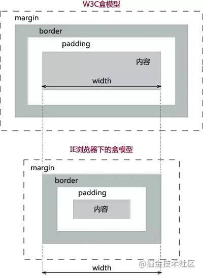
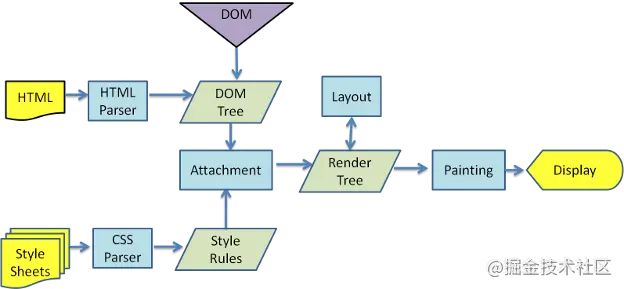
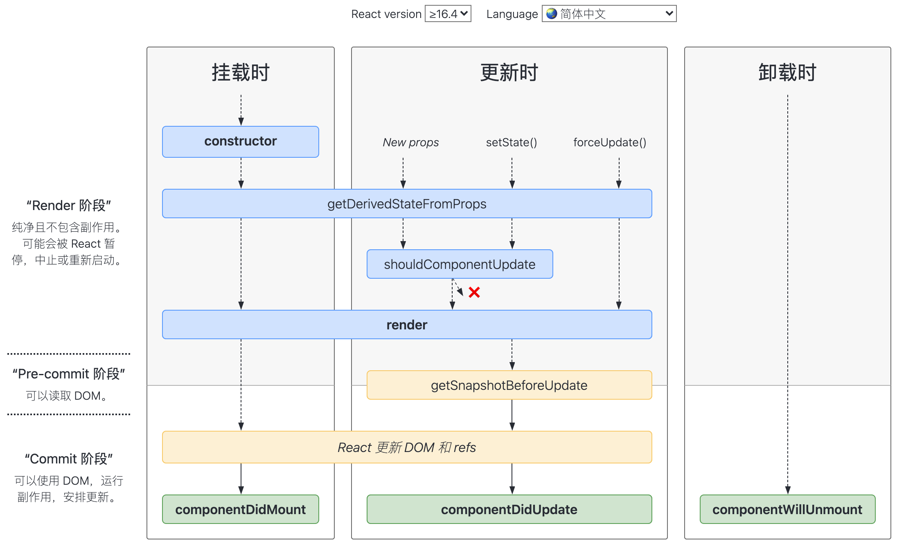
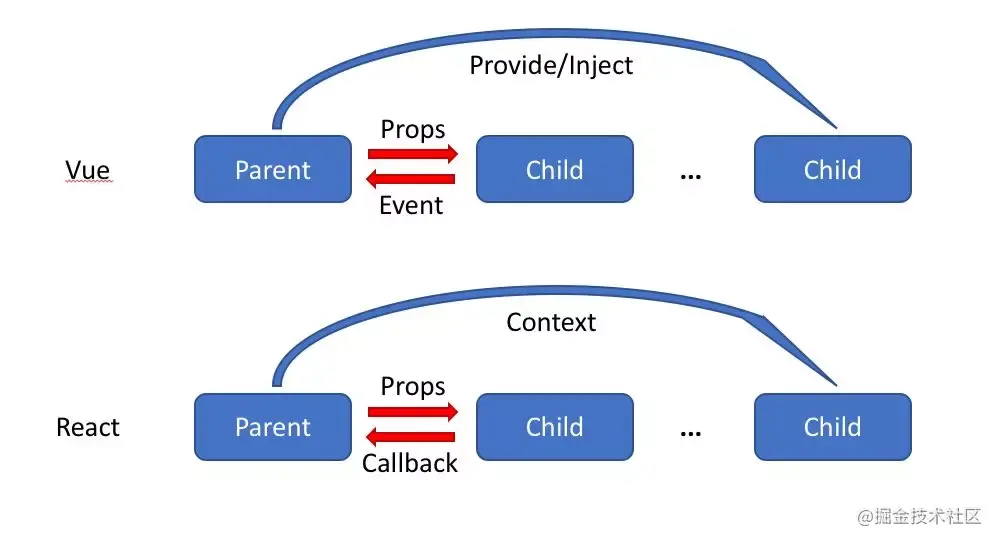
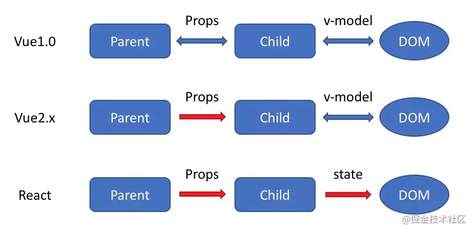
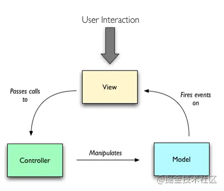
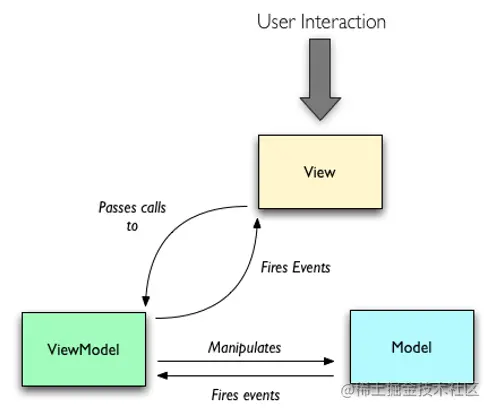
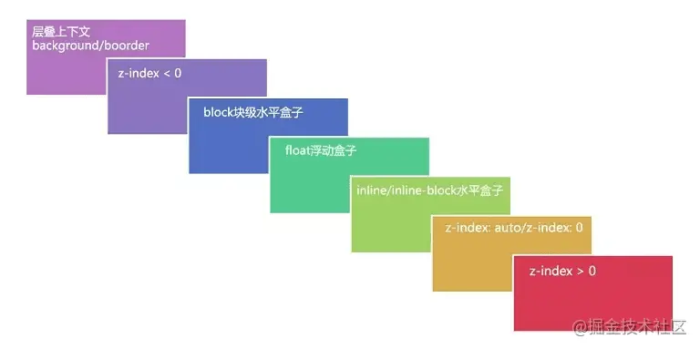

# 子弈面经

原文链接：[面试分享：两年工作经验成功面试阿里P6总结](https://juejin.cn/post/6844903928442667015)

## 有赞（一面）

1. ### 说说 `CSS` 选择器以及这些选择器的优先级

    - `!important`
    - 内联样式（1000）
    - `ID` 选择器（0100）
    - 类选择器/属性选择器/伪类选择器（0010）
    - 元素选择器/伪元素选择器（0001）
    - 关系选择器/通配符选择器（0000）

1. ### 你知道什么是 `BFC` 么

    >小提示：这个问题重点是 `BFC` 是什么，`BFC` 触发的条件有哪些，`BFC` 可以干什么。这里我试着讲解了一下 `Boostrap` 的清除浮动（`display：table` 创建匿名 `table-cell` 间接触发 `BFC`），如果有看到别的场景使用或者自身有使用的场景可以尝试讲解一下使用技巧。这样可以让面试官觉得你不仅仅知道他问的东西是什么，你还能很好的使用它。

    - 什么是 `BFC`
      `BFC` 全称为块级格式化上下文 (`Block Formatting Context`) 。`BFC` 是 `W3C CSS 2.1` 规范中的一个概念，它决定了元素如何对其内容进行定位以及与其他元素的关系和相互作用，当涉及到可视化布局的时候，`Block Formatting Context` 提供了一个环境，`HTML` 元素在这个环境中按照一定规则进行布局。一个环境中的元素不会影响到其它环境中的布局。比如浮动元素会形成 `BFC`，浮动元素内部子元素的主要受该浮动元素影响，两个浮动元素之间是互不影响的。这里有点类似一个 `BFC` 就是一个独立的行政单位的意思。可以说 `BFC` 就是一个作用范围，把它理解成是一个独立的容器，并且这个容器里 `box` 的布局与这个容器外的 `box` 毫不相干。
      <br>

      块格式化上下文包含创建它的元素内部的所有内容.
      <br>

      块格式化上下文对浮动定位（`float`）与清除浮动（`clear`）都很重要。浮动定位和清除浮动时只会应用于同一个 `BFC` 内的元素。浮动不会影响其它 `BFC` 中元素的布局，而清除浮动只能清除同一 `BFC` 中在它前面的元素的浮动。外边距折叠（`Margin collapsing`）也只会发生在属于同一 `BFC` 的块级元素之间。
      <br>

    - 触发 `BFC` 的条件
      - 根元素
      - 浮动元素 (元素的 `float` 不是 `none`)
      - 绝对定位元素 (元素具有 `position` 为 `absolute` 或 `fixed`)
      - 行内块元素 (元素具有 `display: inline-block`)
      - 具有 `overflow` 且值不是 `visible` 的块元素（`hidden | scroll | auto`）
      - 弹性元素（`display: flex | inline-flex` 元素的直接子元素）
      - 网格元素（`display: grid | inline-grid` 元素的直接子元素）
      - 表格单元格 (元素具有 `display: table-cell`，`HTML` 表格单元格默认属性)
      - 表格标题 (元素具有 `display: table-caption`, `HTML` 表格标题默认属性)
      - `display: flow-root` 元素
      - `contain` 值为 `layout、content` 或 `paint` 的元素
      - 多列容器（元素的 `column-count` 或 `column-width` 不为 `auto`，包括 `column-count` 为 `1`）
      - `column-span: all` 的元素始终会创建一个新的 `BFC`，即使该元素没有包裹在一个多列容器中
      - 匿名表格单元格元素（元素的 `display: table | table-row |  table-row-group | table-header-group | table-footer-group`（分别是`HTML table、row、tbody、thead、tfoot` 的默认属性）或 `inline-table`）
      <br>

    - `BFC` 的约束规则
      - 内部的盒会在垂直方向一个接一个排列（可以看作 `BFC` 中有一个的常规流）
      - 处于同一个 `BFC` 中的元素相互影响，可能会发生外边距重叠
      - 每个元素的 `margin box` 的左边，与容器块 `border box` 的左边相接触(对于从左往右的格式化，否则相反)，即使存在浮动也是如此
      - `BFC` 就是页面上的一个隔离的独立容器，容器里面的子元素不会影响到外面的元素，反之亦然
      - 计算 `BFC` 的高度时，考虑 `BFC` 所包含的所有元素，连浮动元素也参与计算
      - 浮动盒区域不叠加到 `BFC` 上
      <br>

    - `BFC` 可以解决的问题
      - 垂直外边距重叠问题
        创建新的 `BFC` 避免两个相邻 `<div>` 之间的外边距合并问题
      - 去除浮动
      - 自适用两列布局（`float + overflow`）
      - 让浮动内容和周围的内容等高
        - 使用 `overflow: auto`
          创建一个会包含这个浮动的 `BFC`，通常的做法是设置父元素 `overflow: auto` 或者设置其他的非默认的 `overflow: visible` 的值。

          设置 `overflow: auto` 创建一个新的 `BFC` 来包含这个浮动。我们的 `<div>` 元素现在变成布局中的迷你布局。任何子元素都会被包含进去。

          使用 `overflow` 来创建一个新的 `BFC`，是因为 `overflow` 属性告诉浏览器你想要怎样处理溢出的内容。当你使用这个属性只是为了创建 `BFC` 的时候，你可能会发现一些不想要的问题，比如滚动条或者一些剪切的阴影，需要注意。另外，对于后续的开发，可能不是很清楚当时为什么使用 `overflow`。所以你最好添加一些注释来解释为什么这样做。
        - 使用 `display: flow-root`
          一个新的 `display` 属性的值，它可以创建无副作用的 `BFC`。在父级块中使用 `display: flow-root` 可以创建新的 `BFC`。

          给 `<div>` `display: flow-root` 属性后，`<div>` 中的所有内容都会参与 `BFC`，浮动的内容不会从底部溢出。

          关于值 `flow-root` 的这个名字，当你明白你实际上是在创建一个行为类似于根元素 （浏览器中的 `<html>` 元素） 的东西时，就能发现这个名字的意义了——即创建一个上下文，里面将进行 `flow layout`。

1. ### 了解盒模型么

    包括**内容区域、内边距区域、边框区域**和**外边距区域**。
    

    `box-sizing: content-box`（`W3C` 盒子模型）：元素的宽高大小表现为内容的大小。
    `box-sizing: border-box`（`IE` 盒子模型）：元素的宽高表现为内容 + 内边距 + 边框的大小。背景会延伸到边框的外沿。
    `IE5.x` 和 `IE6` 在怪异模式中使用非标准的盒子模型，这些浏览器的 `width` 属性不是内容的宽度，而是内容、内边距和边框的宽度的总和。

1. ### 如何实现左侧宽度固定，右侧宽度自适应的布局

    ```html
    <!-- DOM 结构 -->
    <div class="box">
      <div class="box-left"></div>
      <div class="box-right"></div>
    </div>
    ```

    - `float + margin`

      ```css
      .box {
        height: 200px;
      }

      .box > div {
        height: 100%;
      }

      .box-left {
        width: 200px;
        float: left;
        background-color: blue;
      }

      .box-right {
        margin-left: 200px;
        background-color: red;
      }
      ```

    - 利用 `calc` 计算宽度

      ```css
      .box {
        height: 200px;
      }

      .box > div {
        height: 100%;
      }

      .box-left {
        width: 200px;
        float: left;
        background-color: blue;
      }

      .box-right {
        width: calc(100% - 200px);
        float: right;
        background-color: red;
      }
      ```

    - `float + overflow`

      ```css
      .box {
        height: 200px;
      }

      .box > div {
        height: 100%;
      }

      .box-left {
        width: 200px;
        float: left;
        background-color: blue;
      }

      .box-right {
        overflow: hidden; /* 有内容就需要加上 */
        background-color: red;
      }
      ```

    - `flex`
    这里不是最佳答案，应该是使用flex-basis实现更合理

      ```css
      .box {
        height: 200px;
        display: flex;
      }

      .box > div {
        height: 100%;
      }

      .box-left {
        width: 200px;
        background-color: blue;
      }

      .box-right {
        flex-basis: 0;
        flex-grow: 1;
        overflow: hidden; /* 有内容就需要加上 */
        background-color: red;
      }
      ```

1. ### 了解跨域吗，一般什么情况下会导致跨域

    - 跨域行为
      - 同源策略限制、安全性考虑
      - 协议、IP和端口不一致都是跨域行为
      <br>

    - `JSONP`
      `Web` 前端事先定义一个用于获取跨域响应数据的回调函数，并通过没有同源策略限制的 `script` 标签发起一个请求（将回调函数的名称放到这个请求的 `query` 参数里），然后服务端返回这个回调函数的执行，并将需要响应的数据放到回调函数的参数里，前端的 `script` 标签请求到这个执行的回调函数后会立马执行，于是就拿到了执行的响应数据。
      <br>

      缺点：`JSONP` 只能发起 `GET` 请求
      <br>

    - 如何实现一个 `JSONP`
      - [jsonp的原理与实现](https://zhangguixu.github.io/2016/12/02/jsonp/)
      - [json与jsonp区别浅析（json才是目的，jsonp只是手段）](https://www.cnblogs.com/iovec/p/5312464.html)
      - [不要再问我跨域的问题了](https://segmentfault.com/a/1190000015597029)
      <br>

    - `JSONP` 安全性问题
      - `CSRF` 攻击
        前端构造一个恶意页面，请求 `JSONP` 接口，收集服务端的敏感信息。如果 `JSONP` 接口还涉及一些敏感操作或信息（比如登录、删除等操作），那就更不安全了。
        解决方法：验证 `JSONP` 的调用来源（`Referer`），服务端判断 `Referer` 是否是白名单，或者部署随机 `Token` 来防御。
      - `XSS` 漏洞
        不严谨的 `content-type` 导致的 `XSS` 漏洞，想象一下 `JSONP` 就是你请求 `http://youdomain.com?callback=douniwan`, 然后返回 `douniwan({ data })`，那假如请求 `http://youdomain.com?callback=<script>alert(1)</script>` 不就返回 `<script>alert(1)</script>({ data })`了吗，如果没有严格定义好 `Content-Type（ Content-Type: application/json ）`，再加上没有过滤 `callback` 参数，直接当 `html` 解析了，就是一个赤裸裸的 `XSS` 了。
        解决方法：严格定义 `Content-Type: application/json`，然后严格过滤 `callback` 后的参数并且限制长度（进行字符转义，例如 `<` 换成 `&lt`，`>` 换成 `&gt`）等，这样返回的脚本内容会变成文本格式，脚本将不会执行。
        <br>

        **服务器被黑，返回一串恶意执行的代码**
        <br>

        可以将执行的代码转发到服务端进行校验 `JSONP` 内容校验，再返回校验结果。
        <br>

    - `CORS`（跨域资款共享）
      - 什么是 `CORS`
        `CORS`（跨域资源共享 `Cross-origin resource sharing`）允许浏览器向跨域服务器发出 `XMLHttpRequest` 请求，从而克服跨域问题，它需要浏览器和服务器的同时支持。
        - 浏览器端会自动向请求头添加 `origin` 字段，表明当前请求来源。
        - 服务器端需要设置响应头的 `Access-Control-Allow-Methods，Access-Control-Allow-Headers，Access-Control-Allow-Origin` 等字段，指定允许的方法，头部，源等信息。
        - 请求分为简单请求和非简单请求，非简单请求会先进行一次 `OPTION` 方法进行预检，看是否允许当前跨域请求。

      - 简单请求
        请求方法是以下三种方法之一：
        - `HEAD`
        - `GET`
        - `POST`
        <br>

        `HTTP` 的请求头信息不超出以下几种字段：
        - `Accept`
        - `Accept-Language`
        - `Content-Language`
        - `Last-Event-ID`
        - `Content-Type`：只限于三个值 `application/x-www-form-urlencoded、multipart/form-data、text/plain`
        <br>

        后端的响应头信息：

        - `Access-Control-Allow-Origin`：该字段是必须的。它的值要么是请求时 `Origin` 字段的值，要么是一个 `*`，表示接受任意域名的请求。
        - `Access-Control-Allow-Credentials`：该字段可选。它的值是一个布尔值，表示是否允许发送 `Cookie`。
        - `Access-Control-Expose-Headers`：该字段可选。`CORS` 请求时， `XMLHttpRequest` 对象的 `getResponseHeader()` 方法只能拿到 `6` 个基本字段：`Cache-Control、Content-Language、Content-Type、Expires、Last-Modified、Pragma`。如果想拿到其他字段，就必须在 `Access-Control-Expose-Headers` 里面指定。
        <br>

      - 非简单请求
        非简单请求是那种对服务器有特殊要求的请求，比如请求方法是 `PUT` 或 `DELETE`，或者 `Content-Type` 字段的类型是 `application/json`。非简单请求的 `CORS` 请求，会在正式通信之前，增加一次 `HTTP` 查询请求，称为"预检"请求（`preflight`）。
        - `Access-Control-Request-Method`：该字段是必须的，用来列出浏览器的 `CORS` 请求会用到哪些 `HTTP` 方法，上例是`PUT`。
        - `Access-Control-Request-Headers`：该字段是一个逗号分隔的字符串，指定浏览器 `CORS` 请求会额外发送的头信息字段，上例是 `X-Custom-Header`。
        <br>

        如果浏览器否定了"预检"请求，会返回一个正常的 `HTTP` 回应，但是没有任何 `CORS` 相关的头信息字段。这时，浏览器就会认定，服务器不同意预检请求，因此触发一个错误，被 `XMLHttpRequest` 对象的 `onerror` 回调函数捕获。
        <br>

    - `JSONP` 和 `CORS` 的对比
      - `JSONP` 只支持 `GET` 请求，`CORS` 支持所有类型的 `HTTP` 请求
      - `JSONP` 的优势在于支持老式浏览器，以及可以向不支持 `CORS` 的网站请求数据
      <br>

    - 其他跨域解决方案
      - `Nginx` 反向代理
      - `postMessage`
      - `document.domain`

1. ### `HTTP2` 和 `HTTP1` 有什么区别

    相对于 `HTTP1.0`，`HTTP1.1` 的优化：

    - 缓存处理：多了 `Entity tag，If-Unmodified-Since, If-Match, If-None-Match` 等缓存信息（`HTTTP1.0 If-Modified-Since,Expires`）
    - 带宽优化及网络连接的使用
    - 错误通知的管理
    - `Host` 头处理
    - 长连接：`HTTP1.1` 中默认开启 `Connection： keep-alive`，一定程度上弥补了 `HTTP1.0` 每次请求都要创建连接的缺点。
    <br>

    相对于 `HTTP1.1`，`HTTP2` 的优化：

    - `HTTP2` 支持二进制传送（实现方便且健壮），`HTTP1.x` 是字符串传送
    - `HTTP2` 支持多路复用
    - `HTTP2` 采用 `HPACK` 压缩算法压缩头部，减小了传输的体积
    - `HTTP2` 支持服务端推送

1. ### 你能说说缓存么？

    缓存分为**强缓存**和**协商缓存**。强缓存不过服务器，协商缓存需要过服务器，协商缓存返回的状态码是 `304`。两类缓存机制可以同时存在，强缓存的优先级高于协商缓存。当执行强缓存时，如若缓存命中，则直接使用缓存数据库中的数据，不再进行缓存协商。
    <br>

    - 强缓存
      - **`Expires（HTTP1.0）`**：`Exprires` 的值为服务端返回的数据到期时间。当再次请求时的请求时间小于返回的此时间，则直接使用缓存数据。但由于服务端时间和客户端时间可能有误差，这也将导致缓存命中的误差。故现在大多数使用 `Cache-Control` 替代。
      <br>

      - **`Pragma（HTTP1.0）`**：当值为 `"no-cache"` 时强制验证缓存，`Pragma` 禁用缓存，如果又给 `Expires` 定义一个还未到期的时间，那么 `Pragma` 字段的优先级会更高。服务端响应添加 `'Pragma': 'no-cache'`，浏览器表现行为和刷新(`F5`)类似。
      <br>

      - **`Cache-Control（HTTP1.1）`**：
        - `private`：客户端可以缓存
        - `public`：客户端和代理服务器都可以缓存
        - `max-age=t`：缓存内容将在 `t` **秒**后失效
        - `no-cache`：需要使用**协商缓存**来验证缓存数据
        - `no-store`：所有内容都不会缓存
        <br>

        请注意 `no-cache` 指令很多人误以为是不缓存，这是不准确的，`no-cache` 的意思是可以缓存，但每次用应该去想服务器验证缓存是否可用。`no-store` 才是不缓存内容。当在首部字段 `Cache-Control` 有指定 `max-age` 指令时，比起首部字段 `Expires`，会优先处理 `max-age` 指令。命中强缓存的表现形式：`Firefox` 浏览器表现为一个灰色的 `200` 状态码。`Chrome` 浏览器状态码表现为 `200 (from disk cache)` 或是 `200 OK (from memory cache)`。
    - 协商缓存
      协商缓存需要进行对比判断是否可以使用缓存。浏览器第一次请求数据时，服务器会将缓存标识与数据一起响应给客户端，客户端将它们备份至缓存中。再次请求时，客户端会将缓存中的标识发送给服务器，服务器根据此标识判断。若未失效，返回 `304` 状态码，浏览器拿到此状态码就可以直接使用缓存数据了。
      <br>

      - `Last-Modified`：服务器在**响应**请求时，会告诉浏览器资源的最后修改时间。
        - `If-Modified-Since`：浏览器再次**请求**服务器的时候，请求头会包含此字段，后面跟着在缓存中获得的最后修改时间。服务端收到此请求头发现有 `If-Modified-Since`，则与被请求资源的最后修改时间进行对比，如果一致则返回 `304` 和响应报文头，浏览器只需要从缓存中获取信息即可。
          - 如果真的被修改：那么开始传输响应一个整体，服务器返回：`200 OK`
          - 如果没有被修改：那么只需传输响应 `header`，服务器返回：`304 Not Modified`

        - `If-Unmodified-Since`: 从某个时间点算起, 是否文件没有被修改，使用的是相对时间，不需要关心客户端和服务端的时间偏差。

          - 如果没有被修改：则开始'继续'传送文件，服务器返回: `200 OK`
          - 如果文件被修改：则不传输，服务器返回: `412 Precondition failed` (预处理错误)
          <br>

        这两个的区别是一个是修改了才下载一个是没修改才下载。如果在服务器上，一个资源被修改了，但其实际内容根本没发生改变，会因为 `Last-Modified` 时间匹配不上而返回了整个实体给客户端（即使客户端缓存里有个一模一样的资源）。为了解决这个问题，`HTTP1.1` 推出了 `Etag`。
        <br>

      - `Etag`：服务器响应请求时，通过此字段告诉浏览器当前资源在服务器生成的唯一标识（生成规则由服务器决定）
        - `If-Match`：条件请求，携带上一次请求中资源的 `ETag`，服务器根据这个字段判断文件是否有新的修改
        - `If-None-Match`：再次请求服务器时，浏览器的请求报文头部会包含此字段，后面的值为在缓存中获取的标识。服务器接收到次报文后发现 `If-None-Match` 则与被请求资源的唯一标识进行对比。

          - 不同，说明资源被改动过，则响应整个资源内容，返回状态码 `200`。
          - 相同，说明资源无心修改，则响应 `header`，浏览器直接从缓存中获取数据信息。返回状态码 `304`。

        但是实际应用中由于 `Etag` 的计算是使用算法来得出的，而算法会占用服务端计算的资源，所有服务端的资源都是宝贵的，所以就很少使用 `Etag` 了。
        <br>

    - 缓存场景
      对于大部分的场景都可以使用强缓存配合协商缓存解决，但是在一些特殊的地方可能需要选择特殊的缓存策略

      - 对于某些不需要缓存的资源，可以使用 `Cache-control: no-store`，表示该资源不需要缓存
      - 对于频繁变动的资源，可以使用 `Cache-Control: no-cache` 并配合 `ETag` 使用，表示该资源已被缓存，但是每次都会发送请求询问资源是否更新
      - 对于代码文件来说，通常使用 `Cache-Control: max-age=31536000` 并配合策略缓存使用，然后对文件进行指纹处理（`hash`），一旦文件名变动就会立刻下载新的文件
      <br>

    - 刷新场景
      - 浏览器地址栏中写入 `URL`，回车浏览器发现缓存中有这个文件了，不用继续请求了，直接去缓存拿（最快）
      - `F5` 就是告诉浏览器，别偷懒，好歹去服务器看看这个文件是否有过期了。于是浏览器就胆胆襟襟的发送一个请求带上 `If-Modify-since`
      - `Ctrl+F5` 告诉浏览器，你先把你缓存中的这个文件给我删了，然后再去服务器请求个完整的资源文件下来。于是客户端就完成了强行更新的操作

1. ### 能说说首屏加载优化有哪些方案么

    - `Vue-Router` 路由懒加载（利用 `Webpack` 的代码切割）
    - 使用 `CDN` 加速，将通用的库从 `vendor` 进行抽离
    - `Nginx` 的 `gzip` 压缩
    - `Vue` 异步组件
    - 服务端渲染 `SSR`
    - 如果使用了一些 `UI` 库，采用按需加载
      - 路由懒加载
      - 组件动态加载
      - 图片懒加载
    - `Webpack` 开启 `gzip` 压缩
    - 如果首屏为登录页，可以做成多入口
    - `Service Worker` 缓存文件处理
    - 使用 `link` 标签的 `rel` 属性设置 `prefetch`（这段资源将会在未来某个导航或者功能要用到，但是本资源的下载顺序权重比较低，`prefetch` 通常用于加速下一次导航）、`preload`（`preload` 将会把资源得下载顺序权重提高，使得关键数据提前下载好，优化页面打开速度）（`Vue CLI 3` 构建的 `html` 采用）
    - 尽量使用 `HTTP2.0`
    - 加 `Loading` 或者骨架屏（优化体验）
    - 静态文件缓存
    - 去掉 `SourceMap` 及注释
    - 图片格式的选择（`WebP`）
      <table>
        <thead>
          <tr>
            <th>格式</th>
            <th>优点</th>
            <th>缺点</th>
            <th>适用场景</th>
          </tr>
        </thead>
        <tbody>
          <tr>
            <td>GIF</td>
            <td>文件小，支持动画、透明，无兼容性问题</td>
            <td>只支持256种颜色</td>
            <td>色彩简单的 logo、icon、动图</td>
          </tr>
          <tr>
            <td>JPG</td>
            <td>色彩丰富，文件小</td>
            <td>有损压缩，反复保存图片质量下降明显</td>
            <td>色彩丰富的图片/渐变图像</td>
          </tr>
          <tr>
            <td>PNG</td>
            <td>无损压缩，支持透明，简单图片尺寸小</td>
            <td>不支持动画，色彩丰富的图片尺寸大</td>
            <td>logo/icon/透明图</td>
          </tr>
          <tr>
            <td>WebP</td>
            <td>文件小，支持有损和无损压缩，支持动画、透明</td>
            <td>浏览器兼容性不好</td>
            <td>支持 WebP 格式的 app 和 webview</td>
          </tr>
        </tbody>
      </table>

1. ### 如何在 `Node` 端配置路径别名（类似于 `Webpack` 中的 `alias` 配置）

    - 全局变量
    - 环境变量
    - 自己 `HACK` 一个 `@` 符号，指向特定的路径
    - `HACK require` 方法

1. ### 谈谈你对作用域链的理解

    了解作用域链之前我们要知道一下几个概念：

    - 函数的生命周期
    - 变量和函数的声明
    - `Activetion Object（AO）、Variable Object（VO）`
    <br>

      函数的生命周期：

      - 创建：`JS` 解析引擎进行预解析，会将函数声明提前，同时将该函数放到全局作用域中或当前函数的上一级函数的局部作用域中。
      - 执行：`JS` 引擎会将当前函数的局部变量和内部函数进行声明提前，然后再执行业务代码，当函数执行完退出时，释放该函数的执行上下文，并注销该函数的局部变量。
      <br>

      变量和函数的声明：如果变量名和函数名声明时相同，函数优先声明。
      <br>

      `Activetion Object（AO）、Variable Object（VO）`：

      - `AO：Activetion Object`（活动对象）
      - `VO：Variable Object`（变量对象）
      <br>

        `VO` 对应的是函数创建阶段，`JS` 解析引擎进行预解析时，所有的变量和函数的声明，统称为 `Variable Object`。该变量与执行上下文相关，知道自己的数据存储在哪里，并且知道如何访问。`VO` 是一个与执行上下文相关的特殊对象，它存储着在上下文中声明的以下内容：
        - 变量 (`var`, 变量声明);
        - 函数声明 (`FunctionDeclaration`, 缩写为 `FD`);
        - 函数的形参
        <br>

        `AO` 对应的是函数执行阶段，当函数被调用执行时，会建立一个执行上下文，该执行上下文包含了函数所需的所有变量，该变量共同组成了一个新的对象就是 `Activetion Object`。该对象包含了：
        - 函数的所有局部变量
        - 函数的所有命名参数
        - 函数的参数集合
        - 函数的 `this` 指向
        <br>

    作用域链：
    当代码在一个环境中创建时，会创建变量对象的一个作用域链（`scope chain`）来保证对执行环境有权访问的变量和函数。作用域第一个对象始终是当前执行代码所在环境的变量对象（`VO`）。如果是函数执行阶段，那么将其 `activation object（AO）`作为作用域链第一个对象，第二个对象是上级函数的执行上下文 `AO`，下一个对象依次类推。
    <br>

    在《JavaScript深入之变量对象》中讲到，**当查找变量的时候，会先从当前上下文的变量对象中查找，如果没有找到，就会从父级(词法层面上的父级)执行上下文的变量对象中查找，一直找到全局上下文的变量对象，也就是全局对象。这样由多个执行上下文的变量对象构成的链表就叫做作用域链。**

1. ### 你知道 `null` 和 `undefined` 有什么区别么

1. ### 闭包有什么作用

1. ### `Vue` 响应式原理

    响应式原理是一个必问的问题，同时面试官经常也会问 `Vue 3.0` 在响应式原理上的优化方案。

1. ### 了解 `Event Loop` 么

    更多：<https://juejin.cn/post/6844903843197616136#heading-3>
    <br>

    事件触发线程管理的任务队列是如何产生的呢？事实上这些任务就是从 `JS` 引擎线程本身产生的，主线程在运行时会产生执行栈，栈中的代码调用某些异步 `API` 时会在任务队列中添加事件，栈中的代码执行完毕后，就会读取任务队列中的事件，去执行事件对应的回调函数，如此循环往复，形成事件循环机制。`JS` 中有两种任务类型：微任务（`microtask`）和宏任务（`macrotask`），在 `ES6` 中，`microtask` 称为 `jobs`，`macrotask` 称为 `task`：

    - 宏任务： `script`（主代码块）、`setTimeout、setInterval、setImmediate、I/O、UI rendering`
    - 微任务：`process.nextTick（Nodejs）、Promise、Object.observe、MutationObserver`

    `Node.js` 中 `Event Loop` 和浏览器中 `Event Loop` 有什么区别

    ```javascript
       ┌───────────────────────┐
    ┌─>│        timers         │<————— 执行 setTimeout()、setInterval() 的回调
    │  └──────────┬────────────┘
    |             |<-- 执行所有 Next Tick Queue 以及 MicroTask Queue 的回调
    │  ┌──────────┴────────────┐
    │  │     pending callbacks │<————— 执行由上一个 Tick 延迟下来的 I/O 回调（待完善，可忽略）
    │  └──────────┬────────────┘
    |             |<-- 执行所有 Next Tick Queue 以及 MicroTask Queue 的回调
    │  ┌──────────┴────────────┐
    │  │     idle, prepare     │<————— 内部调用（可忽略）
    │  └──────────┬────────────┘     
    |             |<-- 执行所有 Next Tick Queue 以及 MicroTask Queue 的回调
    |             |                   ┌───────────────┐
    │  ┌──────────┴────────────┐      │   incoming:   │ - (执行几乎所有的回调，除了 close callbacks、timers、setImmediate)
    │  │         poll          │<─────┤  connections, │ 
    │  └──────────┬────────────┘      │   data, etc.  │ 
    │             |                   |               | 
    |             |                   └───────────────┘
    |             |<-- 执行所有 Next Tick Queue 以及 MicroTask Queue 的回调
    |  ┌──────────┴────────────┐      
    │  │        check          │<————— setImmediate() 的回调将会在这个阶段执行
    │  └──────────┬────────────┘
    |             |<-- 执行所有 Next Tick Queue 以及 MicroTask Queue 的回调
    │  ┌──────────┴────────────┐
    └──┤    close callbacks    │<————— socket.on('close', ...)
       └───────────────────────┘
    ```

    `Node.js` 中宏任务分成了几种类型，并且放在了不同的 `task queue` 里。不同的 `task queue` 在执行顺序上也有区别，微任务放在了每个 `task queue` 的末尾：

    - `setTimeout/setInterval` 属于 `timers` 类型；
    - `setImmediate` 属于 `check` 类型；
    - `socket` 的 `close` 事件属于 `close callbacks` 类型；
    - 其他 `MacroTask` 都属于 `poll` 类型。
    - `process.nextTick` 本质上属于 `MicroTask`，但是它先于所有其他 `MicroTask` 执行；
    - 所有 `MicroTask` 的执行时机在不同类型的 `MacroTask` 切换后。
    - `idle/prepare` 仅供内部调用，我们可以忽略。
    - `pending callbacks` 不太常见，我们也可以忽略。

1. ### 如何避免回流和重绘

    **浏览器渲染过程**

    
    - 浏览器使用流式布局模型 (`Flow Based Layout`)
    - 浏览器会把 `HTML` 解析成 `DOM`，把 `CSS` 解析成 `CSSOM`，`DOM` 和 `CSSOM` 合并就产生了 `Render Tree`
    - 有了 `Render Tree` 就能知道所有节点的样式，计算节点在页面上的大小和位置，把节点绘制到页面上
    - 由于浏览器使用流式布局，对 `Render Tree` 的计算通常只需要遍历一次就可以完成，但 `table` 及其内部元素除外，通常需要多次计算且要花费3倍于同等元素的时间，这也是为什么要避免使用 `table` 布局的原因之一
    <br>

      浏览器渲染过程如下：
      - 解析 `HTML`，生成 `DOM` 树
      - 解析 `CSS`，生成 `CSSOM` 树
      - 将 `DOM` 树和 `CSSOM` 树结合，生成渲染树(`Render Tree`)
      - `Layout`（回流）：根据生成的渲染树，进行回流（`Layout`），得到节点的几何信息（位置，大小）
      - `Painting`（重绘）：根据渲染树以及回流得到的几何信息，得到节点的绝对像素
      - `Display`：将像素发送给 `GPU`，展示在页面上。（这一步其实还有很多内容，比如会在 `GPU` 将多个合成层合并为同一个层，并展示在页面中。而 `css3` 硬件加速的原理则是新建合成层）
      <br>

    **何时触发回流和重绘**
    <br>

      何时发生回流：
      - 添加或删除可见的 `DOM` 元素
      - 元素的位置发生变化
      - 元素的尺寸发生变化（包括外边距、内边框、边框大小、高度和宽度等）
      - 内容发生变化，比如文本变化或图片被另一个不同尺寸的图片所替代。
      - 页面一开始渲染的时候（这肯定避免不了）
      - 浏览器的窗口尺寸变化（因为回流是根据视口的大小来计算元素的位置和大小的）
      <br>

      何时发生重绘（回流一定会触发重绘）：
      <br>

      **当页面中元素样式的改变并不影响它在文档流中的位置时（例如：`color、background-color、visibility` 等），浏览器会将新样式赋予给元素并重新绘制它，这个过程称为重绘。**
      <br>

      有时即使仅仅回流一个单一的元素，它的父元素以及任何跟随它的元素也会产生回流。现代浏览器会对频繁的回流或重绘操作进行优化，浏览器会维护一个队列，把所有引起回流和重绘的操作放入队列中，如果队列中的任务数量或者时间间隔达到一个阈值的，浏览器就会将队列清空，进行一次批处理，这样可以把多次回流和重绘变成一次。你访问以下属性或方法时，浏览器会立刻清空队列：

      - `clientWidth、clientHeight、clientTop、clientLeft`
      - `offsetWidth、offsetHeight、offsetTop、offsetLeft`
      - `scrollWidth、scrollHeight、scrollTop、scrollLeft`
      - `width、height`
      - `getComputedStyle()`
      - `getBoundingClientRect()`

      以上属性和方法都需要返回最新的布局信息，因此浏览器不得不清空队列，触发回流重绘来返回正确的值。因此，我们在修改样式的时候，**最好避免使用上面列出的属性，他们都会刷新渲染队列。**如果要使用它们，最好将值缓存起来。
      <br>

    **如何避免触发回流和重绘**
    <br>

    `CSS`：
    - 避免使用 `table` 布局。
    - 尽可能在 `DOM` 树的最末端改变 `class`。
    - 避免设置多层内联样式。
    - 将动画效果应用到 `position` 属性为 `absolute` 或 `fixed` 的元素上
    - 避免使用 `CSS` 表达式（例如：`calc()`）
    - `CSS3` 硬件加速（`GPU` 加速）（使用 `transform opacity animation`）
    <br>

    `JavaScript`：
    - 避免频繁操作样式，最好一次性重写 `style` 属性，或者将样式列表定义为 `class` 并一次性更改 `class` 属性
    - 避免频繁操作 `DOM`，创建一个 `documentFragment`，在它上面应用所有 `DOM` 操作，最后再把它添加到文档中
    - 也可以先为元素设置 `display: none`，操作结束后再把它显示出来。因为在 `display` 属性为 `none` 的元素上进行的 `DOM` 操作不会引发回流和重绘
    - 避免频繁读取会引发回流/重绘的属性，如果确实需要多次使用，就用一个变量缓存起来
    - 对具有复杂动画的元素使用绝对定位，使它脱离文档流，否则会引起父元素及后续元素频繁回流

## 有赞（二面）

### 笔试题环节

  一开始面试官就发了两张笔试题试卷，总共四道题目，大致考了以下知识点：

  1. 作用域
  1. 原型链（例如实例属性和原型属性一样，删除实例属性后可以继续访问原型属性问题）
  1. 宏任务和微任务的打印顺序
  1. `Array.prototype.map` 的第二个参数

### 项目问答环节

### 算法题环节

1. ### 1块、4块、5块，求总数 `n` 块的最小硬币数

    ```javascript
    // 要算 n 元要多少个凑完[f(n)]，那我分类嘛：
    //  1.首先拿一个1元的硬币,所以这个分类所需最少硬币数为 f(n-1) + 1
    //  2.首先拿一个4元的硬币,这个分类所需最少硬币数为 f(n-4) + 1
    //  3.首先拿一个5元的硬币,这个分类所需最少硬币数为 f(n-5) + 1
    // 对着三种分类分别求其凑的硬币数，然后取最小值就是最终结果：
    // result = min(f(n-1)+1, f(n-4)+1, f(n-5)+1);
    function getMin(x, y, z) {
      let min = x;
      if (y < min) min = y;
      if (z < min) min = z;
      return min;
    }

    function outputMinNumber(n) {
      if (n === 5 || n === 4 || n === 1) return 1;
      if (n === 2) return 2;
      if (n === 3) return 3;
      if (n <= 0) return 0;
      return getMin(outputMinNumber(n - 1) + 1, outputMinNumber(n - 4) + 1, outputMinNumber(n - 5) + 1);
    }
    ```

1. ### 1、1、2、3、5、8...计算第 `n` 个数的值（斐波那契数列）

    ```javascript
    // 递归 - 太吃内存，卡
    function recurFib (n) {
      if (2 > n) return n;
      return recurFib(n - 1) + recurFib(n - 2);
    }

    // 动态规划 - 最快
    function dpFib (n) {
      var arr = [0, 1];
      if (n < 2) return arr[n];
      for (var i = 2; i <= n; i++) {
        arr[i] = arr[i - 1] + arr[i - 2];
      }
      return arr[n];
    }

    // 迭代
    function iterFib (n) {
      if (2 > n) return n;
      var last = 1;
      var lastLast = 0;
      var now;
      for (var i = 2; i <= n; i++) {
        now = last + lastLast;
        lastLast = last;
        last = now;
      }
      return now;
    }
    ```

## 滴滴（一面）

1. ### 你知道哪些安全问题，如何避免

    - `XSS`（跨站脚本攻击）

      `XSS`（`Cross Site Script`）攻击是指攻击者在网站上注入恶意的客户端代码，通过恶意脚本对客户端网页进行篡改，从而在用户浏览网页时，对用户浏览器进行控制或者获取用户隐私数据的一种攻击方式。
      攻击者对客户端网页注入的恶意脚本一般包括 `JavaScript`，有时也会包含 `HTML` 和 `Flash`。有很多种方式进行 `XSS` 攻击，但它们的共同点为：将一些隐私数据像 `cookie、session` 发送给攻击者，将受害者重定向到一个由攻击者控制的网站，在受害者的机器上进行一些恶意操作。
      <br>

      `XSS` 攻击可以分为3类：**反射型（非持久型）、存储型（持久型）、基于DOM**。
      - 反射型
      反射型 `XSS` 只是简单地把用户输入的数据 “反射” 给浏览器，这种攻击方式往往需要攻击者诱使用户点击一个恶意链接（攻击者可以将恶意链接直接发送给受信任用户，发送的方式有很多种，比如 `email`, 网站的私信、评论等，攻击者可以购买存在漏洞网站的广告，将恶意链接插入在广告的链接中），或者提交一个表单，或者进入一个恶意网站时，注入脚本进入被攻击者的网站。最简单的示例是访问一个链接，服务端返回一个可执行脚本：

        ```javascript
        const http = require('http');
        function handleReequest(req, res) {
            res.setHeader('Access-Control-Allow-Origin', '*');
            res.writeHead(200, {'Content-Type': 'text/html; charset=UTF-8'});
            res.write('<script>alert("反射型 XSS 攻击")</script>');
            res.end();
        }

        const server = new http.Server();
        server.listen(8001, '127.0.0.1');
        server.on('request', handleReequest);
        ```

      - 存储型
      存储型 `XSS` 会把用户输入的数据"存储"在服务器端，当浏览器请求数据时，脚本从服务器上传回并执行。这种 `XSS` 攻击具有很强的稳定性。比较常见的一个场景是攻击者在社区或论坛上写下一篇包含恶意 `JavaScript` 代码的文章或评论，文章或评论发表后，所有访问该文章或评论的用户，都会在他们的浏览器中执行这段恶意的 `JavaScript` 代码：

        ```javascript
        // 例如在评论中输入以下留言
        // 如果请求这段留言的时候服务端不做转义处理，请求之后页面会执行这段恶意代码
        `<script>alert('xss 攻击')</script>`
        ```

      - 基于 `DOM`
      基于 `DOM` 的 `XSS` 攻击是指通过恶意脚本修改页面的 `DOM` 结构，是纯粹发生在客户端的攻击：

        ```html
        <h2>XSS: </h2>
        <input type="text" id="input">
        <button id="btn">Submit</button>
        <div id="div"></div>
        <script>
          const input = document.getElementById('input');
          const btn = document.getElementById('btn');
          const div = document.getElementById('div');

          let val;
          
          input.addEventListener('change', (e) => {
              val = e.target.value;
          }, false);

          btn.addEventListener('click', () => {
              div.innerHTML = `<a href=${val}>testLink</a>`
          }, false);
        </script>
        ```

        点击 `Submit` 按钮后，会在当前页面插入一个链接，其地址为用户的输入内容。如果用户在输入时构造了如下内容：
        `'' onclick=alert(/xss/)`
        用户提交之后，页面代码就变成了：
        `<a href onlick="alert(/xss/)">testLink</a>`
        此时，用户点击生成的链接，就会执行对应的脚本。
        <br>

    - `XSS` 攻击防范
      - **`HttpOnly` 防止劫取 `Cookie`**：`HttpOnly` 最早由微软提出，至今已经成为一个标准。浏览器将禁止页面的 `Javascript` 访问带有 `HttpOnly` 属性的 `Cookie`。上文有说到，攻击者可以通过注入恶意脚本获取用户的 `Cookie` 信息。通常 `Cookie` 中都包含了用户的登录凭证信息，攻击者在获取到 `Cookie` 之后，则可以发起 `Cookie` 劫持攻击。所以，严格来说，`HttpOnly` 并非阻止 `XSS` 攻击，而是能阻止 `XSS` 攻击后的 `Cookie` 劫持攻击。
      - **输入检查**：不要相信用户的任何输入。对于用户的任何输入要进行检查、过滤和转义。建立可信任的字符和 `HTML` 标签白名单，对于不在白名单之列的字符或者标签进行过滤或编码。在 `XSS` 防御中，输入检查一般是检查用户输入的数据中是否包含 `<，>` 等特殊字符，如果存在，则对特殊字符进行过滤或编码，这种方式也称为 `XSS Filter`。而在一些前端框架中，都会有一份 `decodingMap`，用于对用户输入所包含的特殊字符或标签进行编码或过滤，如 `<，>，script`，防止 `XSS` 攻击：

        ```javascript
        // vuejs 中的 decodingMap
        // 在 vuejs 中，如果输入带 script 标签的内容，会直接过滤掉
        const decodingMap = {
          '&lt;': '<',
          '&gt;': '>',
          '&quot;': '"',
          '&amp;': '&',
          '&#10;': '\n'
        }
        ```

      - **输出检查**：用户的输入会存在问题，服务端的输出也会存在问题。一般来说，除富文本的输出外，在变量输出到 `HTML` 页面时，可以使用编码或转义的方式来防御 `XSS` 攻击。例如利用 `sanitize-html` 对输出内容进行有规则的过滤之后再输出到页面中。
      <br>

    - `CSRF/XSRF`（跨站请求伪造）
    `CSRF`（`Cross Site Request Forgery`）是一种劫持受信任用户向服务器发送非预期请求的攻击方式。通常情况下，`CSRF` 攻击是攻击者借助受害者的 `Cookie` 骗取服务器的信任，可以在受害者毫不知情的情况下以受害者名义伪造请求发送给受攻击服务器，从而在并未授权的情况下执行在权限保护之下的操作。

      - `Cookie`
      `Cookie` 是服务器发送到用户浏览器并保存在本地的一小块数据，它会在浏览器下次向同一服务器再发起请求时被携带并发送到服务器上。`Cookie` 主要用于以下三个方面：
        - 会话状态管理（如用户登录状态、购物车、游戏分数或其它需要记录的信息）
        - 个性化设置（如用户自定义设置、主题等）
        - 浏览器行为跟踪（如跟踪分析用户行为等）
        <br>

        而浏览器所持有的 `Cookie` 分为两种：
        - `Session Cookie`（会话期 `Cookie`）：会话期 `Cookie` 是最简单的 `Cookie`，它不需要指定过期时间（`Expires`）或者有效期（`Max-Age`），它仅在会话期内有效，浏览器关闭之后它会被自动删除。
        - `Permanent Cookie`（持久性 `Cookie`）：与会话期 `Cookie` 不同的是，持久性 `Cookie` 可以指定一个特定的过期时间（`Expires`）或有效期（`Max-Age`）。
        <br>

        `res.setHeader('Set-Cookie', ['mycookie=222', 'test=3333; expires=Sat, 21 Jul 2018 00:00:00 GMT;']);`
        上述代码创建了两个 `Cookie：mycookie` 和 `test`，前者属于会话期 `Cookie`，后者则属于持久性 `Cookie`。
      <br>

      - `CSRF` 攻击
      使登录用户访问攻击者的网站，发起一个请求，由于 `Cookie` 中包含了用户的认证信息，当用户访问攻击者准备的攻击环境时，攻击者就可以对服务器发起 `CSRF` 攻击。
      在这个攻击过程中，攻击者借助受害者的 `Cookie` 骗取服务器的信任，但并不能拿到 `Cookie`，也看不到 `Cookie` 的内容。而对于服务器返回的结果，由于浏览器同源策略的限制，攻击者也无法进行解析。（攻击者的网站虽然是跨域的，但是他构造的链接是源网站的，跟源网站是同源的，所以能够携带 `Cookie` 发起访问）。
      但是攻击者无法从返回的结果中得到任何东西，他所能做的就是给服务器发送请求，以执行请求中所描述的命令，在服务器端直接改变数据的值，而非窃取服务器中的数据。例如删除数据、修改数据，新增数据等，无法获取数据。
      <br>

    - `CSRF` 攻击防范
      - **验证码**：验证码被认为是对抗 `CSRF` 攻击最简洁而有效的防御方法。从上述示例中可以看出，`CSRF` 攻击往往是在用户不知情的情况下构造了网络请求。而验证码会强制用户必须与应用进行交互，才能完成最终请求。因为通常情况下，验证码能够很好地遏制 `CSRF` 攻击。但验证码并不是万能的，因为出于用户考虑，不能给网站所有的操作都加上验证码。因此，验证码只能作为防御 `CSRF` 的一种辅助手段，而不能作为最主要的解决方案。
      - **`Referer Check`**：根据 `HTTP` 协议，在 `HTTP` 头中有一个字段叫 `Referer`，它记录了该 `HTTP` 请求的来源地址。通过 `Referer Check`，可以检查请求是否来自合法的"源"。
      - **添加 `token` 验证**：要抵御 `CSRF`，关键在于在请求中放入攻击者所不能伪造的信息，并且该信息不存在于 `Cookie` 之中。可以在 `HTTP` 请求中以参数的形式加入一个随机产生的 `token`，并在服务器端建立一个拦截器来验证这个 `token`，如果请求中没有 `token` 或者 `token` 内容不正确，则认为可能是 `CSRF` 攻击而拒绝该请求。
      <br>

    - 防范 `Vue` 中的 `v-html`指令潜在的 `XSS` 攻击
      1.引入 `xss` 包并挂载到 `Vue` 原型上

      ```javascript
      import xss from 'xss';
      Vue.prototype.xss = xss;
      ```

      2.在 `vue.config.js` 中覆写 `html` 指令

      ```javascript
      chainWebpack: config => {
        config.module
          .rule("vue")
          .use("vue-loader")
          .loader("vue-loader")
          .tap(options => {
            options.compilerOptions.directives = {
              html(node, directiveMeta) {
                (node.props || (node.props = [])).push({
                  name: "innerHTML",
                  value: `xss(_s(${directiveMeta.value}))`
                });
              }
            };
            return options;
          });
      }
      ```

1. ### 说说 `Vue` 中 `$nextTick` 的实现原理

    - **异步更新队列**
      `Vue` 在更新 `DOM` 时是异步执行的。只要侦听到数据变化，`Vue` 将开启一个队列，并缓冲在同一事件循环中发生的所有数据变更。如果同一个 `watcher` 被多次触发，只会被推入到队列中一次。这种在缓冲时去除重复数据对于避免不必要的计算和 `DOM` 操作是非常重要的。然后，在下一个的事件循环“`tick`”中，`Vue` 刷新队列并执行实际 (已去重的) 工作。`Vue` 在内部对异步队列尝试使用原生的 `Promise.then、MutationObserver` 和 `setImmediate`，如果执行环境不支持，则会采用 `setTimeout(fn, 0)` 代替。
      <br>

      例如，当你设置 `vm.someData = 'new value'`，该组件不会立即重新渲染。当刷新队列时，组件会在下一个事件循环“`tick`”中更新。为了在数据变化之后等待 `Vue` 完成更新 `DOM`，可以在数据变化之后立即使用 `Vue.nextTick(callback)`。这样回调函数将在 `DOM` 更新完成后被调用。例如：

      ```html
      <div id="example">{{message}}</div>
      ```

      ```javascript
      var vm = new Vue({
        el: '#example',
        data: {
          message: '123'
        }
      })
      vm.message = 'new message' // 更改数据
      vm.$el.textContent === 'new message' // false
      Vue.nextTick(function () {
        vm.$el.textContent === 'new message' // true
      })
      ```

      在组件内使用 `vm.$nextTick()` 实例方法特别方便，因为它不需要全局 `Vue`，并且回调函数中的 `this` 将自动绑定到当前的 `Vue` 实例上：

      ```javascript
      Vue.component('example', {
        template: '<span>{{ message }}</span>',
        data: function () {
          return {
            message: '未更新'
          }
        },
        methods: {
          updateMessage: function () {
            this.message = '已更新'
            console.log(this.$el.textContent) // => '未更新'
            this.$nextTick(function () {
              console.log(this.$el.textContent) // => '已更新'
            })
          }
        }
      })
      ```

      因为 `$nextTick()` 返回一个 `Promise` 对象，所以你可以使用新的 `ES2017 async/await` 语法完成相同的事情：

      ```javascript
      methods: {
        updateMessage: async function () {
          this.message = '已更新'
          console.log(this.$el.textContent) // => '未更新'
          await this.$nextTick()
          console.log(this.$el.textContent) // => '已更新'
        }
      }
      ```

      从服务端接口去获取数据的时候，数据做了修改，如果我们的某些方法去依赖了数据修改后的 `DOM` 变化，我们就必须在 `nextTick` 后执行。如下：

      ```javascript
      getData(res).then(()=>{
        this.xxx = res.data
        this.$nextTick(() => {
          // 这里我们可以获取变化后的 DOM
        })
      })
      ```

      <br>

    - `$nextTick` 源码（[src/core/util/next-tick.js](https://github.com/vuejs/vue/blob/dev/src/core/util/next-tick.js)）
    <br>

      ```javascript
      /* @flow */
      /* globals MutationObserver */

      import { noop } from 'shared/util'
      import { handleError } from './error'
      import { isIE, isIOS, isNative } from './env'

      export let isUsingMicroTask = false

      const callbacks = []
      let pending = false

      function flushCallbacks () {
        pending = false
        const copies = callbacks.slice(0) // 浅拷贝数组
        callbacks.length = 0 // 清空数组 callbacks => []
        for (let i = 0; i < copies.length; i++) {
          copies[i]()
        }
      }

      let timerFunc

      if (typeof Promise !== 'undefined' && isNative(Promise)) {
        const p = Promise.resolve()
        timerFunc = () => {
          p.then(flushCallbacks)
          if (isIOS) setTimeout(noop)
        }
        isUsingMicroTask = true
      } else if (!isIE && typeof MutationObserver !== 'undefined' && (
        isNative(MutationObserver) ||
        MutationObserver.toString() === '[object MutationObserverConstructor]'
      )) {
        let counter = 1
        const observer = new MutationObserver(flushCallbacks)
        const textNode = document.createTextNode(String(counter))
        observer.observe(textNode, {
          characterData: true
        })
        timerFunc = () => {
          counter = (counter + 1) % 2
          textNode.data = String(counter)
        }
        isUsingMicroTask = true
      } else if (typeof setImmediate !== 'undefined' && isNative(setImmediate)) {
        timerFunc = () => {
          setImmediate(flushCallbacks)
        }
      } else {
        timerFunc = () => {
          setTimeout(flushCallbacks, 0)
        }
      }

      export function nextTick (cb?: Function, ctx?: Object) {
        let _resolve
        callbacks.push(() => {
          if (cb) {
            try {
              cb.call(ctx)
            } catch (e) {
              handleError(e, ctx, 'nextTick')
            }
          } else if (_resolve) {
            _resolve(ctx)
          }
        })
        if (!pending) {
          pending = true
          timerFunc()
        }

        if (!cb && typeof Promise !== 'undefined') {
          return new Promise(resolve => {
            _resolve = resolve
          })
        }
      }
      ```

    - `$nextTick` 源码主要分为两块：
      - 能力检测
      - 根据能力检测以不同方式执行回调队列
      <br>

      - **能力检测**
      `Vue` 在内部对异步队列尝试使用原生的 `Promise.then、MutationObserver` 和 `setImmediate`，如果执行环境不支持，则会采用 `setTimeout(fn, 0)` 代替。
      <br>

        宏任务耗费的时间是大于微任务的，所以在浏览器支持的情况下，优先使用微任务。如果浏览器不支持微任务，使用宏任务；但是，各种宏任务之间也有效率的不同，需要根据浏览器的支持情况，使用不同的宏任务。
        `2.5 Promise > setImmediate > MessageChannel > setTimeout`
        `2.6 Promise > MutationObserver > setImmediate > setTimeout`
        <br>

      - **执行回调队列**
        先把传入的回调函数 `cb` 推入 回调队列 `callbacks` 数组，同时在接收第一个回调函数时，执行能力检测中对应的异步方法 `timerFunc`，在该方法中会使用当前浏览器支持的异步方法去异步执行 `flushCallbacks`，而 `flushCallbacks` 函数中会对 `callbacks` 进行遍历，并执行每一个回调函数。

        ```javascript
        if (!cb && typeof Promise !== 'undefined') {
          return new Promise(resolve => {
            _resolve = resolve
          })
        }
        ```

        这是当 `nextTick` 不传 `cb` 参数的时候，提供一个 `Promise` 化的调用，比如：
        `nextTick().then(() => {})`
        当 `_resolve` 函数执行，就会跳到 `then` 的逻辑中。这里有两个问题需要注意：
        <br>

        - 如何保证只在接收第一个回调函数时执行异步方法？
        `nextTick` 源码中使用了一个异步锁的概念，即接收第一个回调函数时，先关上锁，执行异步方法。此时，浏览器处于等待执行完同步代码就执行异步代码的情况。
        <br>

        - 执行 `flushCallbacks` 函数时为什么需要备份回调函数队列？执行的也是备份的回调函数队列？
        因为，会出现这么一种情况：`nextTick` 的回调函数中还使用 `nextTick`。如果 `flushCallbacks` 不做特殊处理，直接循环执行回调函数，会导致里面nextTick 中的回调函数会进入回调队列。

1. ### `Vue` 响应式原理?

1. ### 谈谈对闭包的理解

1. ### `JSONP` 的实现原理

1. ### `CSS` 中的 `BFC`

1. ### 如何实现居中

    - 水平居中

      - 若是行内元素，给其父元素设置 `text-align: center` 即可实现行内元素水平居中
      - 若是块级元素，该元素设置 `margin:0 auto` 即可（元素需要定宽）
      - 若是块级元素，设置父元素为 `flex` 布局，子元素设置 `margin:0 auto` 即可（子元素不需要定宽）
      - 使用 `flex` 父元素设置如下:

        ```css
        .parent {
          display: flex;
          justify-content: center;
        }
        ```

      - `transform` + 绝对定位

        ```css
        .parent {
          position: relative;
        }

        .child {
          position: absolute;
          left: 50%;
          transform: translate(-50%, 0);
        }
        ```

      - `margin-left`（元素定宽）+ 绝对定位

        ```css
        .parent {
          position: relative;
        }

        .child {
          position: absolute;
          left: 50%;
          width: 100px; // 定宽
          margin-left: -50px; // 不能使用 %
        }
        ```

    - 垂直居中

      - 若元素是单行文本, 则可设置 `line-height` 等于父元素高度
      - 若是块级元素，设置父元素为 `flex` 布局，子元素设置 `margin: auto 0` 即可（子元素不需要定宽）
      - 若元素是行内块级元素，使用伪元素让内容块居中：

        ```css
        .parent {
          height: 100px;
        }

        .parent::after, .child {
          display: inline-block;
          vertical-align: middle;
        }

        .parent::after {
          content: '';
          height: 100%;
        }
        ```

      - 居中元素高度不定

        - 设置 `display: table` 属性（`vertical-align` 只对父层为 `td` 或 `th` 时才生效：

          ```css
          .parent {
            height: 100px;
            display: table;
          }

          .child {
            display: table-cell;
            vertical-align: middle;
          }
          ```

        - `flex`：

          ```css
          .parent {
            display: flex;
            align-items: center;
          }
          ```

          优点：内容块的宽高任意, 优雅的溢出。可用于更复杂高级的布局技术中。
          缺点：`IE8/IE9` 不支持、需要浏览器厂商前缀、渲染上可能会有一些问题。

        - `transform` + 绝对定位：

          ```css
          .parent {
            position: relative;
          }

          .child {
            position: absolute;
            top: 50%;
            transform: translate(0, -50%);
          }
          ```

          缺点：`IE8` 不支持, 属性需要追加浏览器厂商前缀，可能干扰其他 `transform` 效果，某些情形下会出现文本或元素边界渲染模糊的现象。

      - 居中元素高度固定

        - `margin-top`（元素定宽）+ 绝对定位:

          ```css
          .parent {
            position: relative;
          }

          .child {
            position: absolute;
            top: 50%;
            height: 50px;
            margin-top: -25px; // 不能使用 %
          }
          ```

        - 绝对定位 + 0:

          ```css
          .parent {
            position: relative;
          }

          .child {
            position: absolute;
            top: 0;
            bottom: 0;
            margin: auto 0;
          }
          ```

    - 水平垂直居中

      - `Flex`（子元素是块级元素）

        ```css
        .parent {
          display: flex;
        }

        .child {
          margin: auto;
        }
        ```

      - `Flex`

        ```css
        .parent {
          display: flex;
          justify-content: center;
          align-items: center;
        }
        ```

      - 绝对定位实现(定位元素定宽定高)

        ```css
        .parent {
          position: relative;
        }

        .child {
          position: absolute;
          left: 0;
          right: 0;
          bottom: 0;
          top: 0;
          margin: auto;
        }
        ```

1. ### 用过 `Flex` 么，能简单介绍一下么？那 `Grid` 呢？

1. ### `bind` 的源码实现

    ```js
    Function.prototype.call = function (context, ...args) {
      context = context || window  // context 如果是 null，则指向 window
      var fn = Symbol()
      context[fn] = this
      var result = context[fn](...args)
      delete context[fn]
      return result
    }

    Function.prototype.apply = function (context, args) {
      context = context || window  // context 如果是 null，则指向 window
      var fn = Symbol()
      context[fn] = this
      var result
      args ? (result = context[fn](...args)) : (result = context[fn]())
      delete context[fn]
      return result
    }

    // 尤雨溪版本
    Function.prototype.bind = function (context) {
      if (typeof this !== 'function') {
        throw new TypeError("Function.prototype.bind - what is trying to be bound is not callable");
      }
      var fn    = this, // the function to bind
          slice = Array.prototype.slice, // cache slice method
          args  = slice.call(arguments, 1), // get the array of addtional arguments (to be curried)
          noop = function () {}, // the intermediate function to serve as a prototype chain connector
                                // (assuming we don't have Object.create() here)
          bound = function () {
              var ctx = this instanceof noop && context
                  ? this
                  : context
              return fn.apply(ctx, args.concat(slice.call(arguments)))
          }
      // inherit the prototype of the to-be-bound function
      noop.prototype = fn.prototype
      bound.prototype = new noop()
      return bound
    }

    function myFun (argumentA, argumentB) {
      console.log(this.value)
      console.log(argumentA)
      console.log(argumentB)
      return this.value
    }

    let obj = {
      value: 'ziyi2'
    }
    console.log(myFun.myCall(obj, 11, 22))
    console.log(myFun.myApply(obj, [11, 22]))
    console.log(myFun.myBind(obj, 33)(11, 22))
    ```

1. ### 伪类和伪元素的区别

    伪类和伪元素是用来修饰不在文档树中的部分，比如，一句话中的第一个字母，或者是列表中的第一个元素。下面分别对伪类和伪元素进行解释：
    - 伪类用于当已有元素处于的某个状态时，为其添加对应的样式，这个状态是根据用户行为而动态变化的。比如说，当用户悬停在指定的元素时，我们可以通过 `:hover` 来描述这个元素的状态。虽然它和普通的 `CSS` 类相似，可以为已有的元素添加样式，但是它只有处于 `DOM` 树无法描述的状态下才能为元素添加样式，所以将其称为伪类。
    - 伪元素用于创建一些不在文档树中的元素，并为其添加样式。比如说，我们可以通过 `::before` 来在一个元素前增加一些文本，并为这些文本添加样式。虽然用户可以看到这些文本，但是这些文本实际上不在文档树中。
    <br>

    区别
    - 伪类的操作对象是文档树中已有的元素，而伪元素则创建了一个文档树外的元素。因此，伪类与伪元素的区别在于：**有没有创建一个文档树之外的元素**。
    - `CSS3` 规范中的要求使用双冒号(`::`)表示伪元素，以此来区分伪元素和伪类，比如 `::before` 和 `::after` 等伪元素使用双冒号(`::`)，`:hover` 和 `:active` 等伪类使用单冒号(`:`)。除了一些低于 `IE8` 版本的浏览器外，大部分浏览器都支持伪元素的双冒号(`::`)表示方法。

## 51信用卡（一面）

1. ### 说说 `DOM` 事件流

1. ### 在 `ES5` 中如何实现继承

    小提示：这里我说了很多，从借用构造函数到组合继承到寄生组合继承，但面试官其实最想听到的是寄生组合继承。面试官还追问我具体要如何实现寄生组合继承。当然这里其实问的问题还可以很多，比如ES6的类继承和ES5中的继承有什么区别。

1. ### 绝对定位

    小提示：这个建议大家好好回忆一下，例如子元素是相对父元素的 `padding、border` 还是 `content` 进行定位之类的，当时面试官问的就这么细。

1. ### 消抖和节流

    小提示：面试官只是问了一下具体的使用场景，没有问实现原理。

    ```javascript
    // 简单消抖
    function debounce (fn, wait = 1000) {
      let timeOutId
      return function () {
        let context = this
        if (timeOutId) clearTimeout(timeOutId)
        timeOutId = setTimeout(() => {
          fn.apply(context, arguments)
        }, wait)
      }
    }

    // 带立即执行参数的消抖
    function debounceImmediate (fn, wait = 1000, immediate) {
      let timeOutId, context, args
      const later = (immediate) => setTimeout(() => {
        if (!immediate) {
          fn.apply(context, args)
          timeOutId = context = args = null
        }
      }, wait)

      return function () {
        if (!timeOutId) {
          timeOutId = later(true)
          if (immediate) fn.apply(this, arguments)
          context = this
          args = arguments
        } else {
          clearTimeout(timeOutId)
          timeOutId = later(false)
        }
      }
    }
    
    // 节流
    function throttle (fn, wait) {
      let timeoutId = null
      return function () {
        let context = this
        if (!timeoutId) {
          timeoutId = setTimeout(() => {
            fn.apply(context, arguments)
            timeoutId = null
          }, wait)
        }
      }
    }
    ```

1. ### `Vue` 中的 `computed` 实现原理

    小提示：这个问题面试官问的很细，绝对是想问你是否阅读过源码。他首先问 `computed` 的实现原理，其次问了这样一个问题：现在有两个 `computed` 计算值，其中一个 `computed` 计算值为什么可以依赖另外一个 `computed` 计算值。这里顺便将 `watch` 的实现原理也贴上。
    <br>

    **`watch` 的实现原理**

      - `watcher` 的分类：
        - `deep watch`（深层次监听）
        - `user watch`（用户监听）
        - `computed watcher`（计算属性）
        - `sync watcher`（同步监听）
        <br>

      - `watch` 实现过程：
        - `watch` 的初始化在 `data` 初始化之后（此时的 `data` 已经通过 `Object.defineProperty` 的设置成响应式）
        - `watch` 的 `key` 会在 `Watcher` 里进行值的读取，也就是立马执行 `get` 获取 `value`（从而实现 `data` 对应的 `key` 执行 `getter` 实现对于 `watch` 的依赖收集），此时如果有 `immediate` 属性那么立马执行 `watch` 对应的回调函数
        - 当 `data` 对应的 `key` 发生变化时，触发 `user watch` 实现 `watch` 回调函数的执行
        <br>

    **`computed` 运行原理**

    - `computed` 的属性是动态挂载到 `vm` 实例上的，和普通的响应式数据在 `data` 里声明不同
    - 设置 `computed` 的 `getter`，如果执行了 `computed` 对应的函数，由于函数会读取 `data` 属性值，因此又会触发 `data` 属性值的 `getter` 函数，在这个执行过程中就可以处理 `computed` 相对于 `data` 的依赖收集关系了
    - 首次计算 `computed` 的值时，会执行 `vm.computed` 属性对应的 `getter` 函数（用户指定的 `computed` 函数，如果没有设置 `getter`，那么将当前指定的函数赋值 `computed` 属性的 `getter`），进行上述的依赖收集
    - 如果 `computed` 的属性值又依赖了其他 `computed` 计算属性值，那么会将当前 `target` 暂存到栈中，先进行其他 `computed` 计算属性值的依赖收集，等其他计算属性依赖收集完成后，在从栈中 `pop` 出来，继续进行当前 `computed` 的依赖收集

      ```javascript
      var vm = new Vue({
        el: '#demo',
        data: {
          firstName: 'Foo',
          lastName: 'Bar'
        },
        computed: {
          fullName: function () {
            return this.firstName + ' ' + this.lastName
          }
        }
      })
      ```

      由于 `this.firstName` 和 `this.lastName`（上面是 `Vue` 官方示例）都是响应式变量，因此会触发它们的 `getter`，根据我们之前的分析，它们会把自身持有的 `dep` 添加到当前正在计算的 `watcher` 中，这个时候 `Dep.target` 就是这个 `computed watcher`，具体步骤如下：

      - `data` 属性初始化 `getter setter`
      - `computed` 计算属性初始化，提供的函数将用作属性 `vm.fullName` 的 `getter`
      - 当首次获取 `fullName` 计算属性的值时，`Dep` 开始依赖收集
      - 在执行 `message getter` 方法时，如果 `Dep` 处于依赖收集状态，则判定 `firstName` 和 `lastName` 为 `fullName` 的依赖，并建立依赖关系
      - 当 `firstName` 或 `lastName` 发生变化时，根据依赖关系，触发 `fullName` 的重新计算
      - 如果计算值没有发生变化，不会触发视图更新
      <br>

      通过以上的分析，我们知道计算属性本质上就是一个 `computed watcher`，也了解了它的创建过程和被访问触发 `getter` 以及依赖更新的过程，其实这是最新的计算属性的实现，之所以这么设计是因为 `Vue` 想确保不仅仅是计算属性依赖的值发生变化，而是当计算属性最终计算的值发生变化才会触发渲染 `watcher` 重新渲染，本质上是一种优化。
      <br>

    **`computed` 计算值为什么还可以依赖另外一个 `computed` 计算值？**
    <br>

    假如计算属性 A 依赖计算属性 B，而计算属性 B 又依赖响应式数据 C，那么最一开始先把计算属性 AB 都转化为 watcher，然后在把计算属性 AB 挂载到 vm 上面的时候，插入了一段 getter，而计算属性 B 的这个 getter 在这个计算属性 B 被读取的时候会把计算属性 A 的 watcher 添加到响应式数据 C 的依赖里面，所以响应式数据 C 在改变的时候会先后导致计算属性 B 和 A 执行 update，从而发生改变。
    <br>

    关键词：**发布订阅模式、找依赖、依次运行**

1. ### 周期函数有哪些（`beforeCreated` 和 `created` 中间都做了什么）

    依次初始化：`injections、props、methods、data、computed、watcher、provide`
    官方源码 [src/core/instance/init.js](https://github.com/vuejs/vue/blob/dev/src/core/instance/init.js)：

    ```javascript
    // @/core/instance/init.js
    if (process.env.NODE_ENV !== 'production') {
      initProxy(vm)
    } else {
      vm._renderProxy = vm
    }
    // expose real self
    vm._self = vm
    initLifecycle(vm)
    initEvents(vm)
    initRender(vm)
    callHook(vm, 'beforeCreate')
    initInjections(vm) // resolve injections before data/props
    initState(vm)
    initProvide(vm) // resolve provide after data/props
    callHook(vm, 'created')

    // @/core/instance/state.js
    export function initState (vm: Component) {
      vm._watchers = []
      const opts = vm.$options
      if (opts.props) initProps(vm, opts.props)
      if (opts.methods) initMethods(vm, opts.methods)
      if (opts.data) {
        initData(vm)
      } else {
        observe(vm._data = {}, true /* asRootData */)
      }
      if (opts.computed) initComputed(vm, opts.computed)
      if (opts.watch && opts.watch !== nativeWatch) {
        initWatch(vm, opts.watch)
      }
    }
    ```

## 阿里部门未知（一面）

1. ### 说说 `Webpack` 的实现原理

1. ### 首屏优化有哪些解决方案

    同上
    <br>

1. ### `Node.js` 的加载机制（`require` 和 `module.exports`）

    ```javascript
    exports = module.exports = somethings

    // 等价于
    module.exports = somethings 
    exports = module.exports
    ```

    原理很简单，即 `module.exports` 指向新的对象时，`exports` 断开了与 `module.exports` 的引用，那么通过 `exports = module.exports` 让 `exports` 重新指向 `module.exports` 即可。

1. ### 你觉得你最擅长什么

1. ### `React` 和 `Vue` 的区别

    - 共同点
      - 使用 `Virtual DOM`
      - 提供了响应式 (`Reactive`) 和组件化 (`Composable`) 的视图组件。
      - 将注意力集中保持在核心库，而将其他功能如路由和全局状态管理交给相关的库。
    - 不同点
      - 生命周期不同
        - `Vue`
          - [`beforeCreate`](https://cn.vuejs.org/v2/api/#beforeCreate) => [`created`](https://cn.vuejs.org/v2/api/#created) => [`beforeMount`](https://cn.vuejs.org/v2/api/#beforeMount) => [`mounted`](https://cn.vuejs.org/v2/api/#mounted) => [`beforeUpdate`](https://cn.vuejs.org/v2/api/#beforeUpdate) => [`updated`](https://cn.vuejs.org/v2/api/#updated) => [`beforeDestory`](https://cn.vuejs.org/v2/api/#beforeDestroy) => [`destroyed`](https://cn.vuejs.org/v2/api/#destroyed)
          - [`activated`](https://cn.vuejs.org/v2/api/#activated) => [`deactivated`](https://cn.vuejs.org/v2/api/#deactivated)
          - [`errorCaptured`](https://cn.vuejs.org/v2/api/#errorCaptured)
        
        - React
          - 挂载时：[`constructor`](https://zh-hans.reactjs.org/docs/react-component.html#constructor) => [`getDerivedStateFromProps`](https://zh-hans.reactjs.org/docs/react-component.html#static-getderivedstatefromprops) => [`render`](https://zh-hans.reactjs.org/docs/react-component.html#render) => `React` 更新 `DOM` 和 `refs` => [`componentDidMount`](https://zh-hans.reactjs.org/docs/react-component.html#componentdidmount)
          - 更新时：`New props`/[`setState()`](https://zh-hans.reactjs.org/docs/react-component.html#setstate)/[`forceUpdate()`](https://zh-hans.reactjs.org/docs/react-component.html#forceupdate) => [`getDerivedStateFromProps`](https://zh-hans.reactjs.org/docs/react-component.html#static-getderivedstatefromprops) => [`shouldComponentUpdate`](https://zh-hans.reactjs.org/docs/react-component.html#shouldcomponentupdate) => [`render`](https://zh-hans.reactjs.org/docs/react-component.html#render)/`no render(stop next)` => [`getSnapshotBeforeUpdate`](https://zh-hans.reactjs.org/docs/react-component.html#getsnapshotbeforeupdate) => `React` 更新 `DOM` 和 `refs` => [`componentDidUpdate`](https://zh-hans.reactjs.org/docs/react-component.html#componentdidupdate)
          - 卸载时：[`componentWillUnmount`](https://zh-hans.reactjs.org/docs/react-component.html#componentwillunmount)
        
        <br>

      - 更新数据的方法不同
        - `Vue`：`this`
        - `React`：`this.setState`
        <br>

      - 组合/混入不同功能
        - `Vue`：[`Mixins`](https://cn.vuejs.org/v2/guide/mixins.html)
        - `React`：[`HOC`（高阶组件）](https://zh-hans.reactjs.org/docs/higher-order-components.html)
        <br>

      - 组件通信的区别
        - `Vue`：`this.$emit()、callback`
        - `React`：`callback`
        
        <br>

      - `Hook`
        - `Vue`：没有（`Vue3.0` 有）
        - `React`：有
        <br>

      - 条件/循环渲染
        - `Vue`：`v-if`、`v-show`、`v-for`、`template`
        - `React`：`map`、`if`、`&&`、三元操作符
        <br>

      - `diff`算法不同
        - `Vue` 会跟踪每一个组件的依赖关系，不需要重新渲染整个组件树。
        - `React` 每当应用的状态被改变时，全部组件都会重新渲染，所以需要 `shouldComponentUpdate` 这个生命周期函数方法来进行控制。
        1. 比较变量
           - `Vue` 维护四个变量：
             - `oldStartIdx` => 旧头索引
             - `oldEndIdx` => 旧尾索引
             - `newStartIdx` => 新头索引
             - `newEndIdx` => 新尾索引

             两边方向同时比较，由新的位置来获取真实 `DOM`；如果老的先走完，就添加；如果新的先走完，就删除
             <br>

           - `React` 维护三个变量：
             - `nextIndex`：（往右）遍历 `nextChildren` 时的 `index`，每遍历一个元素加1（遍历新节点）
             - `lastPlacedIndex`： 从上一次 `prevChildren` 中取出的元素的 `index`（对应新节点），相当于一个比较指引，当发生移动时 `lastPlacedIndex` 值保持上一次比较值，不做移动时使用 `oldIndex` 值
             - `oldIndex`： 元素在数组中的位置（对应旧节点位置），根据 `nextIndex` 在旧结点中寻找对应的元素，若有，比较 `oldIndex` 和 `lastPlacedIndex`，若无，则添加

             节点移动前提是：`oldIndex` < `lastPlacedIndex`
             移动的原则：
             - 首个节点（指的是新节点）不执行移动操作（除非它要被移除），以该节点为原点，其它节点都去寻找自己的新位置;
             - 将原来的元素往右移，通过 `lastIndex` 来控制。在 `lastIndex` 左边的，就往 `lastIndex` 右边移动；在 `lastIndex` 右边的，就不需要动。
             <br>

        2. 比对方式
           - `Vue` 采用从两端到中间的比对方式，而 `React` 采用从左往右依次比对的方式。当一个集合，把最后一个节点移动到第一个，`React` 会把前面的节点依次移动，而 `Vue` 只会把最后一个节点移动到第一个。总体上，`Vue` 的对比方式更高效。

           - `Vue` 比对节点，当节点元素类型相同，而 `className` 不同，认为是不同类型元素，删除重建，而 `React` 会认为是同类型节点，只是修改节点属性

           `React` 只比较节点类型，`key`

            ```javascript
            function sameVnode(vnode1: VNode, vnode2: VNode): boolean {
              return vnode1.key === vnode2.key && vnode1.sel === vnode2.sel;
            }
            ```

           `Vue` 比较节点类型，`key`，属性

            ```javascript
            function sameVnode (a, b) {
              return (
                a.key === b.key &&  // key值
                a.tag === b.tag &&  // 标签名
                a.isComment === b.isComment &&  // 是否为注释节点
                // 是否都定义了data，data包含一些具体信息，例如onclick , style
                isDef(a.data) === isDef(b.data) &&  
                sameInputType(a, b) // 当标签是<input>的时候，type必须相同
              )
            }
            ```

           <br>

        3. 遍历原理
           - `React` 首位是除删除外是固定不动的，然后依次遍历对比
           - `Vue` 的 `compile` 阶段的 `optimize` 标记了 `static` 点，可以减少 `differ` 次数,而且是采用双向遍历方法

        4. 更新 `DOM` 逻辑
           - `Vue` 基于 `snabbdom` 库，它有较好的速度以及模块机制。`Vue Diff` 使用双向链表，边对比，边更新 `DOM`。
           - `React` 主要使用 `diff` 队列保存需要更新哪些 `DOM`，得到 `patch` 树，再统一操作批量更新 `DOM`。
           <br>

        5. 相同点
           - 虚拟 `DOM` 在比较时只比较同一层级节点，复杂度都为 `O(n)`，降低了算法复杂度
           - 都使用 `key` 比较是否是相同节点，都是为了尽可能的复用节点
           - 都是操作虚拟 `DOM`，最小化操作真实 `DOM`，提高性能（其实虚拟 `DOM` 的优势并不是在于它操作 `DOM` 快）
           - 都是不要用 `index` 作为 `key`
           <br>

      - 核心思想不同
        - `Vue` 早期定位是**尽可能的降低前端开发的门槛**。所以 `Vue` **推崇灵活易用（渐进式开发体验），数据可变，双向数据绑定（依赖收集）**
        - `React` 早期口号是**反思最佳体验**。`React` **推崇函数式编程（纯组件），数据不可变以及单向数据流**。函数式编程最大的好处是其稳定性（无副作用）和可测试性（输入相同，输出一定相同），所以通常大家说的 `React` 适合大型应用，根本原因还是在于其函数式编程。
        <br>

        1. 核心思想不同导致写法差异
           - `Vue` 推崇 `template`（简单易懂，从传统前端转过来易于理解）、单文件 `Vue`。而且虽然 `Vue2.0` 以后使用了 `Virtual DOM`，使得 `Vue` 也可以使用 `JSX`（`babel` 工具转换支持），但 `Vue` 官方依然首先推荐 `template`，这跟 `Vue` 的核心思想和定位有一定关系。
           - `React` 推崇 `JSX、HOC、all in js`。
           <br>

        2. 核心思想不同导致 `api` 差异
           - `Vue` 定位简单易上手，基于 `template` 模板 + `options API`，所以不可避免的有较多的概念和 `api`。比如 `template` 模板中需要理解 `slot`、`filter`、指令等概念和 `api`，`options API` 中需要理解 `watch`、`computed`（依赖收集）等概念和 `api`。
           - `React` 本质上核心只有一个 `Virtual DOM + Diff` 算法，所以 `API` 非常少，知道 `setState` 就能开始开发了。
           <br>

        3. 核心思想不同导致社区差异
           - 由于 `Vue` 定义简单易上手，能快速解决问题，所以很多常见的解决方案，是 `Vue` 官方主导开发和维护。比如状态管理库 `Vuex`、路由库 `Vue-Router`、脚手架 `Vue-CLI`、`Vutur` 工具等。
           - `React` 只关注底层，上层应用解决方案大部分都丢给社区去解决。比如状态管理库方面，有 `redux、mobx、redux-sage、dva` 等一大堆，所以这也造就了 `React` 社区非常繁荣。
           <br>

        4. 核心思想不同导致未来升级方向不同
           - `Vue` 依然会定位简单易上手（渐进式开发），依然是考虑通过依赖收集来实现数据可变。这点从 `Vue3` 核心更新内容可以看到：`template` 语法基本不变、`options api` 只增加了 `setup` 选项（`composition api`）、基于依赖收集（`Proxy`）的数据可变。
           - `React` 的函数式编程。`React` 核心思想，是把 `UI` 作为 `Basic Type`，比如 `String、Array` 类型，然后经过 `render` 处理，转换为另外一个 `value`（纯函数）。从 `React Hooks` 可以看出，`React` 团队致力于组件函数式编程（纯组件，无 `class` 组件），尽量减少副作用（减少 `this`，`this` 会引起副作用）。
           <br>

      - 组件实现不同
        - `Vue` 源码实现是把 `options` 挂载到 `Vue` 核心类上，然后再 `new Vue({options})` 拿到实例（`Vue` 组件的 `script` 导出的是一个挂满 `options` 的纯对象而已）。所以 `options api` 中的 `this` 指向内部 `Vue` 实例，对用户是不透明的，所以需要文档去说明 `this.slot、this.slot、this.slot、this.xxx` 这些 `api`。另外 `Vue` 插件都是基于 `Vue` 原型类基础之上建立的，这也是 `Vue` 插件使用 `Vue.install` 的原因，因为要确保第三方库的 `Vue` 和当前应用的 `Vue` 对象是同一个。
        - `React` 内部实现比较简单，直接定义 `render` 函数以生成 `VNode`，而 `React` 内部使用了四大组件类包装 `VNode`，不同类型的 `VNode` 使用相应的组件类处理，职责划分清晰明了（后面的 `Diff` 算法也非常清晰）。`React` 类组件都是继承自 `React.Component` 类，其 `this` 指向用户自定义的类，对用户来说是透明的。
        <br>

      - 响应式原理不同
        - `Vue`
          - `Vue` 依赖收集，自动优化，数据可变。
          - `Vue` 递归监听 `data` 的所有属性,直接修改。
          - 当数据改变时，自动找到引用组件重新渲染。
        - `React`
          - `React` 基于状态机，手动优化，数据不可变，需要 `setState` 驱动新的 `State` 替换老的 `State`。
          - 当数据改变时，以组件为根目录，默认全部重新渲染
          <br>

      - 事件机制不同
        - `Vue`
          - `Vue` 原生事件使用标准 `Web` 事件
          - `Vue` 组件自定义事件机制，是父子组件通信基础
          - `Vue` 合理利用了 `snabbdom` 库的模块插件
        - `React`
          - `React` 原生事件被包装，所有事件都冒泡到顶层 `document` 监听，然后在这里合成事件下发。基于这套，可以跨端使用事件机制，而不是和 `Web DOM` 强绑定。
          - `React` 组件上无事件，父子组件通信使用 `props`
          <br>

      - 数据可变性
        - `React` 整体是函数式的思想，把组件设计成纯组件，状态和逻辑通过参数传入，所以在 `React` 中，是单向数据流，推崇结合 `immutable` 来实现数据不可变。`React` 在 `setState` 之后会重新走渲染的流程，如果 `shouldComponentUpdate` 返回的是 `true`，就继续渲染，如果返回了 `false`，就不会重新渲染，`PureComponent` 就是重写了 `shouldComponentUpdate`，然后在里面作了 `props` 和 `state` 的浅层对比。
        - `Vue` 的思想是响应式的，也就是基于是数据可变的，通过对每一个属性建立 `Watcher` 来监听，当属性变化的时候，响应式的更新对应的虚拟 `dom`。
        <br>

      - 模板渲染方式的不同
        - 在表层上，模板的语法不同，`React` 是通过 `JSX` 渲染模板。而 `Vue` 是通过一种拓展的 `HTML` 语法进行渲染。
        - 在深层上，模板的原理不同,通过原生 `JS` 实现模板中的常见语法，比如插值，条件，循环等，都是通过 `JS` 语法实现的，更加纯粹更加原生。
        - `Vue` 是在和组件 `JS` 代码分离的单独的模板中，通过指令来实现的，比如条件语句就需要 `v-if` 来实现对这一点，这样的做法显得有些独特，会把 `HTML` 弄得很乱。
        <br>

      - 渲染过程不同
        - `Vue` 可以更快地计算出 `Virtual DOM` 的差异，这是由于它在渲染过程中，会跟踪每一个组件的依赖关系，不需要重新渲染整个组件树。
        - `React` 在应用的状态被改变时，全部子组件都会重新渲染。通过 `shouldComponentUpdate` 这个生命周期方法可以进行控制，但 `Vue` 将此视为默认的优化。
        - 如果应用中交互复杂，需要处理大量的 `UI` 变化，那么使用 `Virtual DOM` 是一个好主意。如果更新元素并不频繁，那么 `Virtual DOM` 并不一定适用，性能很可能还不如直接操控 `DOM`。
        <br>

      - 框架本质不同
        - `Vue` 本质是 `MVVM` 框架，由 `MVC` 发展而来；
        - `React` 是前端组件化框架，由后端组件化发展而来。
        <br>

      - 数据流不同
        - `Vue` 是响应式的数据双向绑定系统，而 `React` 是单向数据流，没有双向绑定。
        
        <br>

      - 监听数据变化的实现原理不同
        - `Vue` 通过 `getter/setter` 以及一些函数的劫持，能精确知道数据变化。
        - `React` 默认是通过比较引用的方式（`diff`）进行的，如果不优化可能导致大量不必要的 `VDOM` 的重新渲染。

1. ### `React、Vue` 和 `jQuery` 在什么场景下怎么选型

    - 单页面应用，选三大框架；多页面应用，选 `jQuery`
    - 前端需要处理大量的数据，选三大框架
    - 频繁的操作 `DOM`，选 `jQuery`，毕竟 `jQuery` 封装了大量的兼容性的 `DOM` 操作 `api`；项目是数据驱动的，选三大框架
    - 静态或动态应用 `CSS`，选 `jQuery`
    - 在事件上调用函数，选 `jQuery`
    - 主要用于动画效果，选 `jQuery`

1. ### `Vue` 的响应式原理

1. ### 什么情况下会阻塞 `DOM` 渲染

    - **`CSS` 不会阻塞 `DOM` 解析，但阻塞 `DOM` 树（页面）渲染**：浏览器是解析 `DOM` 生成 `DOM Tree`，结合 `CSS` 生成的 `CSS Tree`，最终组成 `render tree`，再渲染页面
    - **`JS` 阻塞 `DOM` 解析，但浏览器会"偷看"DOM，预先下载相关资源**
    - 浏览器遇到 `<script>` 且没有 `defer` 或 `async` 属性的标签时，会触发页面渲染，因而如果前面 `CSS` 资源尚未加载完毕时，浏览器会等待它加载完毕在执行脚本
    - `alert` 会阻塞所有线程，其中就包括 `GUI` 渲染线程

    注意：如果头部同时有 `<script>` 和 `<link>`，那 `<script>` 放在上面会好点，避免 `<script>` 的阻塞会等待 `<link>` 下载完成，造成更长的时间等待，且 `<script>` 中的逻辑不要依赖样式，否则可能渲染结果与预期不符

1. ### 有哪些异步函数

    - **`setTimeout`**
      - 语法

        ```javascript
        var timeoutID = scope.setTimeout(function[, delay, arg1, arg2, ...]);
        var timeoutID = scope.setTimeout(function[, delay]);
        var timeoutID = scope.setTimeout(code[, delay]);
        ```

      - 参数
        - `function`：你想要在到期时间(`delay` 毫秒)之后执行的函数。
        - `code`：这是一个可选语法，你可以使用字符串而不是 `function`，在 `delay` 毫秒之后编译和执行字符串 (使用该语法是不推荐的, 原因和使用 `eval()` 一样，有安全风险)。
        - `delay`（可选）：延迟的毫秒数 (一秒等于1000毫秒)，函数的调用会在该延迟之后发生。如果省略该参数，`delay` 取默认值0，意味着“马上”执行，或者尽快执行。不管是哪种情况，实际的延迟时间可能会比期待的(`delay` 毫秒数) 值长，原因请查看实际延时比设定值更久的原因：最小延迟时间。
        - `arg1, ..., argN`（可选）：附加参数，一旦定时器到期，它们会作为参数传递给 `function`

      - 返回值
        返回值 `timeoutID` 是一个正整数，表示定时器的编号。这个值可以传递给 `clearTimeout()` 来取消该定时器。

        需要注意的是 `setTimeout()` 和 `setInterval()` 共用一个编号池，技术上，`clearTimeout()` 和 `clearInterval()` 可以互换。但是，为了避免混淆，不要混用取消定时函数。

        在同一个对象上（一个 `window` 或者 `worker`），`setTimeout()` 或者 `setInterval()` 在后续的调用不会重用同一个定时器编号。但是不同的对象使用独立的编号池。
        <br>

    - **`setInterval`**
      - 语法

        ```javascript
        var intervalID = scope.setInterval(function, delay, [arg1, arg2, ...]);
        var intervalID = scope.setInterval(code, delay);
        ```

      - 参数
        - `function`：要重复调用的函数。每经过指定延迟毫秒后执行的函数。
        - `code`：这是一个可选语法，你可以使用字符串而不是 `function`，在 `delay` 毫秒之后编译和执行字符串 (使用该语法是不推荐的, 原因和使用 `eval()` 一样，有安全风险)。
        - `delay`：延迟的毫秒数。
        - `arg1, ..., argN`（可选）：附加参数，一旦定时器到期，它们会作为参数传递给 `function`

      - 返回值
        返回值 `intervalID` 是一个非零数值，用来标识通过 `setInterval()` 创建的计时器，这个值可以用来作为 `clearInterval()` 的参数来清除对应的计时器。

        需要注意的是 `setTimeout()` 和 `setInterval()` 共用一个编号池，技术上，`clearTimeout()` 和 `clearInterval()` 可以互换。但是，为了避免混淆，不要混用取消定时函数。

        在同一个对象上（一个 `window` 或者 `worker`），`setTimeout()` 或者 `setInterval()` 在后续的调用不会重用同一个定时器编号。但是不同的对象使用独立的编号池。
        <br>

    - **`requestAnimationFrame`**
      - 语法

        ```javascript
        window.requestAnimationFrame(callback);
        ```

      - 参数
        `callback`：下一次重绘之前更新动画帧所调用的函数。该回调函数会被传入 `DOMHighResTimeStamp` 参数，该参数与 `performance.now()` 的返回值相同，它表示 `requestAnimationFrame()` 开始去执行回调函数的时刻。
      - 返回值
        一个 `long` 整数，请求 `ID`，是回调列表中唯一的标识。是个非零值，没别的意义。你可以传这个值给 `window.cancelAnimationFrame()` 以取消回调函数。
      - 注意
        - 若你想在浏览器下次重绘之前继续更新下一帧动画，那么回调函数自身必须再次调用 `window.requestAnimationFrame()`
        - 请确保总是使用第一个参数(或其它获得当前时间的方法)计算每次调用之间的时间间隔，否则动画在高刷新率的屏幕中会运行得更快。
      - 示例

        ```javascript
        const element = document.getElementById('some-element-you-want-to-animate');
        let start;

        function step(timestamp) {
          if (start === undefined) start = timestamp;
          const elapsed = timestamp - start;

          //这里使用`Math.min()`确保元素刚好停在200px的位置。
          element.style.transform = 'translateX(' + Math.min(0.1 * elapsed, 200) + 'px)';

          if (elapsed < 2000) { // 在两秒后停止动画
            window.requestAnimationFrame(step);
          }
        }

        window.requestAnimationFrame(step);

        // 如何撤销 requestAnimationFrame ？
        // cancelAnimationFrame 方法以 requestAnimationFrame() 的返回值为参数，此处我们将该返回值存在变量 rAF 中：
        cancelAnimationFrame(rAF);
        ```

        <br>

    - **`Promise`**
      `Callback` 的异步操作形式除了会造成回调地狱，还会造成难以测试的问题。`ES6` 中的 `Promise` （基于 `Promise A +` 规范的异步编程解决方案）利用有限状态机的原理来解决异步的处理问题，`Promise` 对象提供了统一的异步编程 `API`，它的特点如下：

      - `Promise` 对象的执行状态不受外界影响。`Promise` 对象的异步操作有三种状态： `pending`（进行中）、 `fulfilled`（已成功）和 `rejected`（已失败），只有 `Promise` 对象本身的异步操作结果可以决定当前的执行状态，任何其他的操作无法改变状态的结果
      - `Promise` 对象的执行状态不可变。`Promise` 的状态只有两种变化可能：从 `pending`（进行中）变为 `fulfilled`（已成功）或从 `pending`（进行中）变为 `rejected`（已失败）
      <br>

      >温馨提示：有限状态机提供了一种优雅的解决方式，异步的处理本身可以通过异步状态的变化来触发相应的操作，这会比回调函数在逻辑上的处理更加合理，也可以降低代码的复杂度。

      Promise 对象的执行状态不可变示例如下：

      ```typescript
      const promise = new Promise<number>((resolve, reject) => {
        // 状态变更为 fulfilled 并返回结果 1 后不会再变更状态
        resolve(1);
        // 不会变更状态
        reject(4);
      });

      promise
        .then((result) => {
          // 在 ES 6 中 Promise 的 then 回调执行是异步执行（微任务）
          // 在当前 then 被调用的那轮事件循环（Event Loop）的末尾执行
          console.log('result: ', result);
        })
        .catch((error) => {
          // 不执行
          console.error('error: ', error);
        });
      ```

      假设要实现两个继发的 `HTTP` 请求，第一个请求接口返回的数据是第二个请求接口的参数，使用回调函数的实现方式如下所示（这里使用 `setTimeout` 来指代异步请求）：

      ```typescript
      // 回调地狱
      const doubble = (result: number, callback: (finallResult: number) => void) => {
        // Mock 第一个异步请求
        setTimeout(() => {
          // Mock 第二个异步请求（假设第二个请求的参数依赖第一个请求的返回结果）
          setTimeout(() => {
            callback(result * 2);
          }, 2000);
        }, 1000);
      };

      doubble(1000, (result) => {
        console.log('result: ', result);
      });
      ```

      >温馨提示：继发请求的依赖关系非常常见，例如人员基本信息管理系统的开发中，经常需要先展示组织树结构，并默认加载第一个组织下的人员列表信息。

      如果采用 `Promise` 的处理方式则可以规避上述常见的回调地狱问题：

      ```typescript
      const firstPromise = (result: number): Promise<number> => {
        return new Promise((resolve, reject) => {
          // Mock 异步请求
          // 将 resolve 改成 reject 会被 catch 捕获
          setTimeout(() => resolve(result), 1000);
        });
      };

      const nextPromise = (result: number): Promise<number> => {
        return new Promise((resolve, reject) => {
          // Mock 异步请求
          // 将 resolve 改成 reject 会被 catch 捕获
          setTimeout(() => resolve(result * 2), 1000);
        });
      };

      firstPromise(1000)
        .then((result) => {
          return nextPromise(result);
        })
        .then((result) => {
          // 2s 后打印 2000
          console.log('result: ', result);
        })
        // 任何一个 Promise 到达 rejected 状态都能被 catch 捕获
        .catch((err) => {
          console.error('err: ', err);
        });
      ```

      `Promise` 的错误回调可以同时捕获 `firstPromise` 和 `nextPromise` 两个函数的 `rejected` 状态。接下来考虑以下调用场景：

      ```typescript
      const firstPromise = (result: number): Promise<number> => {
        return new Promise((resolve, reject) => {
          // Mock 异步请求
          setTimeout(() => resolve(result), 1000);
        });
      };

      const nextPromise = (result: number): Promise<number> => {
        return new Promise((resolve, reject) => {
          // Mock 异步请求
          setTimeout(() => resolve(result * 2), 1000);
        });
      };

      firstPromise(1000)
        .then((result) => {
          nextPromise(result).then((result) => {
            // 后打印
            console.log('nextPromise result: ', result);
          });
        })
        .then((result) => {
          // 先打印
          // 由于上一个 then 没有返回值，这里打印 undefined
          console.log('firstPromise result: ', result);
        })
        .catch((err) => {
          console.error('err: ', err);
        });
      ```

      首先 `Promise` 可以注册多个 `then`（放在一个执行队列里），并且这些 `then` 会根据上一次返回值的结果依次执行。除此之外，各个 `Promise` 的 `then` 执行互不干扰。 我们将示例进行简单的变换：

      ```typescript
      const firstPromise = (result: number): Promise<number> => {
        return new Promise((resolve, reject) => {
          // Mock 异步请求
          setTimeout(() => resolve(result), 1000);
        });
      };

      const nextPromise = (result: number): Promise<number> => {
        return new Promise((resolve, reject) => {
          // Mock 异步请求
          setTimeout(() => resolve(result * 2), 1000);
        });
      };

      firstPromise(1000)
        .then((result) => {
          // 返回了 nextPromise 的 then 执行后的结果
          return nextPromise(result).then((result) => {
            return result;
          });
        })
        // 接着 nextPromise 的 then 执行的返回结果继续执行
        .then((result) => {
          // 2s 后打印 2000
          console.log('nextPromise result: ', result);
        })
        .catch((err) => {
          console.error('err: ', err);
        });
      ```

      上述例子中的执行结果是因为 `then` 的执行会返回一个新的 `Promise` 对象，并且如果 `then` 执行后返回的仍然是 `Promise` 对象，那么下一个 `then` 的链式调用会等待该 `Promise` 对象的状态发生变化后才会调用（能得到这个 `Promise` 处理的结果）。接下来重点看下 `Promise` 的错误处理：

      ```typescript
      const promise = new Promise<string>((resolve, reject) => {
        // 下述是异常代码
        console.log(a.b.c);
        resolve('hello');
      });

      promise
        .then((result) => {
          console.log('result: ', result);
        })
        // 去掉 catch 仍然会抛出错误，但不会退出进程终止脚本执行
        .catch((err) => {
          // 执行
          // ReferenceError: a is not defined
          console.error(err);
        });

      setTimeout(() => {
        // 继续执行
        console.log('hello world!');
      }, 2000);
      ```

      从上述示例可以看出 `Promise` 的错误不会影响其他代码的执行，只会影响 `Promise` 内部的代码本身，因为 `Promise` 会在内部对错误进行异常捕获，从而保证整体代码执行的稳定性。`Promise` 还提供了其他的一些 `API` 方便多任务的执行，包括

      - `Promise.all`：适合多个异步任务并发执行但不允许其中任何一个任务失败
      - `Promise.race`：适合多个异步任务抢占式执行
      - `Promise.allSettled`：适合多个异步任务并发执行但允许某些任务失败
      - `Promise.any`：只要其中的一个 `promise` 成功，就返回那个已经成功的 `promise`，否则返回一个由失败组成的 `promise` 数组
      <br>

      `Promise` 相对于 `Callback` 对于异步的处理更加优雅，并且能力也更加强大， 但是也存在一些自身的缺点：

      - 无法取消 `Promise` 的执行
      - 无法在 `Promise` 外部通过 `try...catch...` 的形式进行错误捕获（`Promise` 内部捕获了错误）
      - 状态单一，每次决断只能产生一种状态结果，需要不停的进行链式调用
      <br>

    - **`async/await`**
    <br>

      `Async` 是 `Generator` 函数的语法糖，相对于 `Generator` 而言 `Async` 的特性如下：

      - 内置执行器：`Generator` 函数需要设计手动执行器或者通用执行器（例如 `Co` 执行器）进行执行，`Async` 语法则内置了自动执行器，设计代码时无须关心执行步骤
      - `yield` 命令无约束：在 `Generator` 中使用 `Co` 执行器时 `yield` 后必须是 `Promise` 对象或者 `Thunk` 函数，而 `Async` 语法中的 `await` 后可以是 `Promise` 对象或者原始数据类型对象、数字、字符串、布尔值等（此时会对其进行 `Promise.resolve()` 包装处理）
      - 返回 `Promise`：`async` 函数的返回值是 `Promise` 对象（返回原始数据类型会被 `Promise` 进行封装），因此还可以作为 `await` 的命令参数，相对于 `Generator` 返回 `Iterator` 遍历器更加简洁实用
      <br>

      举个简单的示例：

      ```typescript
      const firstPromise = (result: number): Promise<number> => {
        return new Promise((resolve, reject) => {
          setTimeout(() => resolve(result * 2), 1000);
        });
      };

      const nextPromise = (result: number): Promise<number> => {
        return new Promise((resolve, reject) => {
          setTimeout(() => resolve(result * 3), 1000);
        });
      };

      async function co() {
        const firstResult = await firstPromise(1);
        // 1s 后打印 2
        console.log('firstResult: ', firstResult); 
        // 等待 firstPromise 的状态发生变化后执行
        const nextResult = await nextPromise(firstResult);
        // 2s 后打印 6
        console.log('nextResult: ', nextResult); 
        return nextResult;
      }

      co();

      co().then((res) => {
        console.log('res: ', res); // 6
      });
      ```

      通过上述示例可以看出，`async` 函数的特性如下：

      - 调用 `async` 函数后返回的是一个 `Promise` 对象，通过 `then` 回调可以拿到 `async` 函数内部 `return` 语句的返回值  
      - 调用 `async` 函数后返回的 `Promise` 对象必须等待内部所有 `await` 对应的 `Promise` 执行完（这使得 `async` 函数可能是阻塞式执行）后才会发生状态变化，除非中途遇到了 `return` 语句
      - `await` 命令后如果是 `Promise` 对象，则返回 `Promise` 对象处理后的结果，如果是原始数据类型，则直接返回原始数据类型
      <br>

      上述代码是阻塞式执行，`nextPromise` 需要等待 `firstPromise` 执行完成后才能继续执行，如果希望两者能够并发执行，则可以进行下述设计：

      ```typescript
      const firstPromise = (result: number): Promise<number> => {
        return new Promise((resolve, reject) => {
          setTimeout(() => resolve(result * 2), 1000);
        });
      };

      const nextPromise = (result: number): Promise<number> => {
        return new Promise((resolve, reject) => {
          setTimeout(() => resolve(result * 3), 1000);
        });
      };

      async function co() {
        return await Promise.all([firstPromise(1), nextPromise(1)]);
      }

      co().then((res) => {
        console.log('res: ', res); // [2,3]
      });
      ```

      除了使用 `Promise` 自带的并发执行 `API`，也可以通过让所有的 `Promise` 提前并发执行来处理：

      ```typescript
      const firstPromise = (result: number): Promise<number> => {
        return new Promise((resolve, reject) => {
          console.log('firstPromise');
          setTimeout(() => resolve(result * 2), 10000);
        });
      };

      const nextPromise = (result: number): Promise<number> => {
        return new Promise((resolve, reject) => {
          console.log('nextPromise');
          setTimeout(() => resolve(result * 3), 1000);
        });
      };

      async function co() {
        // 执行 firstPromise
        const first = firstPromise(1);
        // 和 firstPromise 同时执行 nextPromise
        const next = nextPromise(1);
        // 等待 firstPromise 结果回来
        const firstResult = await first;
        console.log('firstResult: ', firstResult);
        // 等待 nextPromise 结果回来
        const nextResult = await next;
        console.log('nextResult: ', nextResult);
        return nextResult;
      }

      co().then((res) => {
        console.log('res: ', res); // 3
      });
      ```

      `Async` 的错误处理相对于 `Generator` 会更加简单，具体示例如下所示：

      ```typescript
      const firstPromise = (result: number): Promise<number> => {
        return new Promise((resolve, reject) => {
          // Promise 决断错误
          setTimeout(() => reject(result * 2), 1000);
        });
      };

      const nextPromise = (result: number): Promise<number> => {
        return new Promise((resolve, reject) => {
          setTimeout(() => resolve(result * 3), 1000);
        });
      };

      async function co() {
        const firstResult = await firstPromise(1);
        console.log('firstResult: ', firstResult);
        const nextResult = await nextPromise(1);
        console.log('nextResult: ', nextResult);
        return nextResult;
      }

      co()
        .then((res) => {
          console.log('res: ', res);
        })
        .catch((err) => {
          console.error('err: ', err); // err: 2
        });
      ```

      `async` 函数内部抛出的错误，会导致函数返回的 `Promise` 对象变为 `rejected` 状态，从而可以通过 `catch` 捕获， 上述代码只是一个粗粒度的容错处理，如果希望 `firstPromise` 错误后可以继续执行 `nextPromise`，则可以通过 `try...catch...` 在 `async` 函数里进行局部错误捕获：

      ```typescript
      const firstPromise = (result: number): Promise<number> => {
        return new Promise((resolve, reject) => {
          // Promise 决断错误
          setTimeout(() => reject(result * 2), 1000);
        });
      };

      const nextPromise = (result: number): Promise<number> => {
        return new Promise((resolve, reject) => {
          setTimeout(() => resolve(result * 3), 1000);
        });
      };

      async function co() {
        try {
          await firstPromise(1);
        } catch (err) {
          console.error('err: ', err); // err: 2
        }
        
        // nextPromise 继续执行
        const nextResult = await nextPromise(1);
        return nextResult;
      }

      co()
        .then((res) => {
          console.log('res: ', res); // res: 3
        })
        .catch((err) => {
          console.error('err: ', err);
        });
      ```

      <br>

    - **`Generator`**
    <br>

      `Promise` 解决了 `Callback` 的回调地狱问题，但也造成了代码冗余，如果一些异步任务不支持 `Promise` 语法，就需要进行一层 `Promise` 封装。`Generator` 将 `JavaScript` 的异步编程带入了一个全新的阶段，它使得异步代码的设计和执行看起来和同步代码一致。`Generator` 使用的简单示例如下：

      ```typescript
      const firstPromise = (result: number): Promise<number> => {
        return new Promise((resolve, reject) => {
          setTimeout(() => resolve(result * 2), 1000);
        });
      };

      const nextPromise = (result: number): Promise<number> => {
        return new Promise((resolve, reject) => {
          setTimeout(() => resolve(result * 3), 1000);
        });
      };

      // 在 Generator 函数里执行的异步代码看起来和同步代码一致
      function* gen(result: number): Generator<Promise<number>, Promise<number>, number> {
        // 异步代码
        const firstResult = yield firstPromise(result)
        console.log('firstResult: ', firstResult) // 2
        // 异步代码
        const nextResult = yield nextPromise(firstResult)
        console.log('nextResult: ', nextResult) // 6
        return nextPromise(firstResult)
      }

      const g = gen(1)

      // 手动执行 Generator 函数
      g.next().value.then((res: number) => {
        // 将 firstPromise 的返回值传递给第一个 yield 表单式对应的 firstResult
        return g.next(res).value
      }).then((res: number) => {
        // 将 nextPromise 的返回值传递给第二个 yield 表单式对应的 nextResult
        return g.next(res).value
      })
      ```

      通过上述代码，可以看出 `Generator` 相对于 `Promise` 具有以下优势：

      - 丰富了状态类型，`Generator` 通过 `next` 可以产生不同的状态信息，也可以通过 `return` 结束函数的执行状态，相对于 `Promise` 的 `resolve` 不可变状态更加丰富
      - `Generator` 函数内部的异步代码执行看起来和同步代码执行一致，非常利于代码的维护
      - `Generator` 函数内部的执行逻辑和相应的状态变化逻辑解耦，降低了代码的复杂度
      <br>

      `next` 可以不停的改变状态使得 `yield` 得以继续执行的代码可以变得非常有规律，例如从上述的手动执行 `Generator` 函数可以看出，完全可以将其封装成一个自动执行的执行器，具体如下所示：

      ```typescript
      const firstPromise = (result: number): Promise<number> => {
        return new Promise((resolve, reject) => {
          setTimeout(() => resolve(result * 2), 1000);
        });
      };

      const nextPromise = (result: number): Promise<number> => {
        return new Promise((resolve, reject) => {
          setTimeout(() => resolve(result * 3), 1000);
        });
      };

      type Gen =  Generator<Promise<number>, Promise<number>, number>

      function* gen(): Gen {
        const firstResult = yield firstPromise(1)
        console.log('firstResult: ', firstResult) // 2
        const nextResult = yield nextPromise(firstResult)
        console.log('nextResult: ', nextResult) // 6
        return nextPromise(firstResult)
      }

      // Generator 自动执行器
      function co(gen: () => Gen) {
        const g = gen()
        function next(data: number) {
          const result = g.next(data)
          if (result.done) {
            return result.value
          }
          result.value.then(data => {
            // 通过递归的方式处理相同的逻辑
            next(data)
          })
        }
        // 第一次调用 next 主要用于启动 Generator 函数
        // 内部指针会从函数头部开始执行，直到遇到第一个 yield 表达式
        // 因此第一次 next 传递的参数没有任何含义（这里传递只是为了防止 TS 报错）
        next(0)
      }

      co(gen)
      ```

      需要注意的是 `Generator` 函数的返回值是一个 `Iterator` 遍历器对象，具体如下所示：

      ```typescript
      const firstPromise = (result: number): Promise<number> => {
        return new Promise((resolve, reject) => {
          setTimeout(() => resolve(result * 2), 1000);
        });
      };

      const nextPromise = (result: number): Promise<number> => {
        return new Promise((resolve, reject) => {
          setTimeout(() => resolve(result * 3), 1000);
        });
      };

      type Gen = Generator<Promise<number>>;

      function* gen(): Gen {
        yield firstPromise(1);
        yield nextPromise(2);
      }

      // 注意使用 next 是继发执行，而这里是并发执行
      Promise.all([...gen()]).then((res) => {
        console.log('res: ', res);
      });

      for (const promise of gen()) {
        promise.then((res) => {
          console.log('res: ', res);
        });
      }
      ```

      `Generator` 函数的错误处理相对复杂一些，极端情况下需要对执行和 `Generator` 函数进行双重错误捕获，具体如下所示：

      ```typescript
      const firstPromise = (result: number): Promise<number> => {
        return new Promise((resolve, reject) => {
          // 需要注意这里的reject 没有被捕获
          setTimeout(() => reject(result * 2), 1000);
        });
      };

      const nextPromise = (result: number): Promise<number> => {
        return new Promise((resolve, reject) => {
          setTimeout(() => resolve(result * 3), 1000);
        });
      };

      type Gen = Generator<Promise<number>>;

      function* gen(): Gen {
        try {
          yield firstPromise(1);
          yield nextPromise(2);
        } catch (err) {
          console.error('Generator 函数错误捕获: ', err);
        }
      }

      try {
        const g = gen();
        g.next();
        // 返回 Promise 后还需要通过 Promise.prototype.catch 进行错误捕获
        g.next();
        // Generator 函数错误捕获
        g.throw('err');
        // 执行器错误捕获
        g.throw('err');
      } catch (err) {
        console.error('执行错误捕获: ', err);
      }
      ```

      在使用 `g.throw` 的时候还需要注意以下一些事项：

      - 如果 `Generator` 函数本身没有捕获错误，那么 `Generator` 函数内部抛出的错误可以在执行处进行错误捕获
      - 如果 `Generator` 函数内部和执行处都没有进行错误捕获，则终止进程并抛出错误信息
      - 如果没有执行过 `g.next`，则 `g.throw` 不会在 `Gererator` 函数中被捕获（因为执行指针没有启动 `Generator` 函数的执行），此时可以在执行处进行执行错误捕获
      <br>

    - **`Callback`**
    <br>

      `Callback`（回调函数）是在 `Web` 前端开发中经常会使用的编程方式。这里举一个常用的定时器示例：

      ```typescript
      export interface IObj {
        value: string;
        deferExec(): void;
        deferExecAnonymous(): void;
        console(): void;
      }

      export const obj: IObj = {
        value: 'hello',

        deferExecBind() {
          // 使用箭头函数可达到一样的效果
          setTimeout(this.console.bind(this), 1000);
        },

        deferExec() {
          setTimeout(this.console, 1000);
        },

        console() {
          console.log(this.value);
        },
      };

      obj.deferExecBind(); // hello
      obj.deferExec(); // undefined
      ```

      回调函数经常会因为调用环境的变化而导致 `this` 的指向性变化。除此之外，使用回调函数来处理多个继发的异步任务时容易导致回调地狱（`Callback Hell`）:

      ```typescript
      fs.readFile(fileA, 'utf-8', function (err, data) {
        fs.readFile(fileB, 'utf-8', function (err, data) {
          fs.readFile(fileC, 'utf-8', function (err, data) {
            fs.readFile(fileD, 'utf-8', function (err, data) {
              // 假设在业务中 fileD 的读写依次依赖 fileA、fileB 和 fileC
              // 或者经常也可以在业务中看到多个 HTTP 请求的操作有前后依赖（继发 HTTP 请求）
              // 这些异步任务之间纵向嵌套强耦合，无法进行横向复用
              // 如果某个异步发生变化，那它的所有上层或下层回调可能都需要跟着变化（比如 fileA 和 fileB 的依赖关系倒置）
              // 因此称这种现象为 回调地狱
              // ....
            });
          });
        });
      });
      ```

      回调函数不能通过 `return` 返回数据，比如我们希望调用带有回调参数的函数并返回异步执行的结果时，只能通过再次回调的方式进行参数传递：

      ```typescript
      // 希望延迟 3s 后执行并拿到结果
      function getAsyncResult(result: number) {
        setTimeout(() => {
          return result * 3;
        }, 1000);
      }

      // 尽管这是常规的编程思维方式
      const result = getAsyncResult(3000);
      // 但是打印 undefined
      console.log('result: ', result);

      function getAsyncResultWithCb(result: number, cb: (result: number) => void) {
        setTimeout(() => {
          cb(result * 3);
        }, 1000);
      }

      // 通过回调的形式获取结果
      getAsyncResultWithCb(3000, (result) => {
        console.log('result: ', result); // 9000
      });
      ```

      对于 `JavaScript` 中标准的异步 `API` 可能无法通过在外部进行 `try...catch...` 的方式进行错误捕获：

      ```typescript
      try {
        setTimeout(() => {
          // 下述是异常代码
          // 你可以在回调函数的内部进行 try...catch...
          console.log(a.b.c)
        }, 1000)
      } catch(err) {
        // 这里不会执行
        // 进程会被终止
        console.error(err)
      }
      ```

      上述示例讲述的都是 `JavaScript` 中标准的异步 `API`，如果使用一些三方的异步 `API` 并且提供了回调能力时，这些 `API` 可能是非受信的，在真正使用的时候会因为执行反转（回调函数的执行权在三方库中）导致以下一些问题：

      - 使用者的回调函数设计没有进行错误捕获，而恰恰三方库进行了错误捕获却没有抛出错误处理信息，此时使用者很难感知到自己设计的回调函数是否有错误
      - 使用者难以感知到三方库的回调时机和回调次数，这个回调函数执行的权利控制在三方库手中
      - 使用者无法更改三方库提供的回调参数，回调参数可能无法满足使用者的诉求
      ...

      举个简单的例子：

      ```typescript
      interface ILib<T> {
        params: T;
        emit(params: T): void;
        on(callback: (params: T) => void): void;
      }

      // 假设以下是一个三方库，并发布成了npm 包
      export const lib: ILib<string> = {
        params: '',

        emit(params) {
          this.params = params;
        },

        on(callback) {
          try {
            // callback 回调执行权在 lib 上
            // lib 库可以决定回调执行多次
            callback(this.params);
            callback(this.params);
            callback(this.params);
            // lib 库甚至可以决定回调延迟执行
            // 异步执行回调函数
            setTimeout(() => {
              callback(this.params);
            }, 3000);
          } catch (err) {
            // 假设 lib 库的捕获没有抛出任何异常信息
          }
        },
      };

      // 开发者引入 lib 库开始使用
      lib.emit('hello');

      lib.on((value) => {
        // 使用者希望 on 里的回调只执行一次
        // 这里的回调函数的执行时机是由三方库 lib 决定
        // 实际上打印四次，并且其中一次是异步执行
        console.log(value);
      });

      lib.on((value) => {
        // 下述是异常代码
        // 但是执行下述代码不会抛出任何异常信息
        // 开发者无法感知自己的代码设计错误
        console.log(value.a.b.c)
      });
      ```

1. ### 讲讲 `MVVM`，说说与 `MVC` 有什么区别

    [基于Vue实现一个简易MVVM/MV*设计模式的演变历史](https://juejin.cn/post/6844904099704471559#heading-0)

    - `MVC`（`Model-View-Controller`）

      

      - `View`：检测用户的键盘、鼠标等行为，传递调用 `Controller` 执行应用逻辑。`View` 更新需要重新获取 `Model` 的数据。
      - `Controller`：`View` 和 `Model` 之间协作的应用逻辑或业务逻辑处理。
      - `Model`：`Model` 变更后，通过观察者模式通知 `View` 更新视图。

      - **`Model` 的更新通过观察者模式，可以实现多视图共享同一个 `Model`。**

      - 优点：
        职责分离：模块化程度高、`Controller` 可替换、可复用性、可扩展性强。
        多视图更新：使用观察者模式可以做到单Model通知多视图实现数据更新。

      - 缺点：
        测试困难：`View` 需要 `UI` 环境，因此依赖 `View` 的 `Controller` 测试相对比较困难（现在 `Web` 前端的很多测试框架都已经解决了该问题）。
        依赖强烈：`View` 强依赖 `Model`(特定业务场景)，因此 `View` 无法组件化设计。

    - `MVVM`（`Model-View-ViewModel`)

      

      - `ViewModel`：内部集成了 `Binder`(`Data-binding Engine`，数据绑定引擎)，而 `Binder` 则会实现 `View` 和 `Model` 的双向绑定，从而实现 `View` 或 `Model` 的自动更新。
      - `View`：可组件化，例如目前各种流行的 `UI` 组件框架，`View` 的变化会通过 `Binder` 自动更新相应的 `Model`。
      - `Model`：`Model` 的变化会被 `Binder` 监听(仍然是通过观察者模式)，一旦监听到变化，`Binder` 就会自动实现视图的更新。
      - 优点：
      提升了可维护性，提供双向绑定机制。
      简化了测试，同步逻辑是交由 `Binder` 处理，`View` 跟着 `Model` 同时变更，所以只需要保证 `Model` 的正确性，`View` 就正确。
      - 缺点：
      产生性能问题，对于简单的应用会造成额外的性能消耗。
      对于复杂的应用，视图状态较多，视图状态的维护成本增加，`ViewModel` 构建和维护成本高。

      对前端开发而言 `MVVM` 是非常好的一种设计模式。在浏览器中，路由层可以将控制权交由适当的 `ViewModel`，后者又可以更新并响应持续的 `View`，并且通过一些小修改 `MVVM` 模式可以很好的运行在服务器端，其中的原因就在于 `Model` 与 `View` 已经完全没有了依赖关系（通过 `View` 与 `Model` 的去耦合，可以允许短暂 `View` 与持续 `View` 的并存），这允许 `View` 经由给定的 `ViewModel` 进行渲染。

## 阿里CBU技术部（一面）

1. ### 说说 `z-index` 有什么需要注意的地方

    可能面试官最想知道的是下面这张图：
    

    [深入理解CSS中的层叠上下文和层叠顺序](https://www.zhangxinxu.com/wordpress/2016/01/understand-css-stacking-context-order-z-index/)：
    `层叠上下文（background / border）` < `负z-index` < `block 块级水平盒子` < `float 浮动盒子` < `inline / inline-block 水平盒子` < `z-index: auto / z-index: 0 / 不依赖 z-index 的层叠上下文` < `正z-index`
    <br>

    这里由于回答了定位，面试官追问固定定位的元素是相对于什么进行定位？相对定位会脱离正常文档流么？绝对定位是相对于什么元素进行定位？

    需要注意的是，诸位千万不要把层叠水平和 `CSS` 的 `z-index` 属性混为一谈。没错，某些情况下 `z-index` 确实可以影响层叠水平，但是，只限于定位元素以及 `flex` 盒子的子元素；而层叠水平是所有的元素都存在。

    关键信息包括：

    1. 位于最低水平的 `border / background` 指的是层叠上下文元素的边框和背景色。每一个层叠顺序规则适用于一个完整的层叠上下文元素。
    2. 原图没有呈现 `inline-block` 的层叠顺序，实际上，`inline-block` 和 `inline` 水平元素是同等 `level` 级别。
    3. `z-index: 0` 实际上和 `z-index: auto` 单纯从层叠水平上看，是可以看成是一样的。注意这里的措辞——“单纯从层叠水平上看”，实际上，两者在层叠上下文领域有着根本性的差异。
    <br>

    *为什么内联元素的层叠顺序要比浮动元素和块状元素都高？*

    诸如 `border / background` 一般为装饰属性，而浮动和块状元素一般用作布局，而内联元素都是内容。网页中最重要的是什么？当然是内容了哈，对不对！

    因此，一定要让内容的层叠顺序相当高，当发生层叠是很好，重要的文字啊图片内容可以优先暴露在屏幕上
    <br>

    **当元素发生层叠的时候，其覆盖关系遵循下面2个准则：**

    - **谁大谁上**：当具有明显的层叠水平标示的时候，如识别的 `z-indx` 值，在同一个层叠上下文领域，层叠水平值大的那一个覆盖小的那一个。通俗讲就是官大的压死官小的。
    - **后来居上**：当元素的层叠水平一致、层叠顺序相同的时候，在 `DOM` 流中处于后面的元素会覆盖前面的元素。
    <br>

    层叠上下文元素有如下特性：

    - 层叠上下文的层叠水平要比普通元素高（原因后面会说明）；
    - 层叠上下文可以阻断元素的混合模式（见此文第二部分说明）；
    - 层叠上下文可以嵌套，内部层叠上下文及其所有子元素均受制于外部的层叠上下文。
    - 每个层叠上下文和兄弟元素独立，也就是当进行层叠变化或渲染的时候，只需要考虑后代元素。
    - 每个层叠上下文是自成体系的，当元素发生层叠的时候，整个元素被认为是在父层叠上下文的层叠顺序中。
    <br>

    如何创建层叠上下文？

    - 皇亲国戚派：页面根元素天生具有层叠上下文，称之为“根层叠上下文”。
    - 科考入选派：`z-index` 值为数值的定位元素的传统层叠上下文。
    - 其他当官途径：其他 `CSS3` 属性。

    1. 根层叠上下文
    指的是页面根元素，也就是滚动条的默认的始作俑者 `<html>` 元素。这就是为什么，绝对定位元素在 `left / top` 等值定位的时候，如果没有其他定位元素限制，会相对浏览器窗口定位的原因。

    1. 定位元素与传统层叠上下文
    对于包含有 `position: relative / position: absolute / position: fixed` 的定位元素，当其 `z-index` 值不是 `auto` 的时候，会创建层叠上下文。

        ```html
        <div style="position: relative; z-index: auto;">
              <-- 横妹子 在上面 -->
        </div>
        <div style="position: relative; z-index: auto;">
              <-- 竖妹子 -->
        </div>

        <div style="position: relative; z-index: 0;">
              <-- 横妹子 -->
        </div>
        <div style="position: relative; z-index: 0;">
              <-- 竖妹子 在上面 -->
        </div>
        ```

       `z-index: 0` 所在的 `<div>` 元素是层叠上下文元素，而 `z-index: auto` 所在的 `<div>` 元素是一个普通的元素，于是，里面的两个 `` 妹子的层叠比较就不受父级的影响

    1. `CSS3` 与新时代的层叠上下文

       - `z-index` 值不为 `auto` 的 `flex` 项(父元素 `display: flex | inline-flex`).
       - 元素的 `opacity` 值不是1.
       - 元素的 `transform` 值不是 `none`.
       - 元素 `mix-blend-mode` 值不是 `normal`.
       - 元素的 `filter` 值不是 `none`.
       - 元素的 `isolation` 值是 `isolate`.
       - `will-change` 指定的属性值为上面任意一个。
       - 元素的 `-webkit-overflow-scrolling` 设为 `touch`.
       <br>

       1. `display: flex | inline-flex` 与层叠上下文

          注意，这里的规则有些复杂。要满足两个条件才能形成层叠上下文：条件1是父级需要是 `display: flex` 或者 `display: inline-flex` 水平，条件2是子元素的 `z-index` 不是 `auto`，必须是数值。此时，这个子元素为层叠上下文元素，没错，注意了，是子元素，不是 `flex` 父级元素。

          ```html
          <div class="box">
            <div>
              
            </div>
          </div>

          <!-- 看见蓝色背景 -->
          <style>
          .box {  }
          .box > div { background-color: blue; z-index: 1; }    /* 此时该div是普通元素，z-index无效 */
          .box > div > img { 
            position: relative; z-index: -1; right: -150px;     /* 注意这里是负值z-index */
          }
          </style>

          <!-- 看见图片 -->
          <style>
          .box { display: flex; }
          .box > div { background-color: blue; z-index: 1; }    /* 此时该div是层叠上下文元素，同时z-index生效 */
          .box > div > img { 
            position: relative; z-index: -1; right: -150px;     /* 注意这里是负值z-index */
          }
          </style>
          ```

          <br>

       2. `opacity` 与层叠上下文

          原因就是半透明元素具有层叠上下文，妹子图片的 `z-index: -1` 无法穿透，于是，在蓝色背景上面乖乖显示了。

          ```html
          <div class="box">
            
          </div>

          <!-- 看见蓝色背景 -->
          <style>
          .box { background-color: blue;  }
          .box > img { 
            position: relative; z-index: -1; right: -150px;
          }
          </style>

          <!-- 看见半透明（蓝色背景+图片） -->
          <style>
          .box { background-color: blue; opacity: 0.5;  }
          .box > img { 
            position: relative; z-index: -1; right: -150px;
          }
          </style>
          ```

       3. `transform` 与层叠上下文

          应用了 `transform` 变换的元素同样具有菜单上下文。

          ```html
          <!-- 整体旋转并且图片在蓝色背景上 -->
          <style>
          .box { background-color: blue; transform: rotate(15deg);  }
          .box > img { 
            position: relative; z-index: -1; right: -150px;
          }
          </style>
          ```

       4. `mix-blend-mode` 与层叠上下文

          ```html
          <!-- 图片在蓝色背景上 -->
          <style>
          .box { background-color: blue; mix-blend-mode: darken;  }
          .box > img { 
            position: relative; z-index: -1; right: -150px;
          }
          </style>
          ```

       5. `filter` 与层叠上下文

          ```html
          <!-- 图片在蓝色背景上 -->
          <style>
          .box { background-color: blue; filter: blur(5px);  }
          .box > img { 
            position: relative; z-index: -1; right: -150px;
          }
          </style>
          ```

       6. `isolation: isolate` 与层叠上下文

          ```html
          
          <div class="box">
            
          </div>

          <!-- 看到mm2.jpg与蓝色背景混合，看不到mm1.jpg -->
          <style>
          .mode {
            /* 竖妹子绝对定位，同时混合模式 */
            position: absolute; mix-blend-mode: darken;
          }    
          .box {
            background: blue;         
          }
          .box > img { 
            position: relative; z-index: -1;
          }
          </style>

          <!-- mm1.jpg 在蓝色背景上，mm2.jpg 在蓝色背景下 -->
          <style>
          .mode {
            /* 竖妹子绝对定位，同时混合模式 */
            position: absolute; mix-blend-mode: darken;
          }    
          .box {
            background: blue; isolation:isolate;         
          }
          .box > img { 
            position: relative; z-index: -1;
          }
          </style>
          ```

       7. `will-change` 与层叠上下文

          ```html
          <!-- 图片在蓝色背景上 -->
          <style>
          .box { background-color: blue; will-change: transform;  }
          .box > img { 
            position: relative; z-index: -1; right: -150px;
          }
          </style>
          ```

    为什么定位元素会层叠在普通元素的上面吗？

      - 其根本原因就在于，元素一旦成为定位元素，其 `z-index` 就会自动生效，此时其 `z-index` 就是默认的 `auto`，也就是0级别，根据上面的层叠顺序表，就会覆盖 `inline` 或 `block` 或 `float` 元素。而不支持 `z-index` 的层叠上下文元素天然 `z-index: auto` 级别，也就意味着，层叠上下文元素和定位元素是一个层叠顺序的，于是当他们发生层叠的时候，遵循的是“后来居上”准则。

1. ### 熟悉 `CSS3` 动画么

    小提示：CSS3动画硬件加速？CSS3动画的性能问题（重绘和回流，是否需要脱离正常文档流）？这个我当时答不知道，确实平常用的很少，如果熟悉Vue过渡动画的同学可以讲讲过渡动画？

1. ### 有没有做过什么可视化的项目

1. ### 你觉得你最擅长的是什么

1. ### `Flex` 实现两列布局

    这里简单实现一下（其实应该使用flex-basis属性）：

    ```css
    <div class="box">
      <div class="box-left"></div>
      <div class="box-right"></div>
    </div>
    .box {
      height: 200px;
      display: flex;
    }

    .box > div {
      height: 100%;
    }

    .box-left {
      width: 200px;
      background-color: blue;
    }

    .box-right {
      flex: 1; // 设置flex-grow属性为1，默认为0
      overflow: hidden;
      background-color: red;
    }
    ```

1. ### `ES6/ES7/ES8` 的特性

1. ### 说说 `DOM` 事件流?

    小提示：面试官追问事件委托有什么优点（起码两个以上）、`target、currentTarget、relateTarget` 具体指向什么目标。

1. ### 你觉得你有做过推动流程或者改善流程的事件么，举例说明

    小提示：这个如果做过什么规范或者开发工具之类的，应该比较好回答。

## 阿里企业智能事业部（一面）

1. ### `Event Loop`

1. ### `Webpack` 的 `loader` 和 `plugins` 的区别

1. ### `HTTP` 状态码 `206` 是干什么的

    小提示：工作中没有遇到过需要上传下载大型文件，所以这个问题当时老老实实回答不知道。具体应该和断点续传相关，可能也需要回答一些range的头部信息等。

1. ### `React` 高阶组件的作用有哪些

1. ### `React` 和 `Vue` 的区别?

1. ### `Service Worker` 有哪些作用

    小提示：当时怕说错，老老实实回答不知道。后来查了一下应该和缓存以及HTTP请求拦截相关。

1. ### 跨域

1. ### 文件上传的二进制具体是怎么处理的

    小提示：只知道上传的头信息是application/x-www-form-urlencoded，也可以对上传的文件的数据进行拦截处理，例如对上传文件的信息进行加密处理。

1. ### `Vue` 响应式原理？

1. ### 首屏加载性能优化

## 阿里企业智能事业部（二面）

1. ### `computed` 的实现原理

1. ### `Vue` 的整个实现原理

    小提示：当时面试官问的蛮好玩的，他问从开始写一个.vue文件开始到渲染 `DOM` 到页面上，Vue做了哪些工作。然后我当时没理解面试官是要问vue-loader？DOM树的渲染过程？来来回回试探性的问了面试官几次，才理解原来面试官想知道Vue源码的整个实现过程。

    [基于Vue实现一个简易MVVM/Vue的运行机制简述](https://juejin.cn/post/6844904099704471559#heading-13)

1. ### 通讯

    小提示：面试官问我如何知道上位机软件给下位机设备发送了5次信息。

    请求帧数据结构如下：

    |帧头|帧序号|帧负载|帧校验|帧尾|
    |-|-|-|-|-|
    |2 Byte|1 Byte|N Byte|1 Byte|1 Byte|

    这里帧头使用2字节识别，校验可以采用CRC校验，帧序号用来识别发送了几次信息。

1. ### `Chrome` 插件如何屏蔽广告

    例如 `Service Work` 对请求拦截处理是否可以有效屏蔽广告等

1. ### 如何判断两个变量相等

    ```javascript
    Object.is = function (x, y) {
      if (x === y) {
        // +0 !== -0
        // 1/+0 = +Infinity; 1/-0 = -Infinity
        // +Infinity !== -Infinity
        // Infinity：正无穷大的数值；-Infinity：负无穷大的数值
        return x !== 0 || 1 / x === 1 / y;
      } else {
        // NaN == NaN
        // 一个变量不等于自身变量，那么它一定是 NaN
        // 两个都是 NaN 的时候返回 true
        return x !== x && y !== y;
      }
    };
    ```

1. ### `Watch` 的运行原理

1. ### `Vue` 的数据为什么频繁变化但只会更新一次

    `Vue` 在更新 `DOM` 时是异步执行的。只要侦听到数据变化，`Vue` 将开启一个队列，并缓冲在同一事件循环中发生的所有数据变更。如果同一个 `watcher` 被多次触发，只会被推入到队列中一次。这种在缓冲时去除重复数据对于避免不必要的计算和 `DOM` 操作是非常重要的。然后，在下一个的事件循环“`tick`”中，`Vue` 刷新队列并执行实际 (已去重的) 工作。`Vue` 在内部对异步队列尝试使用原生的 `Promise.then、MutationObserver` 和 `setImmediate`，如果执行环境不支持，则会采用 `setTimeout(fn, 0)` 代替。
    <br>

    另外，关于 `waiting` 变量，这是很重要的一个标志位，它保证 `flushSchedulerQueue` 回调（`$nextTick` 中执行）允许被置入 `callbacks` 一次。
    <br>

    因为 `Vue` 的事件机制是通过事件队列来调度执行，会等主进程执行空闲后进行调度，所以先会去等待所有的同步代码执行完成之后再去一次更新。这样的性能优势很明显，比如：
    <br>

    现在有这样的一种情况，`mounted` 的时候 `test` 的值会被循环执行 `++1000` 次。每次 `++` 时，都会根据响应式触发 `setter -> Dep -> Watcher -> update -> run`。如果这时候没有异步更新视图，那么每次 `++` 都会直接操作 `DOM` 更新视图，这是非常消耗性能的。所以 `Vue` 实现了一个 `queue` 队列，在下一个 `tick`（或者是当前 `tick` 的微任务阶段）统一执行 `queue` 中 `Watcher` 的 `run`。同时，拥有相同 `id` 的 `Watcher` 不会被重复加入到该 `queue` 中去，所以不会执行 `1000` 次 `Watcher` 的 `run`。最终更新视图只会直接将 `test` 对的 `DOM` 的 `0` 变成 `1000`。保证更新视图操作 `DOM` 的动作是在当前栈执行完以后下一个 `tick`（或者是当前 `tick` 的微任务阶段）的时候调用，大大优化了性能。
    <br>

    执行顺序 `update` -> `queueWatcher` -> 维护观察者队列（重复 `id` 的 `Watcher` 处理） -> `waiting` 标志位处理（保证需要更新 `DOM` 或者 `Watcher flushSchedulerQueue` 只会被推入异步执行的 `$nextTick` 回调数组一次）-> 处理 `$nextTick`（在为微任务或者宏任务中异步更新 `DOM`）

    `Vue` 是异步更新 `Dom` 的，`Dom` 的更新放在下一个宏任务或者当前宏任务的末尾（微任务）中进行执行

    由于 `Vue` 的数据驱动视图更新是异步的，即修改数据的当下，视图不会立刻更新，而是等同一事件循环中的所有数据变化完成之后，再统一进行视图更新。在同一事件循环中的数据变化后，`DOM` 完成更新，立即执行 `nextTick(callback)` 内的回调。
    <br>

    `Vue` 和 `React` 一样，对 `DOM` 的修改都是异步的。它会在队列里记录你对 `DOM` 的操作并进行 `diff` 操作，后一个操作会覆盖前一个，然后更新 `DOM`。

1. ### `Event Loop`?

1. ### 除了 `Flex` 还可以用什么进行布局

    `Grid`

1. ### 绝对定位、固定定位和 `z-index`

    - **绝对定位**
      - 一旦给元素加上 `absolute` 或 `float` 就相当于给元素加上了 `display: block`
      - `absolute` 元素覆盖正常文档流内元素（不用设 `z-index`，自然覆盖）
      - 可以减少重绘和回流的开销（如 `absolute + top: -9999em`，或 `absolute + visibility: hidden`，将动画效果放到 `absolute` 元素中）
      <br>

    - **属性介绍**
      - `static`，默认值。位置设置为 `static` 的元素，它始终会处于文档流给予的位置。
      - `inherit`，规定应该从父元素继承 `position` 属性的值。但是任何的版本的 `Internet Explorer`（包括 `IE8`）都不支持属性值`inherit`。
      - `fixed`，生成绝对定位的元素。默认情况下，可定位于相对于浏览器窗口的指定坐标。元素的位置通过 `left, top, right, bottom` 属性进行规定。不论窗口滚动与否，元素都会留在那个位置。但当祖先元素具有 `transform` 属性且不为 `none` 时，就会相对于祖先元素指定坐标，而不是浏览器窗口。
      - `absolute`，生成绝对定位的元素，相对于距该元素最近的已定位的祖先元素进行定位。此元素的位置可通过 `left, top, right, bottom` 属性来规定。
      - `relative`，生成相对定位的元素，相对于该元素在文档中的初始位置进行定位。通过 `left, top, right, bottom` 属性来设置此元素相对于自身位置的偏移。
      <br>

      浮动、绝对定位和固定定位会脱离文档流，相对定位不会脱离文档流，绝对定位相对于该元素最近的已定位的祖先元素，如果没有一个祖先元素设置定位，那么参照物是 `body` 层。
      <br>

      绝对定位相对于包含块的起始位置：
      - 如果祖先元素是块级元素，包含块则设置为该元素的内边距边界。
      - 如果祖先元素是行内元素，包含块则设置为该祖先元素的内容边界。
      <br>

    - **问答题：**
      - 定位的元素的起始位置为父包含块的内边距（不会在 `border` 里，除非使用负值，会在 `padding` 里）
      - 定位的元素的 `margin` 还是能起作用的
      - `background` 属性是会显示在 `border` 里的
      - `z-index` 是有层叠层级的，需要考虑同一个层叠上下文的层叠优先级
      - `z-index` 是负值不会覆盖包含块的背景色（但是如果有内容，会被包含块的内容覆盖）
      - `z-index` 的值影响的元素是定位元素以及 `flex` 盒子
      - 上面一个定位元素，下面一个正常流的元素，定位元素会覆盖在正常流元素之上，除非给 `z-index` 是负值
      - 页面根元素 `html` 天生具有层叠上下文，称之为“根层叠上下文”

## 阿里企业智能事业部（Leader面）

1. ### 算法

1. ### 项目的框架层次图

### LeaderA 面试

1. ### 项目相关

### LeaderB 面试

1. ### 项目相关 1

1. ### 统计（`PV、UV`）

1. ### 如果访问的页面出不来PV怎么统计？

1. ### 页面有没有做什么行为监测？

1. ### 页面访问量过大怎么处理？

1. ### 对管理的项目的未来计划

1. ### 项目的框架层次图 1

1. ### 对未来前端的思考

1. ### 对前端技术的关注方向

### HR面试

1. ### 为什么要离开现在的公司

1. ### 以前公司的岗位制度是什么样

1. ### 你是校招进去的么

1. ### 你现在的岗位等级情况

1. ### 你的绩效情况

1. ### 你领导对你的评价是怎么样的

1. ### 领导是不是经常找你沟通

1. ### 你未来对于你的职业有什么规划

## 阿里企业智能事业部（HR面）

1. ### 你为什么要离开现在的公司

1. ### 你们公司的岗位等级是怎么评定的，你现在是什么岗位等级

1. ### 谈谈你在公司的绩效情况

1. ### 你觉得你做的最有成就感的一件事

1. ### 你一般解决问题的方法有哪些

1. ### 你是因为什么契机选择做前端

1. ### 你有对你所在的公司做过什么流程或制度规范上的改进么

1. ### 你最近在看什么书，和工作相关么，你为什么要看这些书

1. ### 看到你之前还面试了其他两个部门都挂在了一面，你感觉是什么原因

1. ### 你期望的薪资待遇是多少

1. ### 你为什么喜欢Web前端这个岗位

1. ### 你未来的职业规划

1. ### 你觉得你的优点和缺点有哪些

1. ### 为什么选择阿里巴巴

1. ### 对之前几个面试官做下评价

1. ### 你用过阿里的哪些产品顺便谈谈这些产品的优缺点

1. ### 你对于互联网是怎么理解的
