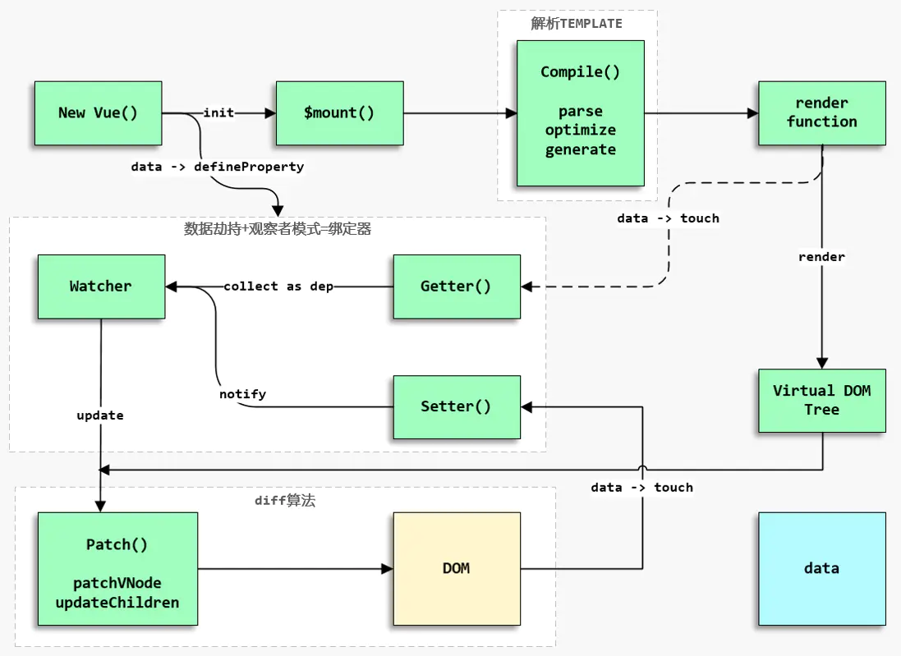

# 阿里常见面试题

原文链接：<https://juejin.cn/post/6844904093425598471>

****
ℹ️：未完成
★：常考
★★：重点掌握
★★★：高频，必背
****

## `HTML` 篇

- 在 `HTML` 中如何做 `SEO` 优化？

- 首屏和白屏时间如何计算？

## `CSS` 篇

- 了解 `Flex` 布局么？平常有使用 `Flex` 进行布局么？

  解题思路

  - 首先得说出 `Flex` 布局概念，`Flex` 的结构组成（`Flex Container` 、`Flex Item`），遇到的所有面试者都没有此回答
  - 其次可以讲讲自己平常用的最多的 `Flex` 属性
  - 最后可以讲讲自己平时常用的布局（左右两列，上下两行等）

- `CSS` 中解决浮动中高度塌陷的方案有哪些？

  解题思路

  - 可以先概括解决高度塌陷问题的两种类型：`clear` 属性和 `BFC` 法
  - 然后可以介绍两种类型的具体方案：

    - 追加元素并设置 `clear` 属性
    - 使用 `CSS` 样式插入伪元素
    - `Bootstrap` 的解决高度塌陷方案（`BFC`）

  可能追加的面试题（详见参考链接）

  高度塌陷产生的原因是什么？
  `clear` 属性清除浮动的原理是什么？
  采用 BFC 解决高度塌陷和 `clear` 属性清除浮动相比的优势是什么？

- `Flex` 如何实现上下两行，上行高度自适应，下行高度 `200px`？

  解题思路

  - `flex-direction: column`
  - `flex: 1`

- 如何设计一个 `4` 列等宽布局，各列之间的边距是 `10px`（考虑浏览器的兼容性）？

  解题思路

  - 浮动和清除浮动
  - `margin` 负值的作用（可参考 `Bootstrap 3` 中栅格容器 `.container` 的样式）

  ```html
  <!DOCTYPE html>
  <html lang="en">
    <head>
      <meta charset="UTF-8" />
      <meta name="viewport" content="width=device-width, initial-scale=1.0" />
      <title>Document</title>

      <style>
        * {
          margin: 0px;
          padding: 0px;
        }
        
        .container {
          margin-right: -10px;
        }
        
        .row {
          box-sizing: border-box;
          padding-right: 10px;
          width: 25%;
          height: 100px;
          float: left;
        }

        .container::before {
          display: table;
          content: '';
        }

        .container::after {
          display: table;
          content: '';
          clear: both;
        }
      </style>
    </head>
    <body>
      <div class="container">
        <div class="row">第一列</div>
        <div class="row">第二列</div>
        <div class="row">第三列</div>
        <div class="row">第四列</div>
      </div>
    </body>
  </html>
  ```

  可能追加的面试题

  如果你回答的是 `Table` 布局，那一定会追问 `Table` 布局和 `Div` 布局有什么区别？

- `CSS` 如何实现三列布局，左侧和右侧固定宽度，中间自适应宽度？

- `CSS` 清除浮动的原理是什么？

  解题思路
  利用清除可以设置元素禁止浮动元素出现在它的左侧、右侧甚至是双侧。

  ```html
  <style>
    div {
      display: inline-block;
      width: 40%;
      height: 100px;
      background: #d3cff7;
      margin-right: 10px;
      margin-bottom : 0;
      padding: 0;
    }
    
    .float {
      float: left;
    }
    
    .box {
      height: 50px;
    }
    p {
      border: 1px solid black;
      margin:0;
      padding:0;
      width: 80%;
    }
  </style>

  <div class="float"></div>
  <div class="box"></div>
  <p>3333333333333333333333333333333333333333333</p>
  ```

  1
  2
  3333333333333333333333333333333333333333333

  由于 div1 浮动，p 和 div1 布局重叠，为了解决这个问题，可以使 p 元素左侧不允许有浮动元素，给 p 元素添加一个 clear:left 的样式之后

  1
  2
  3333333333333333333333333333333333333333333

  可以发现 p 的位置下移从而使 p 和 div1 布局不会重叠，其实是使用清除之后，自动增加了 p 元素的上外边距，确保它落在浮动元素 div1 的下面。CSS2.1 引入了清除区域的概念，清除区域是在元素上外边距之上增加的额外间隔（确保浮动元素不会与该元素重叠），不允许浮动元素进入这个范围，意味着设置 clear 属性的 p 元素的外边距并不改变，之所以该元素会向下移动是因为清除区域造成的。div1 和 div2 的高度分别是 100px 和 50px， 因此清除区域的高度在 50px 左右（不算 border 和浏览器代理初始样式等）。如果给 p 元素一个上外边距 margin-top:30px，则 p 元素并不会向下移动 30px，而是在解析完样式之后清除区域的高度变成了 50px - 30px 左右，而 p 元素仍然位置不变，如果要使 p 元素下移，则需要使 p 元素的 margin-top 值高于最大的清除区域高度 50px，并且向下位移的距离也是 margin-top 值减去最大的清除区域高度。

- `BFF` 的作用有哪些？

- `CSS` 中的 `vertical-align` 有哪些值？它在什么情况下才能生效？

  解题思路
  `vertical-align` 属性值：

  - 线类：`baseline、top、middle、bottom`
  - 文本类：`text-top、text-bottom`
  - 上标下标类：`sub、super`
  - 数值百分比类：`20px、2em、20%` 等（对于基线往上或往下偏移）

  温馨提示：负值相对于基线往下偏移，正值往上偏移，事实上 `vertical-align:base-line` 等同于 `vertical-align:0`。这个负值真的是 `CSS` 神器！

  `vertical-align` 生效前提：

  - 内联元素 `span、strong、em、img、button、input` 等
  - `display` 值为 `inline、inline-block、inline-table` 或 `table-cell` 的元素
  - 需要注意浮动和绝对定位会让元素块状化，因此此元素绝对不会生效

- `CSS` 中选择器有哪些？`CSS` 选择器优先级是怎么去匹配？

- 伪元素和伪类有什么区别？

- `CSS` 中的 `background` 的 `background-image` 属性可以和 `background-color` 属性一起生效么？

  可能追加的面试题

  `background-color` 属性可以覆盖 `background-image` 属性吗？

- 了解 `CSS 3` 动画的硬件加速么？在重绘和重流方面有什么需要注意的点？

- `CSS` 可以做哪些优化工作 ?

- 浮动元素和绝对定位元素的区别和应用?

- `CSS` 中哪些属性可以继承？

## `JavaScript / TypeScript` 篇

- `JavaScript` 中数组是如何存储的？

  解题思路

  - 同种类型数据的数组分配连续的内存空间
  - 存在非同种类型数据的数组使用哈希映射分配内存空间

  温馨提示：可以想象一下连续的内存空间只需要根据索引（指针）直接计算存储位置即可。如果是哈希映射那么首先需要计算索引值，然后如果索引值有冲突的场景下还需要进行二次查找（需要知道哈希的存储方式）。

  可能追加的面试题

  - `JavaScript` 中的数组为什么可以不需要分配固定的内存空间？
  - `JavaScript` 中数组的存储和 `C / C++ / Java` 中数组的存储有什么区别？
  - `JavaScript` 中数组是否可以理解为特殊的对象？
  - `JavaScript` 中数组和 `C / C++ / Java` 中数组存储在性能上有什么区别？
  - `JavaScript` 中的 `Array` 和 `Node.js` 中的 `Buffer` 有什么区别？
  - `JavaScript` 中的数组何时是连续存储的，何时是哈希存储的？
  - 哈希存储的键冲突（散列碰撞）可以有哪些解决方案（开链法、线性探测法、红黑树等）？

- 聊聊继承以及说说 `ES5` 和 `ES6` 继承的区别？

  解题思路

  - `ES5` 的继承使用借助构造函数实现，实质是先创造子类的实例对象 `this`，然后再将父类的方法添加到 `this` 上面。`ES6` 的继承机制完全不同，实质是先创造父类的实例对象this（所以必须先调用 `super` 方法），然后再用子类的构造函数修改 `this`。
  - `ES6` 在继承的语法上不仅继承了类的原型对象，还继承了类的静态属性和静态方法
  - ...

- 说说对原生 `JavaScript` 的理解？

  解题思路

  - `JavaScript` 实现包含的几个部分
  - `JavaScript` 的语言类型特性
  - 解释性脚本语言（对标编译性脚本语言）
  - 面向对象（面向过程）
  - 事件驱动 / 异步 `IO`
  - 缺少的关键性功能等（块级作用域 、模块、子类型等）
  - 自由...

- 谈谈你对 `TypeScript` 的理解？

  解题思路

  - 类型批注和编译时类型检查
  - 类
  - 接口
  - 模块
  - 装饰器
  - 声明文件（类似于 `C` 中的头文件）
  - 对 `ES6` 的支持
  - 语法提示
  - `ESLint`（`TSLint` 不推荐）
  ...

- `JavaScript` 中几种迭代语法在 `Chrome` 等现代浏览器中的性能差异？

  面试题来源
  应聘者简历里写了熟悉高性能 `JavaScript` 开发

  解题思路

  - 考察 `for、for...of、for...in、forEach、while、do...while` 等
  - 可以使用 `console.time` 和 `console.timeEnd` 进行测试
  - 注意现代浏览器多次执行的性能优化问题
  - `++` 和 `--` 有没有区别
  - 遍历的时候是否存在查找原型链的过程

  可能追加的面试题

  - 字面量 / 数组 / 对象存储性能有没有什么区别？
  - 条件比较多的时候 `if-else` 和 `switch` 性能哪个高？
  - 高性能的 `JavaScript` 开发在语法层面你觉得有哪些可以提升性能？
  - 如何在代码中减少迭代次数？
  - 如何实现一个 `Duff` 装置？

- 如何提升 `JavaScript` 变量的存储性能？

  解题思路

  - 访问字面量和局部变量的速度最快，访问数组元素和对象成员相对较慢
  - 由于局部变量存在于作用域链的起始位置，因此访问局部变量比访问跨作用域变量更快，全局变量的访问速度最慢
  - 避免使用 `with` 和 `catch`，除非是有必要的情况下
  - 嵌套的对象成员会明显影响性能，尽量少用，例如 `window.location.href`
  - 属性和方法在原型链中的位置越深，则访问它的速度也越慢
  - 通常来说，需要访问多次的对象成员、数组元素、跨作用域变量可以保存在局部变量中从而提升 `JavaScript` 执行效率

- 浏览器和 `Node.js` 的事件循环机制有什么区别？

- 比较一下 `TypeScript` 和 `JavaScript`，在什么情况下你觉得需要 `TypeScript` ?

- 在 `JavaScript` 中如何实现对象的私有属性?

- `async / await` 和 `Promise` 的区别?

  解题思路：

  - `await` 会等待异步代码执行，会阻塞代码（使用时要考虑性能）
  - `async / await` 在调试方面会更加方便

- 在 `JavaScript` 可以有哪几种形式实现继承，各有什么优缺点？

  解题思路

## `React` 篇

- `React` 中的 `setState` 为什么需要异步操作？

  解题思路

  - 保持内部一致性：`props` 的更新是异步的，因为 `re-render` 父组件的时候，传入子组件的 `props` 才变化；为了保持数据一致，`state` 也不直接更新，都是在 `flush` 的时候更新
  = 将 `state` 的更新延缓到最后批量合并再去渲染对于应用的性能优化是有极大好处的，如果每次的状态改变都去重新渲染真实 `DONM`，那么它将带来巨大的性能消耗
  - 立即更新回来视觉上的不适应，比如在页面打开时候，多个请求发布导致频繁更改 `Loading` 状态，会导致 `Loading` 图标闪烁

  可能追加的面试题

  - 什么时候 `setState` 会进行同步操作？
  - `React` 官方对于 `setState` 特定情况下进行同步操作的优化方案是什么？
  - `React` 中 `setState` 后想要拿到更新的 `state` 值应该怎么处理？

- `React` 应用如何在重新加载页面时保留数据？

  解题思路

  - `localStorage` 结合 `Redux`
  - `url query`（注意长度限制）

- 使用 `React Hooks` 的同时为什么需要使用高阶组件？

  面试题来源
  简历中写着使用 `Hooks` 结合高阶组件完成业务开发

  解题思路

  - 反向入坑问题，如果是业务迁移可以说明进行部分改造迁移导致
  - 正向说明 `Reat Hooks` 中不需要高阶组件的写法，例如 `Redux` 举例
  - 自定义 `Hook`

  可能追加的面试题

  - 完全用 `Hooks` 的写法是否可以摒弃高阶组件的写法？
  - 怎么使用 `Hooks` 替代高阶组件？

- `Ajax` 请求放在 `componentDidMount` 里进行处理还是放在 `componentWillMount` 里进行处理比较合适？

  解题思路

  - 服务端渲染
  - `Event Loop`

  `JS` 是单线程，Ajax 请求不会 "返回" 并且触发当我们正在 rendering 的时候（Ajax  的执行结果会放到任务队列中，等主线程执行完后采取读取任务队列中的任务进行执行），因为理论上放在哪里结果都一样，都会执行两次 render。
  这样的话，就没必要在componentWillMount中调用 Ajax，以避免理解不到位，对state的结果预计错误。componentDidMount的执行很明了，不会引起歧义，所以在componentDidMount中最合理了。

  可能追加的面试题

  - 说说 `React` 官方推荐 `Ajax` 请求放在 `componentDidMount` 里进行处理，而不是放在 `componentWillMount` 里进行处理？
  - 如果 `Ajax` 请求放在 `componentWillMount` 里进行处理，且 `Ajax` 的返回结果在 `render` 之前，那么最终会执行几次 `render`?

- `React` 在语法层面可以做哪些性能优化？

  解题思路

  - `PureComponent + Redux + immutable-js / immutability-helper`
  - `Redux ->  Redux Toolkit`
  - 组件库按需加载
  - 动态 `Ployfill`
  - `Tree Shaking`
  - 路由懒加载
  - `Hooks useCallback`
  - `React Fragments`
  - 构建函数中的事件 `bind` 处理
  - 避免使用内联样式属性
  - `JSX` 中合理控制条件渲染的范围（避免无谓的重复渲染）
  - `key`
  - 保持 `state` 中数据必响应的特性

  可能追加的面试题

  - 深比较和浅比较的区别是什么？
  - 平常在 `render` 时有哪些需要注意的地方？

- `React` 和 `Vue` 的区别？

  除此之外，在语法层面：

  - 在复用层面 `React` 可通过高阶函数、自定义 `Hooks` 实现。而 `Vue` 在大部分情况下使用 `Mixin`。
  - `Vue` 的组件实例有实现自定义事件，父子组件通信可以更解耦。`React` 万物皆 `Props` 或者自己实现类似的自定义事件。
  - `Vue` 中可以使用插槽 `Slot` 分发内容，`React` 万物皆 `Props`。
  - `Vue` 中丰富的指令（确实好用，还支持灵活的自定义指令），`React` 万物皆 `JSX`。
  - `Vue` 中的计算属性和侦听属性语法糖，`React` 可在特定的周期函数中进行处理。
  - `Vue` 框架对过渡动画的支持，`React` 原生没发现该能力。
  - `Vue` 提供一站式服务，`React` 往往在设计时需要考虑生态应用。
  - `Vue` 全局配置、全局 `API` 还是挺好用的，比如 `Vue.use` 可全局在实例中注入对象。
  - `Vue` 中的全局组件非常好用，不需要像 `React` 那样一遍遍引入组件。
  - `Vue` 的 `Template` 中使用一些变量数据（例如常量）必须挂载在 `this` 上（简直蛋疼），`React` 中的 `JSX` 万物皆可 `JavaScript`。
  - `React Hooks` 新颖式概念和语法设计。
  - `React Fragments` 非常棒，`Vue` 暂时没发现类似的功能（会造成更多的元素嵌套问题）。
  ...

  可能追加的面试题

  - 说说 `React` 和 `Vue` 的三个明显的区别？
  - 能说说 `React` 相比 `Vue` 的优势在哪里？
  - 能说说 `Vue` 相比 `React` 的优势在哪里？
  - 你觉得在什么场景下用 `Vue` 或 `React`?

## `Vue` 篇

- `Vue CLI 3` 有哪些特性？

  面试题来源
  简历中写着 `Vue CLI` 技术栈

  解题思路

  - 图形化界面（`vue ui`）
  - 插件系统
  - `CLI` 服务
  - `Vue CLI` 无需 `Eject` 即可进行 `Webpack` 配置（针对 `Create React App`）
  - 可配置化 `Polyfill`
  - 现代模式
  - `Prefetch / Preload`
  - `webpack-merge / webpack-chain`
  - 浏览器兼容性
  - `CSS` 预处理器
  - 环境变量
  - 构建应用 / 库 / `Web Components` 组件
  - 部署（`CORS / PWA`）
  ...

  可能追加的面试题

  - 有没有设计过通用的 `Vuc CLI` 插件？
  - 有没有设计过通用的 `Vue` 脚手架？
  - 有研究过 `Vue CLI` 的源码吗？

- 能对比一下 `Create React App` 和 `Vue CLI 3` 吗？

  面试题来源
  简历上写着熟悉 `React` 和 `Vue` 技术栈
  解题思路

  `Creat React App` 在工程化体系上没有 `Vue CLI 3.x` 更加的开箱即用，除此之外，`Vue CLI 3.x` 中的插件体系是一个非常棒的特性，它使自定义脚手架模板变得非常灵活（非常适合企业定制化脚手架）。当然 `Create React App` 是有它自己的设计理念的，对于简单的应用它是一种优势（不可配置化预先约定）。

- `Vue.js` 整个实现原理？

  面试题来源
  简历中写着熟悉 Vue.js 源码，或者简历中只写着 Vue.js 技术栈，或者面试的过程找不到亮点

  解题思路

  

  这里简单的描述一下 `Vue 2.x` 的运行机制（需要注意分析的是 `Runtime + Compiler` 的 `Vue.js`）。

  初始化流程：

  - 创建 `Vue` 实例对象
  - init过程会初始化生命周期，初始化事件中心，初始化渲染、执行beforeCreate周期函数、初始化 data、props、computed、watcher、执行created周期函数等。
  - 初始化后，调用$mount方法对Vue实例进行挂载（挂载的核心过程包括模板编译、渲染以及更新三个过程）。
  - 如果没有在 Vue 实例上定义render方法而是定义了template，那么需要经历编译阶段。需要先将template 字符串编译成 render function，template 字符串编译步骤如下 ：

    - parse正则解析template字符串形成 AST（抽象语法树，是源代码的抽象语法结构的树状表现形式）
    - optimize标记静态节点跳过 DIFF 算法（DIFF 算法是逐层进行比对，只有同层级的节点进行比对，因此时间的复杂度只有 O(n)。如果对于时间复杂度不是很清晰的，可以查看我写的文章ziyi2/algorithms-javascript/渐进记号）
    - generate将 AST 转化成render function字符串

  - 编译成render function 后，调用$mount的mountComponent方法，先执行beforeMount钩子函数，然后核心是实例化一个渲染Watcher，在它的回调函数（初始化的时候执行，以及组件实例中监测到数据发生变化时执行）中调用updateComponent方法（此方法调用render方法生成虚拟 Node，最终调用update方法更新 DOM）。
  - 调用render方法将render function渲染成虚拟的Node（真正的 DOM 元素是非常庞大的，因为浏览器的标准就把 DOM 设计的非常复杂。如果频繁的去做 DOM 更新，会产生一定的性能问题，而 Virtual DOM 就是用一个原生的 JavaScript 对象去描述一个 DOM 节点，所以它比创建一个 DOM 的代价要小很多，而且修改属性也很轻松，还可以做到跨平台兼容），render方法的第一个参数是createElement(或者说是h函数)，这个在官方文档也有说明。
  - 生成虚拟 DOM 树后，需要将虚拟 DOM 树转化成真实的 DOM 节点，此时需要调用update方法，update方法又会调用pacth方法把虚拟 DOM 转换成真正的 DOM 节点。需要注意在图中忽略了新建真实 DOM 的情况（如果没有旧的虚拟 Node，那么可以直接通过createElm创建真实 DOM 节点），这里重点分析在已有虚拟 Node 的情况下，会通过sameVnode判断当前需要更新的 Node节点是否和旧的 Node 节点相同（例如我们设置的key属性发生了变化，那么节点显然不同），如果节点不同那么将旧节点采用新节点替换即可，如果相同且存在子节点，需要调用patchVNode 方法执行 DIFF 算法更新 DOM，从而提升 DOM 操作的性能。

  需要注意在初始化阶段，没有详细描述数据的响应式过程，这个在响应式流程里做说明。

  响应式流程：

  在init的时候会利用Object.defineProperty方法（不兼容 IE8）监听Vue实例的响应式数据的变化从而实现数据劫持能力（利用了 JavaScript 对象的访问器属性get和set，在未来的 Vue3 中会使用 ES6 的Proxy来优化响应式原理）。在初始化流程中的编译阶段，当render function被渲染的时候，会读取Vue实例中和视图相关的响应式数据，此时会触发getter函数进行依赖收集（将观察者Watcher对象存放到当前闭包的订阅者Dep的subs中），此时的数据劫持功能和观察者模式就实现了一个 MVVM 模式中的  Binder，之后就是正常的渲染和更新流程。
  当数据发生变化或者视图导致的数据发生了变化时，会触发数据劫持的setter函数，setter会通知初始化依赖收集中的Dep中的和视图相应的Watcher，告知需要重新渲染视图，Wather就会再次通过update方法来更新视图。

  可以发现只要视图中添加监听事件，自动变更对应的数据变化时，就可以实现数据和视图的双向绑定了。
  可能追加的面试题

  Vue.js 源码的入口主要做了些什么处理？
  Vue.js 中的数据劫持是怎么实现的？浏览器兼容性呢？
  Vue.js 中的依赖收集是怎么处理的？和闭包有什么关联吗？
  Vue.js 中的模板解析需要经历哪几个阶段？
  Vue.js 中的虚拟节点优势是什么？
  Vue.js 中的 DIFF 算法是怎么处理的？
  Vue.js 中 DIFF 算法的时间复杂度是多少？为什么？
  Vue.js 中 computed / watch 实现的原理是什么？
  Vue.js 中有哪些周期函数？这些周期函数都是在什么时机执行的？
  Vue.js 中的 $nextTick 的原理是什么？它主要经历了哪些变化？为什么？
  Vue.js 对 DOM 的更新做了哪些标记优化处理？
  Vue.js 在语法层面可以做哪些优化处理？
  Vue.js 2.x 中的 Proxy 代理主要做了些什么工作？
  Vue.js 2.x 中如何支持 TypeScript ?
  Vue 3.x 的源码相对 Vue 2.x 主要做了哪些变化？
  Vue.js 中的 M / V / VM 分别指的是哪些？
  Vue-loader 主要有哪些特性？
  Vue.js 如何做 ESLint 校验？
  Vue.js 如何做单元测试？
  了解过 Vue-Router  / Vuex 的源码吗？（感知性问题，不会深入问）
  发布 / 订阅模式和观察者模式的区别是什么？
  手写一个发布 / 订阅模式？
  简述 MVC / MVP / MVVM 的区别？
  如果熟悉 Nuxt 等可能会问 SSR 的实现原理？
  平常遇到 Vue.js 报 error / warning 的时候有深入追踪错误栈的习惯吗？
  Vue 2.x 中的数据劫持能否采用发布 / 订阅模式实现？采用观察者模式带来的优势和劣势有哪些？
  Vue 的整个框架的实现原理大致可分为哪几个部分？

- `Vue.js` 中组件之间通信有哪些方案？

  解题思路

  Vuex
  Event Bus
  Pub / Sub
  Emit / On
  provide / inject
  Element UI dispatch / broadcast
  props
  parent / children 实例对象

  可能追加的面试题

  Element UI 中 dispatch 和  broadcast 是如何实现的？
  祖先和子孙之间通信有哪些方案？
  任意组件之间通信有哪些方案？

- `Vue` 如何定制化脚手架？需要考虑哪些因素？

- `$nextTick` 执行的时机和 `DOM` 渲染的关系是什么？

  可能追加的面试题

  什么是 Event Loop ?
  宏任务和微任务有什么区别？
  哪些是宏任务哪些是微任务？
  $nextTick在几个版本迭代中都经历了什么变化？
  打开新的浏览器窗口时会重新创建一个新的 Network 进程吗？

  参考链接

  你真的理解$nextTick么

- `Vue` 使用的是什么版本，如何配合 `TypeScript` 工作，`TypeScript` 有哪些特性？

- `Vue` 里的 `keep-alive` 是怎么实现的？

  面试题来源
  简历中出现 keep-alive 信息
  可能追加的面试题

  设置了 keep-alive 之后对组件渲染的生命周期有什么影响？
  keep-alive 有哪些特性？

- 说说 `Vue` 里的数据劫持在不同版本里是如何处理的？

- `Vue` 能做哪些性能优化？

  解题思路

  keep-alive
  路由懒加载
  Preload / Prefetch
  key
  响应式依赖扁平化
  减少非必要的响应式依赖
  Object.freeze
  DOM 滚动加载
  v-if / v-show
  computed / watch
  事件销毁（防止内存泄漏）
  组件按需引入
  预渲染
  按需 Polyfill
  模板预编译
  渲染函数
  官方风格指南 + 官方 ESLint 插件
  ...

  可能追加的面试题

  路由懒加载是如何实现的？
  Coding Split 和哪些 Webpack 配置相关？
  Polyfill 是什么？Vue 支持哪些相关的可配置化信息？
  Vue 中可以使用 JSX 吗？（居然有人不清楚 JSX 是什么）

## 组件篇

- `React` 中受控组件和非受控组件的区别？

  面试题来源
  简历写着抽取公共业务组件
  解题思路

  数据由 React 组件 / DOM 节点管理

  可能追加的面试题

  在哪些场景应该使用非受控组件？

  参考链接

  Controlled and uncontrolled form inputs in React don't have to be complicated

- `React` 中如何实现一个 `Input` 组件开发？

- 公司的组件库搭建、设计与维护？

  面试题来源
  简历写着设计和维护公司的组件库
  解题思路

  完整引入 / 按需引入
  构建流程设计
  单元测试
  输出模式（umd / commonjs2 / es6）
  样式构建
  国际化 / 工具
  ESLint / Prettier / Stylint
  TypeScript（声明） / JavaScript
  Webpack 配置 / Webpack 分析
  Babel 处理
  Polyfill 注意点
  Markdown 演示 & CI
  三方库处理方式
  浏览器兼容性
  Autoprefixer
  Lerna / Single Npm / Multiple Npm
  Single Npm & Template
  Git 钩子处理 & Git 规范
  语义化版本规范
  团队 / 范围 / 开发规范 / 代码 Review

  可能追加的面试题

  Webpack 构建速度 / 性能优化？
  Webpack 分析工具？
  组件库的框架设计？
  构建 Bundle 优化？
  按需加载功能可以有哪些实现方案？
  主要负责了哪些组件的设计？
  主动性的业务组件封装案例？
  看过 xxx 组件库的源码设计吗？
  设计组件的时候会考虑对 TypeScript 进行支持吗？
  业务组件的单元测试一般需要测试什么内容？

  参考链接

  Vue CLI 3结合Lerna进行UI框架设计

- 了解 `Element UI` 组件的框架设计吗？

  面试题来源
  简历写着使用 Element UI 进行业务开发并自己设计过组件
  参考链接

  Vue CLI 3结合Lerna进行UI框架设计

- 组件库要做按需加载，觉得应该怎么做？

  面试题来源
  简历写着使用使用按需加载提升页面性能
  解题思路

  Single Npm
  Lerna
  Multi Entry Syntax

- 如何自动屏蔽 `Input` 的自动密码填充？

## 设计模式篇

- 设计模式中观察者模式和发布 / 订阅模式有哪些区别？

  面试题来源
  简历中写着熟悉设计模式、Redis、Vue 源码等
  可能追加的面试题

  平常在哪些地方有使用到观察者或发布 / 订阅模式？

  参考链接

  基于Vue实现一个简易MVVM

- 了解 `MVC / MVP / MVVM` 的区别吗？

  参考链接

  基于Vue实现一个简易MVVM

## 工程化篇

- `Webpack` 构建速度优化有哪些方案？

  面试题来源
  项目中写着使用 Webpack 进行构建速率优化
  解题思路

  speed-measure-webpack-plugin
  排除三方库，防止二次打包
  thread-loader
  cache-loader
  HappyPack
  parallel-webpack
  ...

  可能追加的面试题

  未优化前构建需要多少时间，优化后构建需要多少时间？
  有没有分析是什么问题导致构建速率变慢？

- 说说你对 `cz` 生态的了解？

  面试题来源
  项目中写着使用 cz 规范 Git 提交
  参考链接

  Cz工具集使用介绍 - 规范Git提交说明

- 简单说说 `Webpack` 对于性能优化有哪些特性？

## 性能优化篇

- 了解 `SPA` 的懒加载么？

- `Vue` 如何配合 `Echarts / OpenLayers` 实现性能优化？

## 服务篇

- 有做过基于 `Express` 的应用框架技术选型么？

- 前后端分离的历史？分离模式带来的好处和坏处有哪些？

- `Node` 里的事件循环机制和浏览器的事件循环机制有什么区别？

- 说说怎么用纯粹的 `Node.js` 做一个服务端框架？谈谈 `Node.js` 服务端 `MVC` 的理解？

- 熟悉 `Node`，谈谈服务端 `MVC` 的演变历史？

- 跨域的解决方案有哪些？`CORS` 是怎么处理跨域？

## 框架篇

- 什么是 `H5` ?

- `AMD 、CMD` 和 `CommonJS` 区别？

  可能追加的面试题

  common.js 和 ES 6 中模块引入的区别？

- 如何设计突发大规模并发架构？

- 一般公司是怎么部署前端代码？

## `HTTP` 篇

- `GET` 和 `POST` 的区别？

  可能追加的面试题

  GET 和 POST 在安全性上有什么区别？
  GET 在哪些情况下会有安全性问题？

- 随便聊聊 `Ajax`，聊聊 `axios`？

- `axios` 库有什么能力？`axios` 库发请求的之前能做拦截么？

  可能追加的面试题

  axios 库发请求的之前能做拦截么？
  axios 库发请求的时候能取消请求么？

- 硬件层和前端是如何做通讯的？

  可能追加的面试题

  WebSocket 的浏览器兼容性如何处理？

- 谈谈你对缓存的理解，举一个和你最相关的缓存的使用案例。

- 服务端推送主要用到什么技术？

- `HTTP 2` 相对于 `HTTP 1` 有什么区别？

- `WebSokect` 本质上是基于什么协议进行通信的（`TCP / UDP`）？

  可能追加的面试题

  在不兼容 WebSockect 的情况下如何做降级兼容处理？

- 简单介绍一下 `Graphql`，说说为什么要在你的项目中使用 `Graphql`？

- 了解跨域么，一般什么情况下会导致跨域？

- `cookie` 和 `session` 的区别？

## 测试篇

- 平常开发的过程中有写过单元测试或者 `e2e` 测试么？

- 自动化测试主要是做什么？

## 优化篇

- `SEO` 有哪些优化方案？

  可能追加的面试题

  预渲染的原理是什么？

- 说说任何前端优化处理？

## 业务篇

- 规范代码书写的适用范围有多大？

- 版权信息小工具是干什么的，能具体介绍一下么？

- 介绍一下 `dtd` 组件，组件是如何维护的，版本是怎么控制的？

- 在业务的开发中有没有发现什么痛点并对其进行改进？

- 有没有觉得交互设计不合理然后自己想出方案推动交互更改的案例？

- 前端广告投放如何？`Chrome` 如何劫持广告？

- 简化业务设计的复杂度案例有么？

- 有没有做过什么工具简化业务开发？

- `Moxtra` 是你主推的么？讲讲 `RxJS`?

- 有没有主动 `own` 过业务，并高效排除业务风险的案例？

- 说说如何衡量提升产品的体验？

温馨提示：有些业务问题主要针对的是简历中的项目，在这里不适合展示。不过有一点需要注意，面试官可能会对业务的数据非常感兴趣，所以在业务上有比较 NB 的数据可以体现的最好可以提前准备好。业务这一块可能会考量的点：业务数据 / 业务难点 / 业务成果 / 业务贡献 / 业务主动性 / 业务 own 能力 / 技术栈选型考量 / 业务影响范围 / 业务通用性 / 业务思考 ......

## 名词解析篇

- 什么是渐进增强和优雅降级？

## 笔试篇

- `0 1 1 2 3 5 8`，假设第 `0` 个是 `0`，第 `1` 个是 `1`，求第 `n` 个数的实现方式？

- 简单实现一个发布订阅机制？

- 简单实现带立即执行参数的消抖函数：`function debounceImmediate (fn: Function, wait: number, immediate: boolean))`？

- 实现一个扑克牌式的插入排序（我们总是喜欢将某张扑克牌插入到已排序的扑克中），输入：`[5,6,1,8,7,2,4,3]`，输出：`[1,2,3,4,5,6,7]`，并提供单元测试思路（如何测试你的代码是稳定正确的）？

- 实现一个简易的模板引擎

  ```javascript
  let template = '嗨，{{name}}您好，今天是星期 {day}';
  let data = {
    name: '张三',
    day: '三'
  }
  render(template, data); // 嗨，张三您好，今天是星期三
  ```

## 混沌篇

- 你觉得你最擅长什么？

- 假设某个组织下面挂了 `10w` 个节点，如何做优化处理？

- 用 Vue 的时候有没有遇到过难以解决的问题？

- 说说你业务中觉得性能优化最大的一个场景？

- 说说你业务中至今没有解决的问题？

- 说说你业务中遇到最难解决的问题？

## 八卦篇

- 高效的自学能力，能举个例子体现一下高效么？

- 除了业务上的开发，平常会有什么学习计划么？

- 平常有什么兴趣爱好？

****
ℹ️：未完成
★：常考
★★：重点掌握
★★★：高频，必背
****
